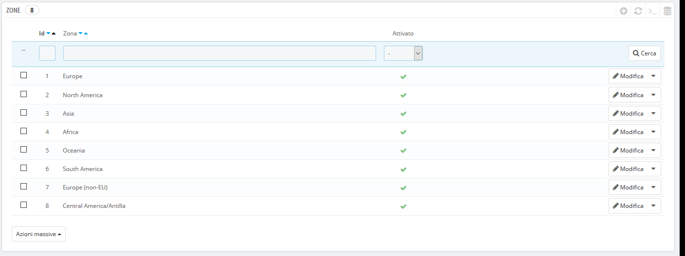
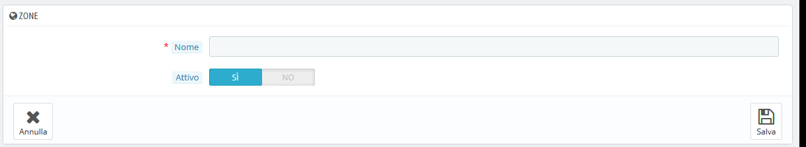

# Zone

Le zone di PrestaShop sono un elenco delle sottoregioni del mondo \([http://en.wikipedia.org/wiki/Subregion](http://en.wikipedia.org/wiki/Subregion)\). Aiuta a categorizzare i Paesi.

Se necessario, è possibile creare più zone: clicca su "Aggiungi nuova zona" per visualizzare il form di creazione.

Tutto ciò che serve è un nome e uno Stato, ad esempio puoi specificare che non effettui le consegne in Oceania.

In modalità multinegozio, è anche possibile associare una zona a una selezione di negozi.

