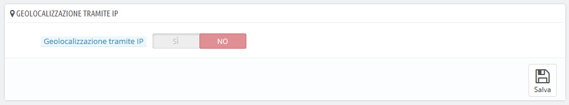
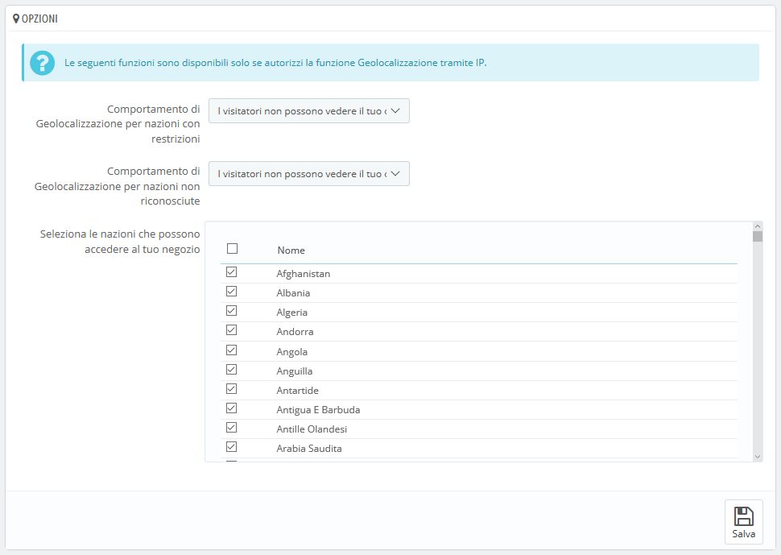
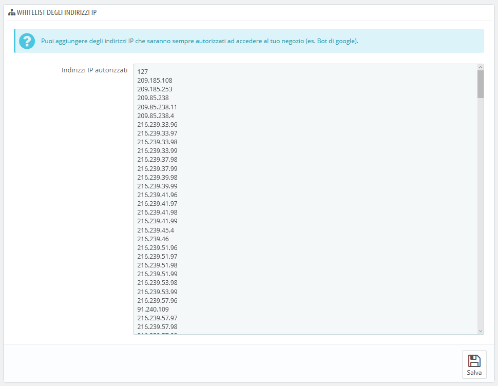

# Geolocalizzazione

La geolocalizzazione è "l'identificazione della posizione geografica nel mondo reale di un dato oggetto, come ad esempio un telefono cellulare o un computer connesso o meno ad Internet, secondo varie possibili tecniche." (scopri di più su [https://it.wikipedia.org/wiki/Geolocalizzazione](https://it.wikipedia.org/wiki/Geolocalizzazione)). Nel nostro caso la geolocalizzazione viene utilizzata per conoscere la posizione di un visitatore, utilizzando l’IP del suo computer e altri strumenti. Uno degli usi della geolocalizzazione è quello di bloccare visitatori di determinate città o Paesi.

Come indicato, la prima volta che apri la pagina "Geolocalizzazione", affinché tu possa utilizzare la geolocalizzazione, hai prima bisogno di scaricare uno specifico file: [http://geolite.maxmind.com/download/geoip/database/GeoLiteCity.dat.gz](http://geolite.maxmind.com/download/geoip/database/GeoLiteCity.dat.gz). Questo file è il GeoLite City database di MaxMind, un accurato database di città e location. Scaricalo cliccando sul link e decomprimilo nella directory `/tools/geoip/` della tua installazione di PrestaShop.

Una volta a che il file è nella corretta cartella, abilita l’opzione "Geolocalizzazione tramite IP" e la sua impostazione andrà a buon fine.

## Opzioni 

Puoi scegliere quali Paesi possono accedere al tuo negozio (per impostazione predefinita, tutti) e impostare i comportamenti di PrestaShop per i Paesi con e senza restrizioni. Puoi scegliere tre opzioni:

* I visitatori non possono vedere il tuo catalogo.
* I visitatori possono vedere il tuo catalogo ma non possono fare un ordine. In effetti, il tuo negozio è in "Modalità Catalogo".
* Tutte le caratteristiche sono disponibili (solo per Paesi senza restrizioni).\
  \
  

È possibile selezionare o deselezionare tutti i Paesi contemporaneamente selezionando la casella in cima all'elenco (accanto a "Nome"). Quando selezioni Paesi che possono accedere al tuo negozio online, assicurati di non bloccare nessun Paese per errore, perché perderesti tutte le potenziali vendite dei suoi abitanti!

## Whitelist degli indirizzi IP 

Questa sezione ti abilita ad accettare specifici indirizzi IP nonostante un blocco. Può essere utile in caso di spammer, robot o attacchi hacker. È già precompilato con un elenco di buoni IP conosciuti. Aggiungi quelli di cui necessiti, uno per riga, e clicca su "Salva".

