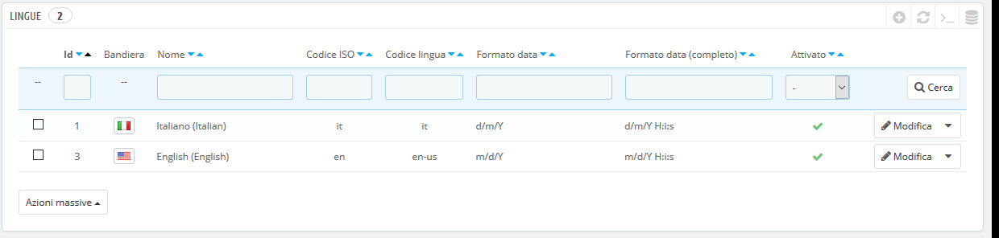
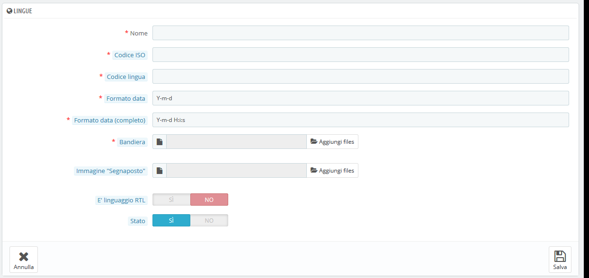

# Lingue

PrestaShop viene concepito multilingue: c'è una lingua predefinita (quella dell’installazione), ma molte altre sono disponibili per il download.

Partecipa alle traduzioni di PrestaShop

Se PrestaShop non è completamente tradotto nella tua lingua, puoi aiutarci a tradurlo entrando nella nostra comunità aperta di traduttori e contribuire nella tua lingua! [https://crowdin.com/project/prestashop-official](https://crowdin.com/project/prestashop-official)

La pagina "Lingue" gestisce le lingue che vedrai nel tuo pannello di amministrazione del tuo negozio.

La pagina mostra le lingue già installate nel tuo negozio, insieme ad alcune informazioni: codice ISO, codice linguaggio, formato data (breve e completa). È possibile attivare o disattivare una lingua cliccando sull'icona nella colonna "Abilitata".

L'aggiunta di una nuova lingua è semplicemente una questione di importazione del pacchetto di localizzazione di un Paese che utilizza quella lingua (nella pagina "Localizzazione"). Se si scopre che non funziona o se hai bisogno di qualcosa personalizzato, puoi aggiungere manualmente una nuova lingua utilizzando il form che si aprirà cliccando sul pulsante "Aggiungi nuovo".

Puoi anche aggiungere una nuova lingua dalla pagina "Traduzioni", nella sezione "Aggiungi/aggiorna una lingua". Contrariamente a un pacchetto di localizzazione, questo importerà solo la lingua e non le impostazioni di localizzazione (unità, valuta, ecc.).

## Creating a New Language 

Prima di creare una nuova lingua, è consigliabile verificare se è già disponibile nella pagina "Traduzioni" in "Aggiungi/aggiorna una sezione di lingua". Infatti, anche qualora non completa, importerà le traduzioni ufficiali di PrestaShop e fornirà una base per il tuo lavoro di traduzione.

Creare una nuova lingua significa tradurre tutto il testo del front end, del back end, i moduli di PrestaShop, ecc., o rischiare di utilizzare le stringhe inglesi predefinite. Per completare la traduzione, è necessario utilizzare l'opzione "Modifica traduzioni" nella pagina "Traduzioni", nel menu "Internazionale".

Per creare una nuova lingua, è necessario compilare più campi possibile dei moduli:

* **Nome**. Il nome è pubblico. Se si crea quella lingua per scopi regionali, si può specificare nel nome: "francese (Quebec)", per esempio.
* **Codice ISO**. Inserire l'adeguato codice ISO-639-1 a 2 lettere. Vedi [https://it.wikipedia.org/wiki/ISO\_3166-1](https://it.wikipedia.org/wiki/ISO\_3166-1) per ulteriori informazioni.\
  Se stai importando un pacchetto di lingue, questo codice deve corrispondere esattamente a quello del pacchetto.
* **Codice lingua**. Inserisci il codice di lingua a 4 lettere, nel formato xx-yy, xx è il codice ISO della lingua (come sopra), e yy il codice ISO del Paese, utilizzando ISO 3166-1 alpha-2 ([http://en.wikipedia.org/wiki/ISO\_3166-1\_alpha-2](http://en.wikipedia.org/wiki/ISO\_3166-1\_alpha-2)). Vedi [http://en.wikipedia.org/wiki/IETF\_language\_tag](http://en.wikipedia.org/wiki/IETF\_language\_tag) per ulteriori informazioni.
* **Formato data**. I Paesi non condividono sempre lo stesso formato della data (vedi [https://it.wikipedia.org/wiki/Formato\_della\_data\_per\_stato](https://it.wikipedia.org/wiki/Formato\_della\_data\_per\_stato)). Dunque, quando il tuo negozio mostra 02/08/12, un cliente della Francia capirà "il 2 agosto 2012" mentre uno degli Stati Uniti capirà "8 febbraio 2012" - e un cliente giapponese potrebbe anche leggerlo come "il 12 agosto, 2002 ". Ecco perché è importante indicare il formato a seconda della tua lingua. Le lettere utilizzate dovrebbero essere quella della funzione `date` () di PHP: [http://php.net/manual/en/function.date.php](http://php.net/manual/en/function.date.php).
* **Formato data (completo**). Come per il formato di data sopra, ma con il formato di ora compreso.
* **Bandiera**. Carica un'immagine della bandiera che meglio corrisponde alla lingua che vuoi aggiungere. Dovrebbe essere 16x11 pixel. Si consiglia di utilizzare il set gratuito di immagini Flags FamFamFam: [http://www.famfamfam.com/lab/icons/flags/](http://www.famfamfam.com/lab/icons/flags/).
* **Immagine "Segnaposto**". Carica un'immagine che verrà visualizzata quando un prodotto non ha ancora un'immagine. Questa immagine è semplicemente un'immagine vuota, con su scritto "Nessuna immagine" o "Nessuna immagine disponibile" nella lingua corrispondente. L'immagine dovrebbe essere 250x250 pixel. È possibile trovare immagini "Segnaposto" esistenti nella directory / `img/l` dell'installazione di PrestaShop.
* **È linguaggio RTL**. Alcune lingue sono scritte da destra a sinistra, in particolare quelle che utilizzano lo script arabo o l'alfabeto ebraico ([http://en.wikipedia.org/wiki/Right-to-left](http://en.wikipedia.org/wiki/Right-to-left)). Quando un tema PrestaShop è ben codificato, è in grado di gestire i linguaggi RTL, a condizione che sia chiaramente impostato come tale.
* **Stato**. Puoi disattivare una nuova lingua finché non sarai pronto a tradurre tutto.
* **Associazione negozi**. È possibile rendere la lingua disponibile solo per una selezione di negozi, ad esempio negozi che mirano a una specifica località.

Una volta che la lingua viene salvata e abilitata, è possibile importare il suo Pacchetto Lingua. Ciò avviene nella pagina "Traduzioni", sotto il menu "Localizzazione". Utilizza lo strumento "Importa manualmente un pacchetto lingua".

Infine, assicurati che tutto funzioni: vai nel front office del tuo negozio e clicca sulle bandiere in alto. Allo stesso modo, i clienti possono ora selezionare una lingua aggiuntiva utilizzando queste icone.

Condividi le tue traduzioni con la comunità

Potresti aver interamente tradotto un nuovo linguaggio attraverso l'interfaccia di PrestaShop. Puoi condividerlo con la comunità di PrestaShop inviando un'esportazione a [translation@prestashop.com](mailto:translation@prestashop.com). Caricheremo il tuo contributo al nostro [progetto traduzioni](https://crowdin.com/project/prestashop-official) in modo che anche altri commercianti del tuo Paese ne possano usufruire!

Per vedere come è possibile esportare le tue traduzioni, vai alla pagina "Traduzioni" del menu "Internazionale" nella sezione "Esporta una lingua".
