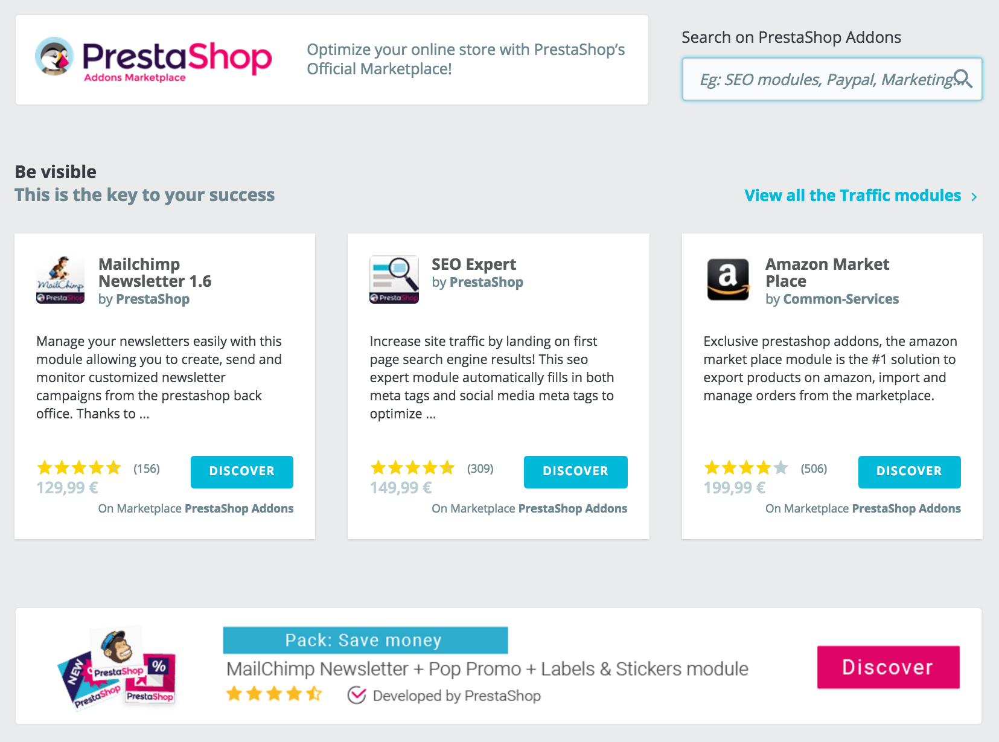

# Catalogo Moduli

PrestaShop viene fornito con oltre 100 moduli. Anche se sembrano tantissimi, potresti desiderare di andare oltre aggiungendo funzioni extra che non sono disponibili di default in PrestaShop.

Molti altri moduli sono disponibili sul sito web Addons di PrestaShop [http://addons.prestashop.com/](http://addons.prestashop.com/)\), il marketplace ufficiale di PrestaShop. Alcuni sono gratuiti, altri sono a pagamento, ma puoi stare certo che troverai qualcosa che soddisfi le tue esigenze! Se sei un appassionato sviluppatore/designer di temi, puoi anche presentare le tue creazioni e venderle su Addons!

La pagina "Catalogo Moduli" consente di accedere rapidamente e facilmente al database Addons dei moduli e temi. La sua interfaccia è piuttosto semplice:

* Un campo di ricerca, con il quale è possibile ricercare l'intero contenuto sul sito Addons.
* Alcune selezioni di moduli che puoi acquistare direttamente, che ti aiuteranno a raggiungere determinati obiettivi aziendali:
  * Essere visibile
  * Aumentare le vendite
  * Aumenta la spesa media del carrello del cliente
  * Acquisire fiducia attraverso i moduli di pagamento
  * Optare per la velocità con i moduli di spedizione
  * Moduli partner gratuiti

Qualsiasi link nella pagina ti porterà sul sito Addons, in cui sono disponibili più opzioni.

Cliccando su un elemento verrà aperta la relativa pagina Addons in una nuova scheda del browser.

**Addons è il markerplace ufficiale di PrestaShop Moduli e Temi**. Qui i proprietari dei negozi possono ottenere tutti gli elementi necessari per personalizzare il proprio negozio e gli autori possono condividere le proprie creazioni con la community.

I moduli e i temi possono essere gratuiti o a pagamento: il prezzo è deciso dall'autore. Prenditi del tempo per esplorare moduli e temi disponibili, perché costoso non significa sempre migliore.

Devi essere loggato prima di poter scaricare o votare qualcosa. Creare un account è gratuito.

