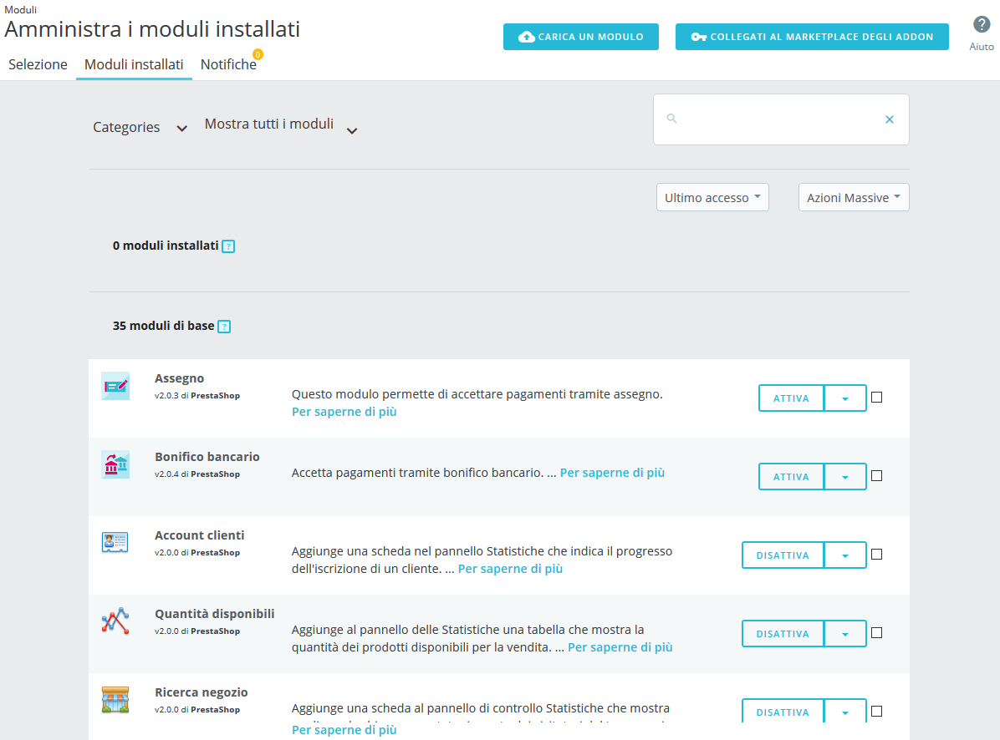
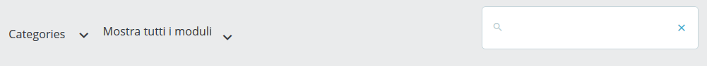

# Moduli Installati

In questa pagina è possibile installare, disinstallare, configurare e aggiornare ciascun modulo. Questo capitolo spiega semplicemente come è possibile gestire i moduli dalla scheda "Moduli installati".

## L’elenco dei Moduli 

Questa lista consente di individuare rapidamente il modulo da configurare o del quale modificare le impostazioni.

È suddiviso in 3 sezioni:

* **Moduli installati**. Questi sono tutti i moduli che hai aggiunto al tuo negozio, acquistandoli da PrestaShop Addons o caricandolo direttamente.
* **Moduli integrati**. Questi moduli di PrestaShop sono preinstallati quando si imposta il negozio. Coprono le basi del commercio elettronico e sono forniti gratuitamente.
* **Moduli del tema**. Ogni tema installato verrà fornito con un proprio set di moduli. Qui troverai tutti i moduli relativi al tuo tema attivo.

Se vuoi trovare rapidamente un modulo, puoi cercarlo direttamente o filtrare i moduli fino a trovare quello che stai cercando.

* **Campo di ricerca.** Cerca un modulo tramite il nome, l'autore o con le parole chiave.
* **Ordina selettori.** L'elenco si ricarica automaticamente quando si effettua una selezione e mostra i moduli in base a tutte le impostazioni correnti.
  * **Categorie.** Sulla sinistra c’è un elenco di tutte le categorie del modulo, con il numero di moduli di ciascuno tra parentesi. Clicca su una categoria per visualizzare i suoi moduli.
  * **Mostra tutti i moduli.** Consente di scegliere tra moduli abilitati e disabilitati. I moduli abilitati sono gli unici che possono essere configurati, qui l'importanza di questo selettore.
  * **Installato e non installato.** Nella maggior parte dei casi, si desidera eseguire un'azione su un modulo installato o installarne un nuovo. Questo filtro è il più comunemente usato.
  * **Ultimo accesso.** Se utilizzi spesso gli stessi moduli, questa opzione renderà più facile trovare i moduli più recenti in cui hai lavorato.
  * **Nome.** Ordina i moduli in ordine alfabetico, dalla A alla Z.

I moduli possono avere uno dei quattro stati seguenti:

* Non-installato.
* Installato ma disabilitato.
* Installato e abilitato.
* Installato e abilitato, ma con avvertenze.

Differenze tra disattivazione e disinstallazione

Se non hai più bisogno di un modulo, è possibile disattivarlo o disinstallarlo. I risultati di entrambe le azioni sono apparentemente uguali: il modulo non è più disponibile, le sue opzioni non appaiono nel tuo back office e qualsiasi elemento aggiunto al tuo front end è scomparso.

La differenza è che la disattivazione di un modulo mantiene la sua configurazione al sicuro per una successiva eventuale riattivazione, mentre la disinstallazione rimuove tutti i dati di configurazione e del database. Tutti i file del modulo verranno eliminati.

Pertanto, dovresti disinstallare un modulo sole se non ti interessano i suoi dati o se sei sicuro di non averne più bisogno.

## Effettuare Azioni sui Moduli 

Ecco le azioni disponibili, a seconda dello stato del modulo:

* Moduli disinstallati: \

  * **Installa.** Questo attiverà l'installazione del modulo su PrestaShop. Il modulo sarà abilitato automaticamente.\
    \

* Moduli installati:
  * **Upgrade.** L'installazione di PrestaShop controlla regolarmente il server Addons se vi sono aggiornamenti per i moduli. Se è così, il pulsante d’azione diventa "Aggiorna" per i moduli interessati. Basta cliccare su di esso e PrestaShop si occuperà di scaricare e aggiornare il modulo.
  * **Attiva.** Per i moduli già disabilitati. Una volta abilitato nuovamente, potrebbe aggiungere nuove opzioni al tuo back office.\

    * **Abilita sul cellulare.** Consentirà la visualizzazione del modulo nel front office dai dispositivi mobili (smartphone, ecc.).
  * **Configurazione.** Alcuni moduli hanno una pagina di configurazione. In questo caso, offrono un collegamento "Configura" per accedere a una nuova interfaccia in cui l'utente sarà in grado di regolare tutte le sue impostazioni
  * **Disabilita.** Se installato, un modulo è abilitato per impostazione predefinita. Puoi disattivarlo, rimuovendo le sue opzioni dal back office, ma mantenendo le impostazioni per una successiva riattivazione.\

    * **Disattiva sul cellulare.** Disattiverà la visualizzazione del modulo nel front office dai dispositivi mobili (smartphone, ecc.).
  * **Reset.** Ripristina le impostazioni del modulo ai propri valori predefiniti.
  * **Disinstallazione.** Disattiva il modulo. Per eliminare anche tutti i suoi file e dati, è necessario selezionare l'opzione "Elimina cartella modulo dopo la disinstallazione".

Queste azioni possono essere eseguite singolarmente su ciascun modulo o in massa grazie al menu "Azioni di massa" a destra.

### Disinstallare un Modulo 

**Non eliminare mai un modulo trascinando direttamente la sua cartella nel cestino usando il tuo client FTP!** Devi lasciare che se ne occupi PrestaShop.

Quando è necessario interrompere temporaneamente l'utilizzo di un modulo, ma desideri continuare la sua configurazione, è possibile disattivarlo semplicemente cliccando sul link "Disattiva". Le azioni si trasformeranno in "Abilita" e "Elimina", ma il pulsante "Disinstalla" resta disponibile.

Se non ti interessa la configurazione del modulo, clicca sul pulsante "Disinstalla": la cartella del modulo rimarrà nella cartella `/modules`, ma il modulo non avrà più alcun impatto sul tuo negozio.

Se desideri rimuovere completamente il modulo dal server, clicca sul collegamento "Elimina": PrestaShop si sbarazzerà della cartella e di tutti i suoi file.

Assicurarti che la disinstallazione o la rimozione del modulo non rompa il tema.
