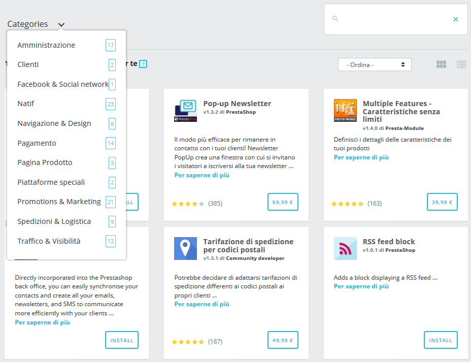

# Selezione Moduli

La scheda "Selezione" riguarda la ricerca di nuovi moduli e servizi per migliorare il tuo negozio. Qui troverai un elenco di tutti i moduli che puoi installare (ma non quelli già installati).

Questa selezione dei moduli consigliati si basa sul tuo Paese, sulla tua lingua e sulla versione di PrestaShop. Include i moduli più popolari del marketplace Addons e dei moduli partner gratuiti.

* [Cercare un modulo o un servizio](selezione-moduli.md#SelezioneModuli-Cercareunmoduloounservizio)
  * [Filtrare i Moduli](selezione-moduli.md#SelezioneModuli-FiltrareiModuli)
  * [Mostra risultati](selezione-moduli.md#SelezioneModuli-Mostrarisultati)
  * [Informazioni sui moduli e servizi](selezione-moduli.md#SelezioneModuli-Informazionisuimodulieservizi)
    * [Scopri di più](selezione-moduli.md#scopri-di-piu)
* [Installare o acquistare un modulo](selezione-moduli.md#SelezioneModuli-Installareoacquistareunmodulo)
* [Caricare un modulo manualmente](selezione-moduli.md#SelezioneModuli-Caricareunmodulomanualmente)
  * [Installarlo utilizzando il form di caricamento](selezione-moduli.md#SelezioneModuli-Installarloutilizzandoilformdicaricamento)
  * [Installazione utilizzando un client FTP](selezione-moduli.md#SelezioneModuli-InstallazioneutilizzandounclientFTP)
* [Connettersi all’Addons Marketplace  ](selezione-moduli.md#SelezioneModuli-Connettersiall’AddonsMarketplace)
  * [Non hai un account Addons?](selezione-moduli.md#SelezioneModuli-NonhaiunaccountAddons?)
  * [Hai già un account?](selezione-moduli.md#hai-gia-un-account)

Qual è la differenza tra un modulo e un servizio?

Un **modulo** consente di aggiungere funzionalità al tuo negozio come nuovi mezzi di pagamento, sincronizzazione di inventario e ordini con il tuo ufficio logistico, esportazione di guide commerciali intelligenti e molti strumenti per te e per i tuoi clienti. I moduli sono dotati di un file che deve essere installato all'interno del tuo PrestaShop.

D'altra parte, un **servizio** è intangibile: non è necessario installare nulla sul tuo negozio per il servizio su cui lavorare. Invece, potrebbe essere necessario firmare un contratto con il fornitore di servizi. I servizi vengono identificati con il pulsante "Scopri".

\
Cercare un modulo o un servizio 
-----------------------------------------------------------------------------------------------------------------------------------------

Se hai un bisogno specifico e stai cercando un modulo che ti aiuti, hai due modi a disposizione per cercare un modulo:

* **Sfoglia le categorie**. Cliccando su "Categorie" troverai un elenco di categorie: i moduli sono organizzati in categorie funzionali, a seconda di come si desidera migliorare il negozio. Vuoi migliorare la sua navigazione o sei piuttosto interessato ad attuare alcune nuove azioni di marketing? Una volta finito con le categorie, seleziona "Tutte le categorie" per ripristinare la selezione.
* **Utilizzare la barra di ricerca**. Se hai in mente una specifica esigenza, puoi anche digitare le parole chiave nella barra di ricerca, sul lato destro della pagina. Ad esempio, se si digita "newsletter", troverai tutti i moduli e i servizi relativi alle newsletter. È inoltre possibile cercare i moduli per nome del modulo o per autore. Per rimuovere una parola chiave, clicca sulla relativa X. Per ripristinare la ricerca, clicca sulla X blu alla destra della barra.

È possibile utilizzare sia la barra di ricerca che le categorie contemporaneamente per ridurre ulteriormente i risultati.

Se la tua ricerca non fornisce risultati, un link ti invita a visitare il Marketplace Addons dove troverai più moduli.

### **Filtrare i Moduli** 

Oltre alla ricerca, puoi anche ordinare i moduli per trovare meglio ciò che ti serve, con questi filtri:

* **Nome**. Ordina i moduli per il loro nome, dalla A alla Z.
* **Prezzo crescente**. Mostra i moduli con il prezzo più basso in primo luogo. I moduli gratuiti verranno mostrati nella parte superiore dell'elenco, ordinati dalla A alla Z.
* **Prezzo decrescente**. Mostra prima i moduli con il prezzo più alto.
* **Popolarità**. Ordina i moduli e i servizi in base alla valutazione nell’Addons. I moduli incorporati verranno visualizzati prima degli altri poiché non dispongono di alcun rating su Addons.

Che cos'è un modulo incorporato?

I moduli incorporati (o nativi) sono disponibili nel tuo negozio sin dall’installazione. Alcuni sono già preinstallati per aiutare l’esecuzione del tuo negozio (li troverai nella scheda "Moduli installati") mentre altri sono disponibili nella scheda "Selezione". Puoi scegliere di installarli o meno, a seconda delle tue esigenze. Coprono le basi del commercio elettronico e sono gratuiti.

### Mostra risultati 

Ci sono due opzioni da scegliere per visualizzare l'elenco dei moduli.

* **Vedi scheda**. Ogni modulo viene mostrato in una scheda, fornendo più spazio per la visualizzazione delle informazioni.
* **Vedi elenco**. Ogni modulo viene mostrato in una riga, consentendo di visualizzare più moduli contemporaneamente. Troverai le stesse informazioni della vista scheda, ad eccezione della popolarità

Cliccando su "Scopri di più" troverai ulteriori dettagli su ogni modulo o servizio.

### **Informazioni sui moduli e servizi** 

Ogni modulo viene fornito con una serie di informazioni che ti guideranno nella tua scelta.

* **Nome del modulo**. Il nome del modulo.
* **Autore del modulo**. L'autore del modulo.
  * "Da PrestaShop" è utilizzato sia per i moduli integrati che per i moduli realizzati da PrestaShop e venduti sul marketplace Addons.
  * "Da partner PrestaShop" identifica i moduli sviluppati dai partner istituzionali di PrestaShop e spesso sono gratuiti.
  * "Dallo sviluppatore comunitario" comprende singoli contributori o agenzie della comunità PrestaShop i cui moduli sono disponibili su Addons.
* **Versione del modulo**. La versione del modulo da installare.
* **Breve descrizione**. Una breve frase per descrivere lo scopo del modulo o del servizio e come può aiutarti
* **Popolarità**. La valutazione data su Addons del modulo (su cinque stelle) e il numero di voti.

#### **Scopri di più**

Se le informazioni di base non ti bastano per prendere una decisione, puoi cliccare su "Scopri di più" per ulteriori dettagli. Si apre un pop-up, con un'immagine del modulo (la sua icona o qualche volta uno screenshot) e diverse schede. Queste informazioni sono fornite dall'autore del modulo, quindi possono variare da un modulo all'altro in termini di quantità e qualità.

* **Panoramica**. Breve descrizione del modulo.
* **Informazioni aggiuntive**. Informazioni più dettagliate.
* **Vantaggi**. I benefici che il modulo porterà al tuo negozio.
* **Caratteristiche**. Quali funzionalità ci si può aspettare dal modulo.
* **Video demo** (opzionale). Un breve video che presenta il modulo.
* **Ultime Modifiche** (opzionale). Un elenco delle novità dell'ultima versione del modulo. Che cosa è stato migliorato o stato aggiunto.

Nella parte inferiore della finestra pop-up possono essere mostrati alcuni badge:

* **Realizzato da PrestaShop**. Questo modulo è stato sviluppato dal team PrestaShop.
* **Partner ufficiale**. Questo modulo è stato sviluppato da un Partner PrestaShop o da un’agenzia Partner.
* **Preferito da PrestaShop**. Questi moduli sono stati premiati dal team PrestaShop come moduli particolarmente semplici e utili!

## **Installare o acquistare un modulo** 

Quando hai scelto il modulo di cui hai bisogno, a seconda del tipo di modulo, puoi eseguire tre diversi tipi di azioni.

* **Installarlo**. I moduli gratuiti dispongono di un pulsante "Installa". Cliccando su di esso, il modulo verrà installato nel tuo negozio. Una volta installato, viene mostrato un nuovo menu per gestirlo: è possibile configurarlo, disinstallarlo, disattivarlo, disabilitarlo da mobile o reimpostarlo. Leggi ulteriori informazioni su queste opzioni nella sezione "Moduli installati".
* **Acquistarlo**. Per acquistare i moduli, anziché "Installa", si visualizzerà il pulsante con il prezzo del modulo. Cliccando su di esso, si verrà reindirizzati nella pagina Addons del modulo, in cui è possibile completare l'acquisto. Non dimenticare di collegare il tuo negozio al tuo account Addons per inserire automaticamente il modulo nel tuo negozio!
* **Scoprirlo**. I servizi mostrano il pulsante "Scopri". Cliccando su di esso, si verrà reindirizzati alla pagina Addons del servizio, dove è possibile sottoscriverlo.

Una volta installato un modulo, lo troverai nell'elenco dei moduli nella scheda "Moduli installati", che è il capitolo successivo.

## **Caricare un modulo manualmente** 

Una volta scaricato un modulo dal negozio online Addons, sta a te installarlo sul tuo sito PrestaShop.

Se non hai collegato il negozio all'account Addons, ci sono due modi per installare un modulo: utilizzando il modulo dedicato o utilizzando il tuo client FTP.

### **Installarlo utilizzando il form di caricamento** 

Per installare automaticamente un nuovo modulo PrestaShop, clicca sul pulsante "Carica un modulo" nella parte superiore della pagina. Si aprirà una finestra popup.

Questo blocco consente di caricare il file zippati del modulo, scaricato da Addons. È possibile caricare un file `zip` o un file `tar.gz`  (tarball). Basta semplicemente trascinare il file del modulo qui, oppure sfogliare il file scaricato cliccando su "seleziona file". Non indica la cartella non compressa del modulo o i suoi file non compressi: solo file zippati!

Una volta che il file viene rilevato, l'installazione viene avviata automaticamente: PrestaShop caricherà il modulo dal computer al suo server, lo decomprime, inserisce i file nella posizione corretta e aggiorna la pagina, tutto questo in pochi secondi. PrestaShop mostrerà quindi "Modulo installato!".

I moduli non vengono installati per impostazione predefinita: è necessario fare clic sul pulsante "Installa" del modulo e quindi configurare le impostazioni tramite la scheda "Moduli installati".

Una volta completata la configurazione, assicurati di verificare immediatamente il modulo per confermare che funziona come previsto.

### **Installazione utilizzando un client FTP** 

È inoltre possibile scegliere di installare un modulo da soli, utilizzando un client FTP.

Per installare manualmente un nuovo modulo PrestaShop:

1. Unzip (decomprimi) il file di archivio del modulo (`.zip` o `tar.gz`). Si dovrebbe creare una nuova cartella.
2. Utilizza il tuo client FTP, connettiti al server web PrestaShop e inserisci la cartella decompressa nella cartella / `modules` di PrestaShop. Fai attenzione a NON caricare quella cartella nella cartella di un altro modulo (cosa che può succedere trascinando oggetti). Carica sia la cartella che i file che contiene, non solo i file.
3. Vai al tuo back office, nella scheda "Selezione".
4. Individua il nuovo modulo nell'elenco dei moduli. Potresti dover scorrere verso il basso; è anche possibile utilizzare il motore di ricerca della lista che dovrebbe fornire un elenco aggiornato dinamico dei nomi dei moduli corrispondenti.
5. Nella riga del nuovo modulo, clicca sul pulsante "Installa".
6. Il modulo è ora installato e dovrebbe essere anche attivo. Se necessario, clicca sul collegamento "Configura" nel modulo. Inoltre, presta attenzione a qualsiasi messaggio di avviso che potrebbe essere mostrato da PrestaShop.

Una volta completata la configurazione, assicurati di verificare immediatamente il modulo per accertarti che funzioni come previsto.

I moduli possono provenire da molte fonti e non tutte sono affidabili. Questo è il motivo per cui PrestaShop mostra talvolta una finestra di avviso per i moduli "Untrusted", cioè i moduli che non sono stati verificati da PrestaShop tramite il marketplace Addons. Questa finestra consente di scegliere se procedere con l'installazione senza ulteriori notifiche o se arrestare il processo di installazione.

L'installazione di un modulo nativo o di un modulo ottenuto tramite Addons non attiverà la visualizzazione di questa finestra.

## Connettersi all’Addons Marketplace   

PrestaShop Addons è il marketplace centrale dove è possibile ottenere nuovi moduli e temi per il tuo negozio. Gli utenti di Addons sono cittadini di prim'ordine quando si tratta di gestire i moduli! Infatti, una volta che l'installazione di PrestaShop è collegata all'account Addons, i moduli ottenuti su Addons saranno automaticamente importati e aggiornati! Ecco perché è altamente consigliabile collegare il proprio negozio al proprio account Addons di PrestaShop.

### Non hai un account Addons? 

Creare un account è gratuito e facile. Clicca sul pulsante "Collegati al marketplace Addons", quindi clicca sul link "Iscriviti ora", che ti porterà qui: [https://addons.prestashop.com/it/login](https://addons.prestashop.com/it/login)

Da lì è possibile creare un nuovo account e navigare tra tutti i moduli e i temi disponibili sul nostro marketplace Addons.

### **Hai già un account?**

Se hai già un account Addons, clicca sul pulsante "Collegati al Marketplace Addons" per aprire la finestra di login.

Inserisci le tue credenziali, clicca su "Andiamo!": l'installazione di PrestaShop è ora collegata all'account Addons e inizierà a confrontare i moduli locali con quelli ottenuti da Addons, assicurandosi di tenerli disponibili e aggiornati!
