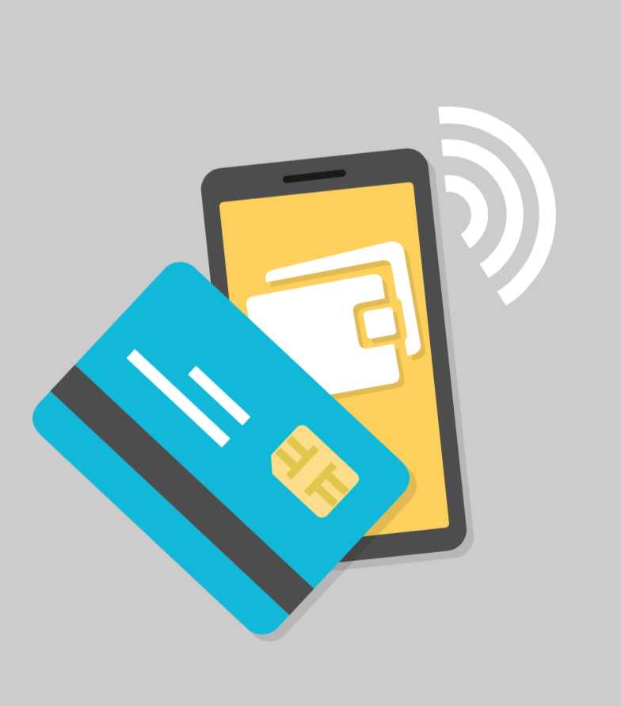

# Gestire i Pagamenti

Con PrestaShop potrai accettare le transazioni dei tuoi clienti usando diversi metodi di pagamento – come assegni, bonifici bancari, contrassegno in contanti - attraverso diversi moduli partner – come PayPal, Moneybookers, HiPay ecc -.

È nel menu "Pagamenti" che si possono effettuare modifiche in merito ai pagamenti.

Il capitolo contiene le seguenti sezioni:

* [Metodi di Pagamento](metodi-di-pagamento.md)
* [Preferenze di Pagamento](preferenze-di-pagamento.md)

