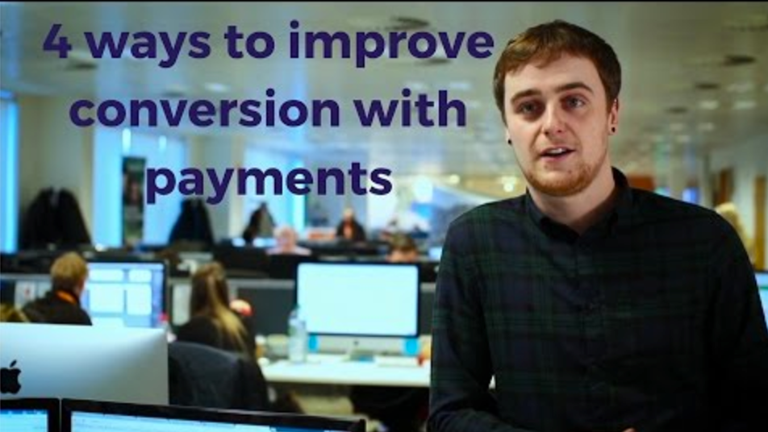

# Metodi di Pagamento

La pagina "Metodi di pagamento" è piuttosto semplice, composta da due sezioni.

**Pagamento attivo**. I metodi di pagamento abilitati sul tuo negozio. Un pulsante di azione consente di gestire i moduli, con le stesse opzioni disponibili nella pagina Moduli.

**Gateway di pagamento consigliati**. A seconda delle impostazioni di posizione e del negozio, PrestaShop ti mostrerà i metodi di pagamento disponibili per il tuo Paese e per i mercati target. Puoi quindi scegliere di aggiungere metodi di pagamento rilevanti per le aspettative dei tuoi clienti. Alcuni moduli possono essere installati gratuitamente, mentre altri sono a pagamento. In questo ultimo caso, verrai reindirizzato ad Addons per acquistare il modulo, prima di poterlo installare.

## Installare un Modulo di Pagamento 

L'installazione di un modulo di pagamento non è fondamentalmente diversa dall'installazione di un modulo normale: basta cliccare sul pulsante "Installa" e tutto quello che resta da fare è configurare il modulo.

Dovresti prestare molta attenzione alle impostazioni e assicurarti che facciano riferimento al tuo indirizzo e conto bancario. La configurazione dei moduli di pagamento spesso significa che devi prima essere noto al fornitore del servizio di pagamento, ossia occorre creare un account sul relativo servizio.

Video - 4 modi per migliorare la conversione con i pagamenti

