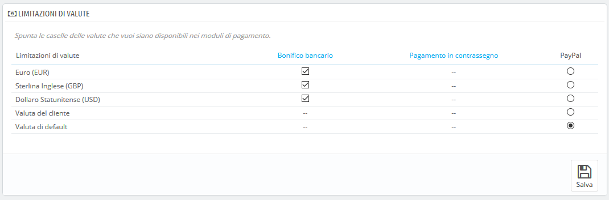

# Preferenze di Pagamento

Le preferenze di pagamento ti aiutano a decidere quale metodo di pagamento rendere disponibile ai tuoi clienti a seconda della valuta, del Paese, del gruppo o del corriere. Fai attenzione a questa pagina se non vuoi sorprese!

**Modulo di pagamento, Limitazioni di Valute**

A seconda del pagamento, la scelta del cliente sulla valuta può differire.

Puoi limitare la scelta dei metodi di pagamento disponibili a seconda delle valute disponibili: puoi far sì che i clienti possano pagare con qualsiasi valuta tramite PayPal, puoi accettare solo dollari se che pagano tramite Moneybookers, ad esempio.

Per impostazione predefinita è disponibile solo la valuta predefinita del negozio. Se hai bisogno di più valute, segui questo processo:

1. Nella pagina "Localizzazione" sotto il menu "Internazionale", importa il pacchetto di localizzazione per il Paese con la valuta a cui sei interessato. Ad esempio, USA per i dollari USA, Regno Unito per la sterlina britannica, ecc.
2. Nella pagina "Valute" sotto il menu "Localizzazione", abilita le valute appena importate.

Se è necessario limita l'utilizzo nel modulo di pagamento in base alla valuta dell'utente, è sufficiente selezionare le caselle e cliccare sul pulsante "Salva restrizioni".

Si noti che le limitazioni di valuta funzionano in modo diverso a seconda del modulo di pagamento:

* Per alcuni, come nel caso del contrassegno, non è possibile modificare l'impostazione predefinita.
* Per altri, come ad esempio il bonifico, l’assegno, Skrill, Ogone ecc., è possibile modificare le impostazioni di valuta, ad eccezione della "Valuta cliente" e della "Valuta predefinita negozio", che rimangono allo stato predefinito.
* Quindi, per altri moduli come Hipay o PayPal, puoi modificare le impostazioni di valuta, ma puoi scegliere una sola opzione tra "Valuta cliente" e "Valuta predefinita negozio", non entrambi.

Il cliente può impostare la sua valuta usando il menu a discesa nella parte superiore di ogni pagina del front office.

Puoi impostare la valuta predefinita del negozio nella pagina "Localizzazione", sotto il menu "Internazionale".

Se si modifica la valuta predefinita dopo aver configurato alcuni primi prodotti, è necessario reimpostare il prezzo di tutti i prodotti. È necessario impostare la valuta predefinita una volta per tutte prima di aggiungere qualsiasi prodotto.

## Modulo di pagamento, Limitazioni di Gruppi 

Puoi limitare i metodi di pagamento disponibili a seconda del gruppo di clienti: puoi creare un gruppo di clienti in cui le persone possono avere accesso a più metodi di pagamento rispetto ai clienti abituali.

Ad esempio, potresti scegliere di avere far pagare i clienti privati con PayPal, Skrill e Hipay, mentre i professionisti potranno pagare solo tramite bonifico bancario. A seconda del tipo di cliente e delle tue scelte, i metodi di pagamento saranno solo quelli che corrispondono alle tue decisioni.

## Modulo di pagamento, Limitazioni di Nazioni 

Puoi limitare la scelta dei metodi di pagamento in base al Paese di origine del cliente. Ad esempio, puoi scegliere di accettare tutti i metodi di pagamento per clienti provenienti da Francia, Spagna e Germania, mentre i clienti dell'Italia, del Regno Unito e della Svizzera potranno solo pagare mediante bonifico bancario.

La tabella elenca tutti i Paesi conosciuti. Se ne manca uno, puoi aggiungerlo usando la pagina "Paesi", nel menu "Zone".

Anche qui, come per le limitazioni di valute, le opzioni disponibili variano a seconda del modulo di pagamento:

* Per alcuni, l'unica opzione è il proprio Paese.
* Per gli altri, le uniche opzioni sono l'insieme dei Paesi supportati dal servizio: Austria, Belgio, Francia, ecc.
* Tutti i moduli di pagamento nativi funzionano con tutti i Paesi.

Trova il Paese che stai cercando nell'elenco alfabetico e seleziona o deseleziona i metodi di pagamento da mettere a disposizione dei clienti di quel Paese. Una volta configurate tutte le impostazioni, clicca sul pulsante "Salva restrizioni", che si trova nella parte inferiore della tabella.

Per impostazione predefinita, tutti i metodi di pagamento installati sono abilitati per il Paese del negozio.

