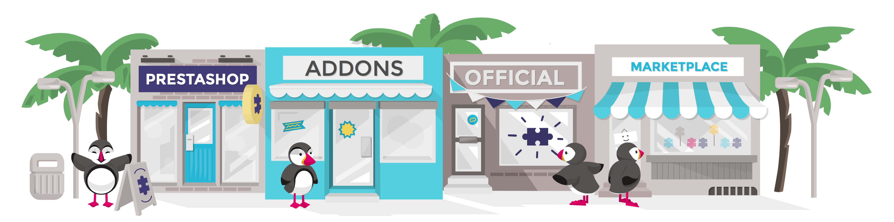

# Personalizzare il tuo negozio

Questa guida ti insegnerà tutte le varie opzioni e le caratteristiche di un'installazione standard di PrestaShop. Cimentarsi con PrestaShop significa esplorare molte impostazioni, possibilità e funzionalità che verranno presentate man mano.

Presto scoprirai che puoi andare oltre la semplice installazione. Infatti, per impostazione predefinita, il tuo negozio ha un tema di default e un centinaio di moduli, ma puoi installare tanti temi e moduli per espandere il tuo negozio e renderlo veramente tuo.

Temi e moduli vengono creati e caricati sul sito PrestaShop Addons, all’indirizzo [https://addons.prestashop.com/it/](https://addons.prestashop.com/it/), l’unico marketplace ufficiale di Prestashop, dove i proprietari dei negozi possono trovare molti modi per estendere e migliorare il proprio negozio.

Creare un account è gratuito e molte opzioni aggiuntive utili e di qualità sono gratuite. Esplora le varie categorie, cerca una parola chiave specifica, quindi acquista e scarica l'add-on \(elemento aggiuntivo\) che ti serve e installalo sul tuo negozio - nella cartella / `moduli` o / `temi` dell'installazione di PrestaShop.

Non devi essere un esperto di PrestaShop per iniziare ad acquistare gli elementi aggiuntivi: dai un'occhiata a più di un migliaio di moduli e più di 900 temi adesso!

Visita [https://addons.prestashop.com/it/](https://addons.prestashop.com/it/)!

