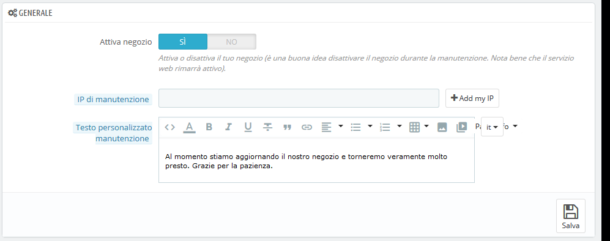
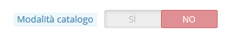
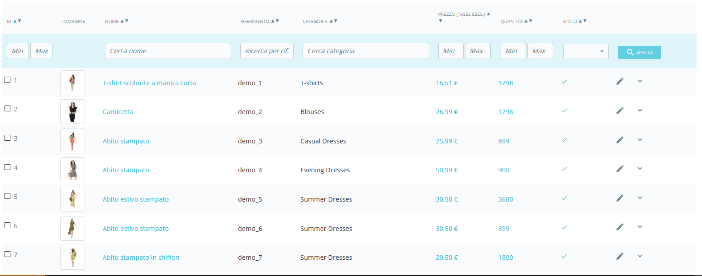
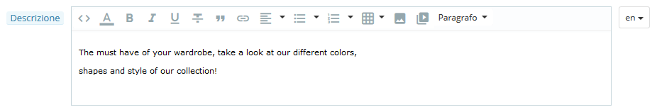
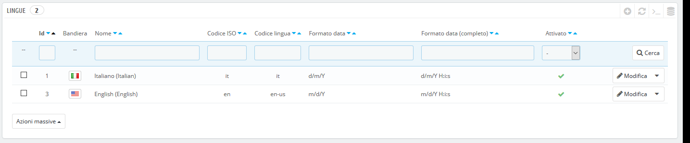
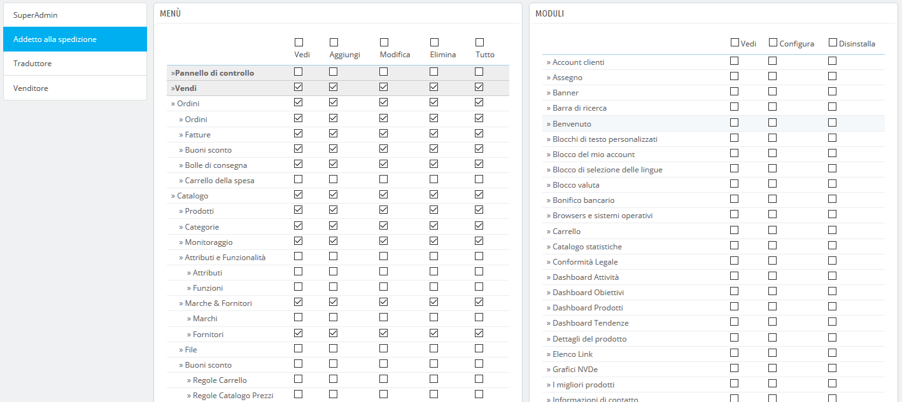

# Primi Passi con PrestaShop 1.7

* [Primi passi con PrestaShop 1.7](primi-passi.md#PrimiPassiconPrestaShop1.7-PrimipassiconPrestaShop1.7)
  * [Disattivare il negozio](primi-passi.md#PrimiPassiconPrestaShop1.7-Disattivareilnegozio)
  * [Cancellare i contenuti dal negozio predefinito](primi-passi.md#PrimiPassiconPrestaShop1.7-Cancellareicontenutidalnegoziopredefinito)
  * [Configura le informazioni del negozio](primi-passi.md#PrimiPassiconPrestaShop1.7-Configuraleinformazionidelnegozio)
    * [Le impostazioni di base del negozio](primi-passi.md#PrimiPassiconPrestaShop1.7-Leimpostazionidibasedelnegozio)
    * [Lingue del negozio](primi-passi.md#PrimiPassiconPrestaShop1.7-Linguedelnegozio)
    * [Informazioni Impiegati](primi-passi.md#PrimiPassiconPrestaShop1.7-InformazioniImpiegati)
  * [Configura i metodi di pagamento ](primi-passi.md#PrimiPassiconPrestaShop1.7-Configuraimetodidipagamento)
  * [Configura corrieri e spedizioni](primi-passi.md#PrimiPassiconPrestaShop1.7-Configuracorrieriespedizioni)
  * [Scegli il tema](primi-passi.md#PrimiPassiconPrestaShop1.7-Scegliiltema)
  * [Scegli i moduli](primi-passi.md#PrimiPassiconPrestaShop1.7-Scegliimoduli)
  * [Crea i prodotti e le categorie prodotti ](primi-passi.md#PrimiPassiconPrestaShop1.7-Creaiprodottielecategorieprodotti)
  * [Crea i contenuti statici](primi-passi.md#PrimiPassiconPrestaShop1.7-Creaicontenutistatici)
  * [Costruisci il top menu](primi-passi.md#PrimiPassiconPrestaShop1.7-Costruisciiltopmenu)
  * [Attiva il tuo negozio](primi-passi.md#PrimiPassiconPrestaShop1.7-Attivailtuonegozio)

## Primi passi con PrestaShop 1.7 

Dedica una buona quantità di tempo al tuo futuro negozio online per assicurarti che ogni parte sia correttamente configurata, protetta, convalidata e pronta per la tua attività.

PrestaShop rende facile installare e costruire la propria attività online, ma non è un lavoro da 5 secondi: si tratta di prodotti, clienti, corrieri e, soprattutto, soldi reali che scorreranno dai tuoi clienti al tuo conto bancario. Siamo sicuri che desideri assicurarti che nulla vada storto durante il processo di convalida di un ordine, che i prodotti siano pronti in magazzino per essere confezionati e spediti ai tuoi clienti senza incappare in problemi e senza imprevisti al di fuori della tua conoscenza.

PrestaShop è uno strumento molto completo, offre talmente tante possibilità che potrebbe spaventare. Questo capitolo ti condurrà quindi attraverso alcune azioni base per impostare il tuo negozio prima del grande lancio. Molto deve essere fatto prima di lanciare il tuo negozio, ma questi sono i passaggi essenziali di configurazione di qualsiasi negozio.

### Disattivare il negozio 

Supponiamo che non è passata ancora un’ora dall'installazione di PrestaShop e che debba configurare un singolo negozio.

Disattivare il tuo negozio significa assicurarti che nessuno possa accedervi mentre sei impegnato a apportare modifiche, creare prodotti, prezzi e imposte, installare moduli di pagamento e un nuovo tema, impostare i corrieri... Si tratta di "mettere il tuo negozio in modalità di manutenzione".

Nel tuo back office, vai alla pagina "Parametri Negozio / Generali". Le opzioni di manutenzione si trovano nella seconda scheda e presentano tre impostazioni semplici:

* **Abilita negozio**. Basta impostarlo su "No" e il tuo front end mostrerà la pagina di manutenzione ai tuoi visitatori che leggeranno che il tuo negozio sarà presto online.
* **IP di manutenzione**. Qui è necessario inserire il proprio indirizzo IP in modo da poter accedere alla propria pagina iniziale e visitare il negozio come se fosse disponibile a tutti. Questa operazione si deve effettuare ogni volta che si mette il proprio negozio in modalità di manutenzione, in quanto avrai sempre bisogno di consultare il tuo front end per assicurarti che tutto sia come previsto. Basta cliccare sul pulsante "Aggiungi il mio IP". È possibile aggiungere altri indirizzi IP separandoli con virgole.
* **Testo personalizzato manutenzione**. Novità della versione 1.7. Ora puoi personalizzare un messaggio che apparirà sul tuo sito, per informare, ad esempio, i visitatori su quando il sito tornerà online.

Se hai già deciso quali sono i tuoi temi e prodotti, puoi semplicemente mettere il tuo negozio in modalità Catalogo. Ciò significa che i clienti possono sfogliare il tuo negozio, ma non verrà visualizzato alcun prezzo e non potranno aggiungere nulla al loro carrello finché non si disabilita la modalità Catalogo.

È possibile attivare la modalità Catalogo passando alla pagina "Parametri del Negozio/Impostazione prodotti", ed è la prima opzione.

### Cancellare i contenuti dal negozio predefinito 

L'installazione predefinita prevede una serie di prodotti - principalmente abiti da donna. Il loro unico scopo è quello di aiutarti a esplorare l'organizzazione di un vero e proprio negozio. Dopo aver appreso le complessità dei legami tra prodotti, categorie, ordini e clienti è necessario eliminare tutti questi elementi per avviare il tuo negozio con un elenco pulito.

Devi quindi cancellare tutti i dati predefiniti, ossia: 

* prodotti e relative...
  * categorie
  * attributi
  * caratteristiche
  * produttori
  * fornitori
  * mappature immagini
  * tag
* ordini
  * messaggi degli ordini
* clienti
  * carrelli dei clienti
* corrieri
  * fasce di prezzo
  * fasce di peso
* contatti & negozi \(cancella o adatta alle necessità del tuo business\)
* pagine \(cancella o adatta alle necessità del tuo business\)

Ciò significa navigare attraverso i vari schermi del back office ed eliminare i contenuti pagina dopo pagina, ma c'è un modo molto più semplice:

1. Vai alla pagina "Moduli&gt; Moduli & Servizi".
2. Individua il modulo "Database Cleaner" e clicca sul relativo pulsante "Installa".
3. Clicca sul pulsante "Configura".
4. Leggi e accetta l'avviso, quindi clicca sul pulsante "Elimina catalogo": elimina tutti i tuoi prodotti e i loro attributi, produttori, ecc.
5. Leggi e accetta l'avviso, quindi clicca sul pulsante "Elimina ordini e clienti": elimina tutti i tuoi clienti, gli ordini, i carrelli, ecc.
6. Clicca sul pulsante "Controlla e risolvi" per perfezionare i vincoli di integrità del database.
7. Clicca sul pulsante "Pulisci e ottimizza" per riorganizzare la memorizzazione fisica dei dati della tabella e dei dati associati, per ridurre lo spazio di archiviazione e migliorare l'efficienza degli I/O quando si accede alle tabelle.

**NON C’É MODO DI TORNARE INDIETRO**. Assicurati di cliccare su questi pulsanti solo se intendi cancellare il database dal contenuto predefinito.

### Configura le informazioni del negozio 

Ora che il negozio è vuoto, puoi iniziare a renderlo tuo, puoi impostare tutto a tuo piacimento, a partire dalle informazioni personali e dalle tue preferenze.

#### Le impostazioni di base del negozio 

Dovresti prestare attenzione alle seguenti impostazioni, la maggior parte delle quali è importante perché viene visualizzata nel front office e quindi vista di tutti i clienti.

Alcune di queste impostazioni richiedono di configurare un modulo invece di modificare una delle preferenze di PrestaShop.

La configurazione di un modulo è semplice:

1. Passa alla pagina "Moduli installati" sotto il menu "Moduli".
2. Digita il nome del modulo \(o parte di esso\) nella casella di ricerca del modulo. Dovresti visualizzare i risultati durante la digitazione.
3. Quando il modulo viene trovato, clicca sul pulsante "Configura" e segui le istruzioni.

Per ogni modulo presentato qui è necessario leggere la documentazione per ulteriori informazioni.

<table>
  <thead>
    <tr>
      <th style="text-align:left">Setting</th>
      <th style="text-align:left">Description</th>
      <th style="text-align:left">Where to find it</th>
    </tr>
  </thead>
  <tbody>
    <tr>
      <td style="text-align:left">Nome Negozio</td>
      <td style="text-align:left">Definisce il tuo marchio, in particolare sui motori di ricerca (Google,
        Yahoo!, Bing...).</td>
      <td style="text-align:left">Menu &quot;Parametri negozio&quot;, pagina &quot;Contatti&quot;, tab &quot;Negozi&quot;,
        e quindi sezione &quot;Dettagli contatti&quot;, opzione modifica &quot;Nome
        Negozio&quot;.</td>
    </tr>
    <tr>
      <td style="text-align:left">Logo Negozio</td>
      <td style="text-align:left">Definisce visivamente il tuo marchio. Il logo predefinito &#xE8; &quot;Classico&quot;,
        il nome del tema predefinito.
         Viene mostrato nella parte in alto a sinistra di ogni pagina del tuo negozio
        cos&#xEC; come nelle fatture e nelle email automatiche.</td>
      <td style="text-align:left">Menu &quot;Design&quot;, pagina &quot;Thema &amp; Logo&quot;, sezione
        &quot;Il tuo tema attuale&quot;, quindi cambia l&#x2019;immagine predefinita
        con il tuo logo.</td>
    </tr>
    <tr>
      <td style="text-align:left">Valuta predefinita del negozioe</td>
      <td style="text-align:left">La valuta predefinita che desideri impostare per i prezzi del tuo negozio.</td>
      <td
      style="text-align:left">Menu &quot;Internazionale&quot;, pagina &quot;Localizzazione&quot;, sezione
        &quot;Configurazione&quot;. Se la valuta non &#xE8; disponibile occorre,
        prima di tutto, importare un pacchetto di localizzazione per la propria
        nazione: usa lo strumento &quot;Pacchetto Importa e Localizza&quot; dalla
        stessa pagina.</td>
    </tr>
    <tr>
      <td style="text-align:left">Informazioni del Negozio</td>
      <td style="text-align:left">Diversi blocchi che presentano il numero di telefono del tuo negozio,
        il tuo indirizzo di contatto e l&apos;email del tuo negozio. Queste info
        sono visualizzate in vari posti nel front office.</td>
      <td style="text-align:left">
        
L&#x2019;informazione proviene dal menu &quot;Parametri negozio&quot;,
          pagina &quot;Contatti&quot;, tab &quot;Negozi&quot; quindi sezione &quot;Dettagli
          contatti&quot;.

        
Per disabilitarli fai riferimento al modulo &quot;Informazioni Contatti&quot;.

      </td>
    </tr>
    <tr>
      <td style="text-align:left">Slider immagini</td>
      <td style="text-align:left">Lo slider presenta diverse immagini che scorrono una dopo l&#x2019;altra.
        Si tratta di una forte firma visiva per il tuo negozio e per i tuoi prodotti.
        Di solito si trova nel centro della homepage.</td>
      <td style="text-align:left">Modulo &quot;Slider immagini&quot;.</td>
    </tr>
    <tr>
      <td style="text-align:left">Pagine</td>
      <td style="text-align:left">Il contenuto delle pagine statiche, come &quot;Chi Siamo&quot;, &quot;Consegna&quot;,
        &quot;Note legali&quot;, &quot;Termini e condizioni&quot; e &quot;Pagamento
        sicuro&quot;. Alcune di esse hanno contenuti predefiniti da adattare al
        tuo business; altri sono vuoti e dovresti inserirvi il tuo testo. Viene
        visualizzato nella sezione &quot;Informazioni&quot; del footer.</td>
      <td
      style="text-align:left">Menu &quot;Design&quot;, pagina &quot;pagine&quot; quindi modifica e crea
        pagine a piacere.</td>
    </tr>
    <tr>
      <td style="text-align:left">Social networks</td>
      <td style="text-align:left">Viene mostrato, nella sezione &quot;Informazioni&quot; del footer, un
        blocco con le diverse icone per seguire la tua azienda sui social media.
        Per impostazione predefinita non viene mostrato, per cui accertati di inserire
        nel modulo i link dei tuoi social media. Se attivo viene mostrato nella
        colonna di destra del footer.</td>
      <td style="text-align:left">Modulo &quot;Link segui Social media&quot;.</td>
    </tr>
    <tr>
      <td style="text-align:left">Condivisione Social media</td>
      <td style="text-align:left">Uno in ogni pagina prodotto, 4 pulsanti per condividere l&#x2019;URL sui
        social media: Facebook, Twitter, Google + e Pinterest.</td>
      <td style="text-align:left">Modulo &quot;Pulsante condivisione Social media&quot;.</td>
    </tr>
    <tr>
      <td style="text-align:left">Top menu</td>
      <td style="text-align:left">La parte in alto del tema predefinito usa un top menu per indicare le
        categorie in cui possono navigare i visitatori cos&#xEC; come i link ad
        altri collegamenti.</td>
      <td style="text-align:left">Modulo &quot;Menu principale&quot;.</td>
    </tr>
    <tr>
      <td style="text-align:left">Rassicurazione</td>
      <td style="text-align:left">Nella pagina prodotto un blocco consente di far visualizzare alcune rassicurazioni.
        Utilizzalo per fornire dettagli riguardo la tua policy dei resi (&quot;Reso
        gratuito!&quot;), il protocollo di sicurezza (&quot;Pagamenti sicuri&quot;),
        ecc., in modo che i clienti si sentano sicuri ordinando dal tuo negozio.</td>
      <td
      style="text-align:left">Modulo &quot;Rassicurazione clienti&quot;.</td>
    </tr>
    <tr>
      <td style="text-align:left">Contenuto della homepage</td>
      <td style="text-align:left">Il tema predefinito contiene un sacco di contenuti demo: testi, immagini,
        collegamenti, ecc. Se si intende utilizzare questo tema per il proprio
        negozio invece di acquistare il tema, &#xE8; necessario assicurarsi di
        rimuovere prima tutto il contenuto predefinito.</td>
      <td style="text-align:left">
        
Modulo &quot;Banner&quot;: cambia l&#x2019;immagine nella parte inferiore
          home page.

        
Modulo &quot;Blocchi di testo personalizzati&quot;: mostra il tuo messaggio
          personale nella parte inferiore della tua home page, sotto al banner.

        
Altri moduli sono disponibili nei &#x201C;Moduli installati&quot;, la
          sezione &quot;Moduli Temi&quot; ti aiuter&#xE0; a definire le varie impostazioni
          del front office, accertati di controllarli tutti!

      </td>
    </tr>
    <tr>
      <td style="text-align:left">Conformit&#xE0; legale</td>
      <td style="text-align:left">Alcune nazioni richiedono specifiche informazioni per i clienti riguardo
        a varie policy. Il modulo &#x201C;Conformit&#xE0; legale&#x201D; ti supporta
        in questo.</td>
      <td style="text-align:left">Per favore leggi la pagina &quot;<a href="http://doc.prestashop.com/display/PS17/Conformarsi+con+la+legislazione+europea">Conformit&#xE0; con la legislazione Europea&quot;</a> per
        conoscere le modifiche che occorre apportare.</td>
    </tr>
  </tbody>
</table>

Queste sono le impostazioni predefinite maggiormente visibili sul tuo front end – soprattutto nel tema predefinito.

La colonna "Dove trovarla" consente di vedere dove è possibile trovare l'interfaccia per modificare questi aspetti del tuo negozio. Questa guida utente fornirà ulteriori dettagli per ogni interfaccia.

#### Lingue del negozio 

PrestaShop è in grado di lavorare con molte lingue, sia nel front office che nel back office. Non appena abiliti più lingue nel tuo back office, ogni campo di testo di back office sarà accompagnato da un selettore di codice di lingua che indica la lingua corrente, in cui puoi cliccare per scegliere un'altra lingua per scrivere contenuto nei campi.

La pagina del prodotto funziona un po’ diversamente. Non troverai un selettore di lingua per ogni campo di testo, ma piuttosto un selettore di lingua generale nella parte superiore della pagina. Una volta selezionata una lingua, è possibile modificare tutti i contenuti in quella lingua. Assicurati di aver modificato quello giusto!

Per impostazione predefinita PrestaShop è installato in due lingue: quella utilizzata durante l'installazione del software e quella collegata al Paese predefinito al momento dell'installazione \(se diversa\). Per gestire le lingue installate passa alla pagina "Localizzazione / Lingue" dal menu "Internazionale". Si presenta una tabella delle lingue disponibili.

Le lingue correntemente abilitate presentano un segno con spunta verde, mentre le altre una croce rossa. Clicca sulla spunta per disattivare la lingua selezionata; clicca su una croce per riattivarla.

Puoi installare e abilitare molte lingue se pensi che il tuo negozio ne abbia bisogno, ma dovrai tradurre i tuoi contenuti in tutte le lingue abilitate: i nomi dei prodotti, le descrizioni, i tag, i nomi di categoria e le descrizioni, i contenuti statici \(pagine\), le impostazioni dei moduli, ecc.

È possibile importare molte altre lingue nella pagina "Internazionale / Traduzione" \("Aggiungi / aggiorna una lingua"\) e quindi attivarle nella pagina "Localizzazione / lingue".

#### Informazioni Impiegati 

Se ci sono persone che ti aiutano con il tuo negozio \(siano esse la tua famiglia, i tuoi amici, o tuoi dipendenti\), occorre creare un account dipendente per ciascuno di essi – già solo per sapere chi ha eseguito un'azione recente. L'altro vantaggio è che puoi dar loro profili specifici e diritti di accesso specifici ai ruoli di amministrazione: per esempio, potresti non consentire a tutti di accedere alle statistiche, alle fatture o alle impostazioni di pagamento.

È possibile creare il maggior numero di profili necessari.

Per creare un nuovo account dipendente vai nel menu "Parametri avanzati", nella pagina "Team" e clicca sul pulsante "Aggiungi nuovo dipendente". Nominalo, come ad esempio "Marco Rossi" o "Gestore delle spedizioni", e salva. Un account può essere utilizzato da tutte le persone che ne hanno bisogno - ma ti consigliamo di crearne uno per ogni persona che ti aiuta.

Ora che hai un account appropriato per il dipendente devi fornire all’account specifiche autorizzazioni personalizzate in base ai suoi compiti. Per impostazione predefinita un nuovo profilo non può fare molto. Spetta a te impostare esattamente le funzioni a cui questo profilo dovrebbe avere accesso. Può essere un compito noioso, ma è importante.

Per assegnare autorizzazioni a un account dipendente è necessario utilizzare l'opzione "Profilo" nella pagina di creazione dell'account: questo menu consente di scegliere il profilo dell'account \(SuperAdmin, traduttore ecc.\)

È possibile modificare queste autorizzazioni in questo modo: passa alla scheda "Autorizzazioni" e seleziona il profilo da modificare. Viene visualizzato un lungo elenco di autorizzazioni: modificale a piacimento. Le modifiche vengono salvate automaticamente.

### Configura i metodi di pagamento  

Scopo del tuo negozio è guadagnare denaro e questo può diventare realtà solo se utilizzi almeno un modulo di pagamento. Diversi moduli sono già disponibili nell'installazione predefinita che è possibile installare e configurare \(dalla pagina "Moduli installati" sotto il menu "Moduli" nella categoria "Pagamenti e Gateway"\) e creare delle restrizioni \(nella sezione " Preferenze" sotto il menu "Pagamento "\). Molti moduli di pagamento richiedono prima di creare un account sul servizio per cui sono stati creati.

È inoltre possibile installare altri moduli di pagamento scaricandoli da Addons: [https://addons.prestashop.com/it/481-pagamento](https://addons.prestashop.com/it/481-pagamento)

Assegno bancario e bonifico sono i soli due metodi di pagamento abilitati per impostazione predefinita. Se scegli di mantenerli **devi** configurarli con le tue informazioni: controlla l'ordine e l'indirizzo dell’assegno, il proprietario del conto, i dettagli della banca \(IBAN, BIC, ecc.\).

Questi metodi di pagamento sono configurati tramite i moduli "Pagamenti via bonifico" e "Pagamenti tramite assegno", che si trovano nella pagina "Moduli installati".

### Configura corrieri e spedizioni 

I prodotti venduti nel tuo negozio devono essere spediti ai tuoi clienti - a meno che si vendano solo prodotti scaricabili, in quel caso il menu "Spedizione" ti sarà poco utile.

Sia che tu stia inviando i tuoi prodotti con posta ordinaria o se hai stipulato un accordo con un corriere, devi impostare queste informazioni all'interno di PrestaShop.

Consulta il capitolo "Gestione dei trasporti" di questa guida per avere informazioni sui trasporti e sui corrieri.

**Il reso non è abilitato per impostazione predefinita**. Se vuoi permettere ai tuoi clienti di restituire i prodotti e di ottenere un rimborso o un buono, puoi farlo nelle "Opzioni di restituzione merce \(RMA\)" della pagina "Reso merce", nel menu "Servizio clienti".

I resi sono spiegati nel capitolo "Gestione del servizio clienti" di questa guida

### Scegli il tema 

Il tuo negozio dovrebbe avere un proprio tema per avere uno stile distintivo e quindi essere più riconoscibile, contraddistinguendolo dai numerosi altri negozi online.

Ci sono molti temi tra cui scegliere sul mercato Addons: [https://addons.prestashop.com/it/3-template-prestashop](https://addons.prestashop.com/it/3-template-prestashop)

Puoi anche scegliere di creare il tuo tema o farlo creare da uno sviluppatore. Per ulteriori informazioni, consulta la Guida Designer di PrestaShop.

Una volta installato il tuo tema, dovresti esplorarlo in modo completo per conoscerlo come le tue tasche e poter aiutare i clienti in qualsiasi situazione. Leggi attentamente la sua documentazione.

È possibile e dovresti personalizzare alcuni aspetti del tema, in particolare il logo adattabile a varie situazioni \(intestazione, posta, fatture, ecc.\) usando la pagina "Tema & Logo", che si trova sotto il menu "Design".

### Scegli i moduli 

PrestaShop viene fornito con oltre cento moduli molto vari: analisi, funzionalità front office, pagamenti, spedizioni ... È necessario esplorare in modo completo i moduli disponibili per sapere quali sono i prodotti che si desidera abilitare e che quali si preferisce mantenere disabilitati.

È inoltre possibile trovare molti altri moduli in Addons: [https://addons.prestashop.com/it/2-modules-prestashop](https://addons.prestashop.com/it/2-modules-prestashop)

Ogni volta che attivi e configuri un modulo, assicurati che funzioni bene in linea con il tuo tema, verifica che le sue caratteristiche non influenzino il front end del tuo negozio.

### Crea i prodotti e le categorie prodotti  

Questa parte è descritta nel dettaglio nei capitoli "Gestione prodotti" e "Gestione categorie".

### Crea i contenuti statici 

Se non l'hai già fatto dovresti prenderti del tempo per scrivere il contenuto delle varie pagine statiche già disponibili nell'installazione di PrestaShop o quelle che ritieni necessarie.

Alcune pagine esistono già, ma il loro contenuto dovrebbe essere decisamente ampliato, in quanto, tra le altre cose, può avere un grande impatto sullo statuto legale del negozio.

Le pagine predefinite sono "Chi siamo", "Consegne", "Note legali", "Termini e condizioni d'uso" e "Pagamenti sicuri". Alcuni di essi hanno un contenuto predefinito, che dovresti aggiornare; altri sono vuoti e dovresti inserirvi il tuo testo.

Per modificare queste pagine, vai nel menu "Design", clicca sulla pagina "Pagine", quindi scegli la pagina che desideri modificare o creane nuovi.

Puoi creare tante pagine quante ne ritieni necessarie.

### Costruisci il top menu 

Ora che disponi di categorie di prodotti e di pagine statiche, devi organizzarle in modo logico e convincente nel menu principale.

Ciò è possibile tramite il modulo "Menu principale": passa alla scheda "Moduli installati" della pagina "Moduli", digita "menu" nel modulo di ricerca modulo, quindi dovresti trovare il modulo. Abilitalo se è disattivato, quindi configuralo: rimuovi le pagine o le categorie che ritieni inutili, aggiungi altre pagine e sposta il contenuto finché non sei soddisfatto della gerarchia del tuo menu.

### Attiva il tuo negozio 

Ora che è tutto pronto e impostato puoi finalmente aprire il negozio al pubblico.

Vai alla pagina "Parametri Negozio / Generali" e cambia le due opzioni nella tabella "Manutenzione":

* **Abilita Negozio**: ripristinalo a "Sì".
* **IP di Manutenzione**: rimuovi il tuo IP dall’elenco. È opzionale: il tuo negozio funzionerà anche se non lo rimuovi.

Il tuo negozio è completo e pronto per accogliere i suoi primi visitatori… e ricevere i suoi primi ordini! 

