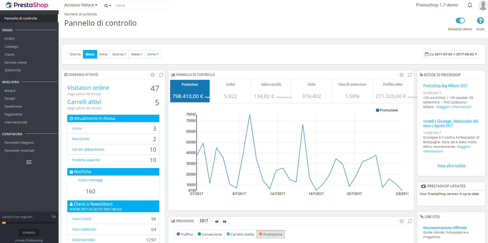
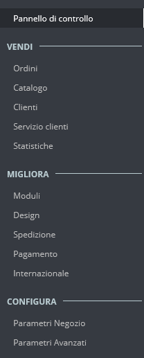
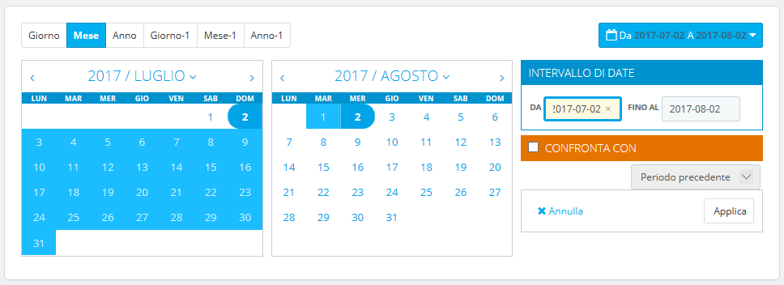
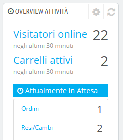
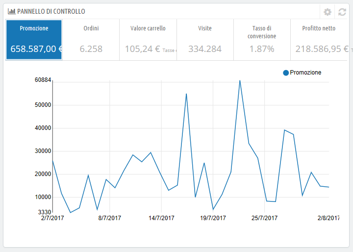
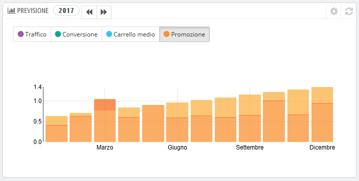
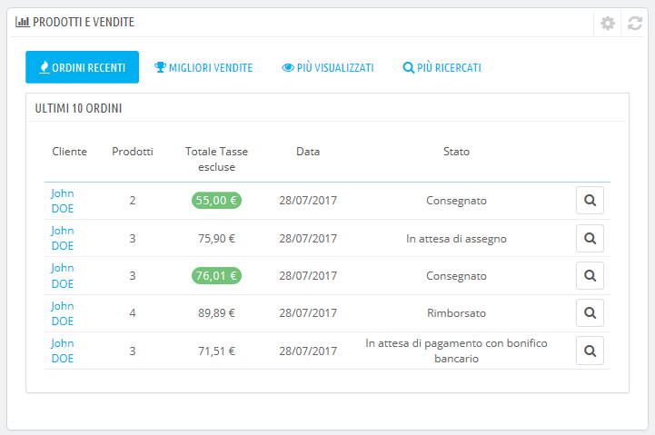

# Scoprire l’Area di Amministrazione

Ora che hai installato PrestaShop 1.7 e che sei correttamente collegato alla tua area di amministrazione, è bene che prenda confidenza con l’interfaccia di amministrazione, che comprenda le sue notifiche e che sappia dove trovare le informazioni di cui necessiti.

Il design dell'area di amministrazione è stato parzialmente rinnovato con la versione 1.7 di PrestaShop per divenire più intuitivo ed ergonomico (come ad esempio la pagina del modulo e la pagina dei prodotti). Anche la navigazione e il menu principale sono stati modificati rispetto alla versione 1.6: mentre le caratteristiche restano le stesse, inizialmente potrebbe essere difficile individuare le pagine rispetto a come si era abituati in precedenza.

Lo scopo di questa riprogettazione è ovviamente quello di facilitare la gestione dei negozi per i commercianti.

Abbiamo creato questo capitolo per aiutarti a sfruttare al meglio l'interfaccia di amministrazione di PrestaShop. È stato progettato per essere molto ergonomico e facile da usare, ma sii consapevole che occorre leggere tutta la guida per avere una perfetta comprensione del tuo nuovo strumento di business online!

## Panoramica dell'interfaccia principale

Prenditi del tempo per esaminare il Pannello di Controllo - cioè la prima pagina che vedi quando accedi al tuo back office. Troverai il riepilogo di tutto ciò che occorre sapere sul tuo negozio in qualsiasi momento, i collegamenti rapidi alla pagina di azione principale, e, come utilizzatore alle prime armi di PrestaShop, ti verranno forniti anche consigli su funzioni a cui vale la pena dare un'occhiata.

### La barra superiore

Nella parte superiore del back office è presente una barra bianca contenente una serie di informazioni e link:&#x20;

* **Il logo PrestaShop.**
* **Accesso veloce**. Questo è il menu dei collegamenti rapidi, che presenta i link più utili. Puoi personalizzarlo cliccando su "Gestisci accessi veloci".
* **Campo di ricerca con elenco a discesa**. Consente di cercare tra i contenuti del tuo negozio.
* **Modalità di debug** (opzionale). Se si imposta il negozio in modalità Debug verrà visualizzata un'icona per ricordare che è stata abilitata.
* **Link al "Nome negozio"**. Apre una nuova scheda del browser con il front end del tuo negozio.
* **Icona campanella e numeri.** Indica il numero di nuove notifiche che, per impostazione predefinita, ti mostrerà gli ultimi ordini.
  * **Ordini**. Apre un pannelo contentente gli ultimi ordini a partire dall’ultima volta in cui hai cliccato sull’icona. Puoi quindi visualizzare uno dei nuovi ordini oppure andare nell’elenco degli ordini.&#x20;
  * **Clienti**. Apre un pannello contenente gli ultimi clienti registrati. Puoi quindi visualizzare uno dei nuovi clienti oppure andare nell’elenco degli clienti.&#x20;
  * **Messaggi**. Apre un pannello contenente i nuovi messaggi inviati al servizio clienti. Puoi quindi visualizzare uno dei nuovi messaggi oppure andare nell’elenco degli messaggi.&#x20;
* **Menu personale con l’immagine del tuo profilo.** Un semplice pannello a discesa con un promemoria dell'account amministrazione con il quale sei attualmente connesso. Contiene i seguenti link:
  * **Link de "I Miei Preferiti"**. Ti porta alla pagina delle preferenze del tuo account, dove puoi impostare alcune opzioni personali (ad esempio, la lingua del tuo back office o la tua password).
  * **Link "Esci".** Ti scollega dall'account utente con cui sei collegato.

### I menu

Durante le attività quotidiane che gestiscono il tuo negozio, consulterai diverse pagine e le opzioni del back office.

In PrestaShop 1.7, il menu è stato riorganizzato in tre sezioni principali, dalle pagine utilizzate più frequentemente a quelle che si aprono meno spesso. In queste sezioni, a  ogni menu si applica a un determinato insieme di attività e contesti:

* **Pannello di controllo**. La homepage del tuo back office in cui puoi vedere le statistiche principali in tempo reale.

**Vendi**

Tutto ciò che concerne le tue attività quotidiane. Ordini, clienti, catalogo, ecc. Questa sezione presenta l’essenza del tuo business, dove vai ogni giorno per far girare il tuo business.

* **Ordini**. Una volta che i clienti iniziano ad aggiungere prodotti nei propri carrelli, in questo menu verranno visualizzati gli ordini, con le relative fatture. Qui si gestiscono anche le carte di credito e, tra le altre cose, i carrelli abbandonati.
* **Catalogo**. Questo è il cuore del tuo negozio, dove potrai aggiungere prodotti, creare categorie, creare vettori e fornitori, definire sconti ecc.
* **Clienti**. Qui puoi accedere a tutte le informazioni sui tuoi clienti e modificarne gli indirizzi.
* **Servizio Clienti**. Qui è dove gestisci il servizio clienti e tutto ciò che concerne l'acquisto: resi di merce, servizio clienti, ecc.
* **Statistiche**. Questo menu consente di accedere a tutte le numerose statistiche e ai grafici raccolti e generati da PrestaShop.

**Migliora**

Qui troverai tutto per personalizzare il tuo negozio e portare la tua attività lontano. Scegli il design del tuo front office, adatta i metodi di pagamento ai mercati di destinazione, espanditi a livello internazionale o migliora il tuo negozio con nuovi moduli e funzioni!

* **Moduli**. Estendi la potenza e l'utilità del tuo negozio aggiungendo e attivando i moduli: ne sono disponibili più di cento per impostazione predefinita e molti altri ancora sono acquistabili su Addons ([https://addons.prestashop.com/it/](https://addons.prestashop.com/it/)).&#x20;
* **Design**. Qui si gestiscono i temi ed è possibile posizionare i blocchi di contenuto dal modulo al tema. In generale qui puoi modificare l'aspetto del tuo negozio.
* **Spedizione**. Tutto ciò che riguarda i vettori ei costi di spedizione.
* **Pagamento**. Seleziona i metodi di pagamento disponibili sul tuo negozio e applica le impostazioni globali ai moduli di pagamento.
* **Internazionale**. Ti aiuta a personalizzare il tuo negozio con valori locali, come la lingua e la traduzione, la valuta, le unità, le tasse, le regole fiscali e le entità geografiche (regioni, Paesi, ecc.).

**Configura**

È suddiviso in due sottomenu. Il primo è uno dei parametri del tuo negozio. Qui troverai tutte le impostazioni necessarie da configurare per avviare l'attività. Una volta che hai fatto le scelte iniziali, non ci tornerai molto spesso. Il secondo menu può essere visto come sezione tecnica, con impostazioni più avanzate che spesso non vengono utilizzate.

* **Parametri Negozio**. PrestaShop è una soluzione di e-commerce molto adattabile, puoi modificare quasi tutti i suoi comportamenti usando queste preferenze complete.
* **Parametri Avanzati**. Questo menu contiene collegamenti a strumenti e pagine informative troppo specifiche per adattarsi ad altri menu, ad esempio le impostazioni del servizio Web, lo strumento di backup del database o la pagina delle performance. Qui ci sono inoltre le impostazioni relative al back office stesso; per esempio, l'elenco dei dipendenti e delle autorizzazioni.
* **Amministrazione**.&#x20;

Questi sono i menu predefiniti. Nota che i moduli possono aggiungere nuove opzioni alle pagine esistenti, nuove pagine ai menu esistenti e persino nuovi menu. Alcuni di questi menu sono ulteriormente divisi in pagine con schede per presentare la varietà di funzioni disponibili in PrestaShop.

Inoltre, un menu è disponibile solo quando viene impostata l'opzione corretta:

* **Magazzino**. Questo menu consente di accedere alla funzionalità di gestione delle scorte, in cui è possibile gestire magazzini, ordini di movimentazione e forniture di magazzino. Si attiva tramite la pagina delle preferenze "Prodotti": basta attivare semplicemente l'opzione "Abilita gestione avanzata del magazzino" (nella sezione "Prodotti") e salvare la modifica per visualizzare il menu.

Tutti i menu standard predefiniti sono spiegati nei dettagli all’interno di questa guida utente.

## I pulsanti

Molte delle pagine del back end utilizzano pulsanti ricorrenti, in alto o in fondo allo schermo. Ad esempio, la pagina delle modifiche dei prodotti possono avere fino a 8 pulsanti disponibili nello stesso momento.

Più che semplici scorciatoie, danno accesso alle funzioni reali che utilizzerai molto spesso.

I pulsanti disponibili variano molto a seconda del contesto e quindi due pagine diverse potrebbero non presentare lo stesso insieme di pulsanti. Tuttavia, ce ne sono sono alcuni che vedrete spesso:

* **Aggiungi nuovo**. Apre la creazione di una pagina nel relativo contesto: nuovo prodotto, categoria del nuovo prodotto, nuovo ordine, ecc.
* **Moduli e Servizi Raccomandati**. Apre una nuova finestra che contiene i moduli disponibili nel relativo contesto.&#x20;
* **Aiuto**. Apre la documentazione relativa alla pagina corrente - o "Guida contestuale".

Il pulsante "Moduli consigliati" presenta i moduli che si applicano al relativo contesto. Ad esempio, nella pagina "Trasporto> Corrieri", vengono visualizzati i moduli della categoria "Trasporto e Logistica" dei moduli. Questo è molto utile quando è necessario trovare rapidamente il modulo da installare e da configurare per ottenere un dato risultato.

Molti dei moduli del back office vengono convalidati con i pulsanti in fondo allo schermo:

* **Salva**. Salva il contenuto della relative pagina e torna all’elenco degli elementi esistenti.&#x20;
* **Salva e rimani**. Salva il contenuto della relativa pagina e lascia la pagina aperta.&#x20;
* **Cancella**. Torna all’elenco degli articoli esistenti.

Tabella dati (lista dei prodotti, delle categorie, dei clienti, ecc.) con relativi pulsanti per gestire l’elenco degli articoli:&#x20;

* **Aggiungi Nuovo**. Crea un nuovo articolo nel relativo contesto.
* **Esporta**. Scarica un file CSV di tutti gli articoli.
* **Importa**. Ti porta alla pagina di opzioni di importazione del CSV dalla quale puoi importare i tuoi file CSV.
* **Aggiorna la Lista**. Ricarica la lista di articoli per mostrare le ultime modifiche.&#x20;
* **Mostra le Query SQL**. Fornisce le query SQL per riprodurre il tuo filtro o la tua ricerca nel tuo SQL manager
* **Esporta nell’SQL Manager**. Apre il menu PrestaShop SQL Manager (nei "Parametri Avanzati") dal quale puoi effettuare la query del database di PrestaShop's con comandi SQL ("`SELECT ...` `FROM ...` `WHERE ...`"). Se l’elenco dei tuoi articoli era filtrato (per nome per esempio) i comandi SQL lo terranno in considerazione (per esempio, "``WHERE 1  AND b.`name` LIKE '%blouse%'``" per l’elenco dei prodotti).

## Aiuto Contestuale

Sin dalla versione 1.6.0.7 di PrestaShop, la documentazione del software è direttamente incorporata nell'interfaccia di amministrazione: cliccando il pulsante "Aiuto" da qualunque pagina del back office, si riduce la larghezza dell'interfaccia principale per far posto ad una nuova colonna sul lato destro, che conterrà la documentazione della sezione attuale del back office.

Un ulteriore clic sul pulsante "Aiuto", chiude l'aiuto contestuale. Se non chiudi la colonna aiuto, PrestaShop capisce che desideri visualizzare la documentazione in ogni pagina del back office, e quindi manterrà la colonna aperta fino a quando farai clic per chiuderla.Se la zona di visualizzazione del browser è inferiore a 1220 pixel di larghezza, PrestaShop apre la documentazione contestuale in una nuova finestra piuttosto che ridurre lo spazio dello schermo dedicato all'interfaccia principale.

\
Nella parte inferiore della colonna di aiuto, una piccolo form consente di informare il team di PrestaShop se la sezione di aiuto è stata utile o meno. Dai una valutazione alla pagina di aiuto cliccando su uno dei 5 livelli di soddisfazione. Se si clicchi su uno dei due livelli più bassi, PrestaShop aprirà una breve form che consente di dettagliare la tua valutazione. Puoi compilarlo e cliccare sul pulsante "Invia" oppure chiudere il form cliccando sulla “x”, solo in quel caso la tua valutazione verrà inviata al nostro server.

## Il Pannello di Controllo

Esploriamo ora il contenuto del Pannello di Controllo stesso. Può sembrare pieno zeppo di informazioni la prima volta per un utente, ma fornisce un ottimo riepilogo delle attività quotidiane del proprio negozio in un colpo d'occhio.

È suddiviso in 4 aree principali: una barra orizzontale e tre colonne.

Modalità Demo

Per impostazione predefinita, il Pannello di Controllo utilizza dati falsi per far visualizzare meglio le diverse statistiche.

Quando si utilizza PrestaShop per un vero e proprio negozio online, è necessario disabilitare questi dati falsi in modo che vengano mostrati quelli reali: disattiva l'opzione "Modalità demo" in alto a destra dello schermo, accanto sull'icona "Aiuto".

### &#x20;The header e la modalità demo

Oltre all'aiuto contestuale, è disponibile anche dell'opzione "Modalità demo", da cui è possibile disattivare i dati falsi utilizzati per impostazione predefinita sull Pannello di Controllo e utilizzare i propri dati (raccolti dal sistema statistico di PrestaShop).

### La barra orizzontale

Nella parte superiore del Pannello di Controllo è presente una singola barra che ti aiuta a scegliere l’intervallo di tempo delle statistiche da visualizzare. Sono disponibili tre tipi di opzioni:

* Giorno, mese o anno correnti.
* Giorno, mese o anno precedenti.
* Selezione della data precisa (il pulsante a destra apre lo strumento di selezione date).

La scelta di un'opzione aggiorna tutti i blocchi di contenuti presenti sul Pannello in modo che si visualizzino i dati solo per il periodo di tempo prescelto. I blocchi che non sono basati su statistiche non cambiano.

Per scegliere un periodo di tempo, puoi cliccare sulla prima e ultima data di quel periodo nel calendario (l'ordine di click non ha importanza) oppure digitare le date nel formato AAAA-MM-GG nell’apposita casella. Clicca su "Applica" per visualizzare la modifica del Pannello in base alle impostazioni.

Puoi anche confrontare due periodi di tempo contemporaneamente selezionando la casella "Confronta con". Seleziona il secondo periodo come fatto per il primo (i due possono anche sovrapporsi), quindi clicca sul pulsante "Applica". Quando si confrontano due periodi, alcuni blocchi di contenuto verranno aggiornati per indicare l'evoluzione dei dati (vedi ad esempio il blocco principale "Pannello di Controllo", che presenta i dati dal modulo Tendenze del Pannello di Controllo).

#### La colonna di sinistra

Per impostazione predefinita, questa colonna presenta i dati del modulo delle attività del Pannello di Controllo e fornisce in breve tempo i dati principali del tuo database:

* Visitatori on-line negli ultimi 30 minuti.
* Carrelli attivi negli ultimi 30 minuti.
* Ordini attualmente in attesa, richieste di resi/cambi, carrelli abbandonati e prodotti non in magazzino.
* Notifiche per nuovi messaggi, richieste d'ordine e recensioni di prodotti.
* Nuovi clienti e nuovi abbonamenti alla newsletter.
* Statistiche del traffico: visite, visitatori unici, fonti di traffico e link diretti.

### La colonna centrale

La colonna centrale è dove il termine "Pannello di Controllo" assume la sua importanza: questa zona presenta all'utente i numeri più importanti relativi alle attività quotidiane del proprio negozio, insieme ad un grafico delle vendite e un elenco degli ultimi ordini. Ogni volta che entri nell'area di amministrazione del tuo negozio, guarderai innanzitutto l'evoluzione che questi numeri prendono. È qui che vedi il tuo negozio vivere e respirare.

Per impostazione predefinita, sono presenti tre blocchi di contenuto in questa colonna, gestiti da moduli:

* **Pannello di Controllo** (Modulo Tendenze). Questo è il blocco principale delle informazioni. Con la sua veste grafica ti aiuta davvero a capire se il tuo negozio è nella giusta direzione o no. Clicca su uno dei grafici per visualizzarlo. Inoltre, quando confronti due periodi di tempo, visualizzi l'evoluzione di ogni dato in percentuale. Sposta il grafico con il mouse per vedere i dettagli.\
  &#x20;\
  Cliccando sulla relativa icona di configurazione (in alto a destra) apri una nuova pagina in cui puoi impostare i diversi costi che il tuo negozio sostiene (imposte bancarie, imposte medie di spedizione, costo dell’hosting, ecc.) per una visione più realistica delle tue tendenze.
* **Previsione** (Modulo Obiettivi). Questo blocco presenta gli obiettivi prefissati per i prossimi mesi e l’andamento del tuo negozio rispetto ad essi. Sposta il grafico con il mouse per vedere i dettagli.

&#x20;\
\
A seconda dei risultati mensili è necessario aggiornare gli obiettivi successivi. Puoi impostare i tuoi obiettivi nel modulo di configurazione del blocco (in alto a destra del blocco) e compilare le tue aspettative mese per mese in termini di traffico, tassi di conversione e valore medio del carrello. La colonna "Vendite" verrà aggiornata in base agli obiettivi impostati nelle altre colonne (ad esempio, per 1000 visitatori con un tasso di conversione del 2% e un carrello medio di €10, si otterrebbe 1000 \* (2/100) \* 10 = €200). Puoi cambiare la valuta nella pagina "Valute" sotto il menu "Localizzazione".

* **Prodotti e Vendite** (Modulo Prodotti). Questo blocco presenta una tabella dei tuoi ultimi ordini e una classifica dei tuoi prodotti: i più venduti, i più visti e le ultime ricerche (a seconda delle ricerche nel form di ricerca del tuo negozio, non dei motori di ricerca).

È possibile impostare il numero di elementi da visualizzare in ogni blocco, aprendo il modulo di configurazione.

### La colonna di destra

Questa ultima colonna è informativa: ti dà le ultime notizie da [PrestaShop.com](http://prestashop.com), le notifiche sulle nuove versioni di PrestaShop e link utili.
