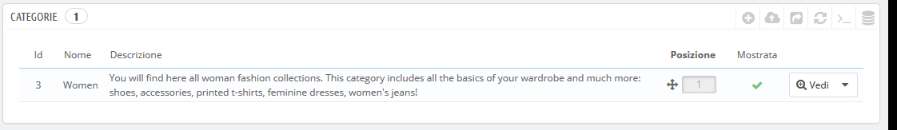
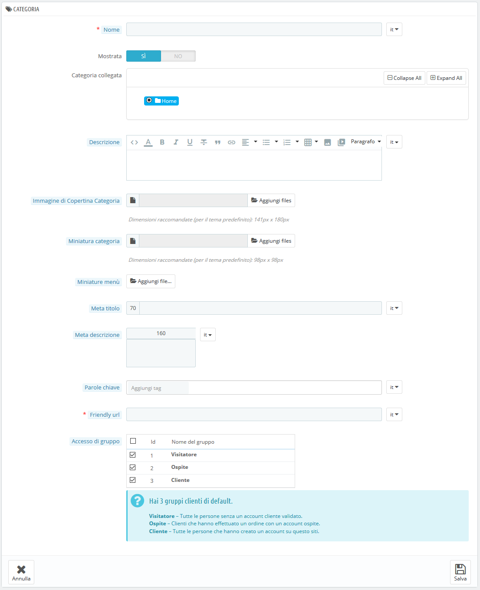

# Gestire Categorie

Le categorie sono essenziali, in quanto consentono di raggruppare prodotti equivalenti. Ciò aiuta i clienti a trovare la propria strada nella varietà del tuo catalogo e ridurre i tempi quando cercano uno specifico tipo di prodotto.

Dovresti creare una nuova categoria dal momento in cui hai almeno due prodotti con attributi equivalenti. I prodotti di una categoria dovrebbero essere comparabili, se non addirittura intercambiabili. Tieni presente questo concetto quando aggiungi nuovi prodotti e crei nuove categorie.

Le categorie determinano il modo in cui le persone navigano sul tuo sito e cercano i tuoi prodotti. Dovresti concentrarti sulla struttura delle categorie e su come queste sono organizzate prima ancora di iniziare a creare schede prodotto.

Le categorie vengono gestite nella pagina "Categorie" del menu "Catalogo". Questa pagina contiene una tabella con le categorie attualmente esistenti, con le principali informazioni.

Per visualizzare le sotto categorie, clicca sulla categoria collegata o seleziona "Mostra" nel menu di azione.



Utilizzando l'icona nella colonna "Mostrata" della tabella, è possibile indicare quali si desidera nascondere al cliente cliccando sulla spunta verde, trasformandola in una "x" rossa.

Tutte le categorie sono in realtà sottocategorie della categoria "Home".

Per modificare la categoria "Home" (o qualsiasi categoria selezionata), clicca sulla freccia accanto al pulsante "Mostra", quindi su "Modifica".

Per creare una nuova categoria (o una sottocategoria di una categoria esistente), clicca sul pulsante "Aggiungi nuova categoria" da qualsiasi livello di categorie.



Traduci le tue categorie!

Assicurati di tradurre ogni campo in ogni lingua che il tuo negozio supporta. Per fare ciò, clicca sul pulsante lingua accanto al campo e scegli la lingua in cui desideri modificare il testo.

Prima di tutto occorre inserire alcune informazioni generali:

* **Nome**. Nomina la tua categoria. Rendilo molto breve e descrittivo e scegli le parole con saggezza: i tuoi clienti faranno affidamento su di esso durante la navigazione nel tuo negozio.
* **Mostrata**. Indica se viene "mostrata" (se è visibile o meno dai tuoi clienti). Ad esempio, potrebbe essere opportuno posticipare la visualizzazione di una nuova categoria ai tuoi clienti perché non l'hai ancora completata.
* **Categoria collegata**. _Non viene visualizzato quando si crea una categoria radice_. Se si desidera creare una sottocategoria appartenente a una categoria diversa dalla home page, scegliere la categoria in cui apparirà. Il form è lo stesso se si crea una categoria radice o una sottocategoria. L'unica differenza è che quando si clicca su "Aggiungi nuova categoria" da un sotto-livello di categorie, PrestaShop capisce che si desidera creare una sottocategoria e quindi imposta l'opzione "categoria madre".
* **Descrizione**. Dovresti riempire questo campo perché non solo sarà utile a te o ai tuoi dipendenti, ma alcuni temi potrebbero anche usufruirne, mostrandole ai tuoi clienti.
* **Immagine di copertina categoria**. Clicca su "Aggiungi file" per caricare un'immagine dal computer che rappresenterà questa categoria. Apparirà nella pagina della categoria.
* **Miniatura categoria**. Visualizza una piccola immagine nella pagina della categoria collegata, se il tema lo consente.
* **Miniature menu**. La miniatura di categoria appare nel menu come una piccola immagine che rappresenta la categoria, se il tema lo consente.
* **Meta titolo**. Il titolo che apparirà sui motori di ricerca quando una ricerca viene fatta da un cliente.&#x20;
* **Meta descrizione**. Una presentazione della tua categoria in poche righe, con l’intento di catturare l'interesse dei clienti. Apparirà nelle pagine dei risultati dei motori di ricerca.
* **Parole chiave**. Parole chiave da definire affinché il tuo sito sia presente sui motori di ricerca. È possibile immetterne diverse, separate da virgole, nonché modi di dire o espressioni, che devono essere indicati tra virgolette.
* **Friendly URL**. Consente di riscrivere gli indirizzi delle tue categorie proprio come desideri.\
  Ad esempio, invece di avere un indirizzo come [http://www.example.com/categoria.php?id\_categoria=3](http://www.example.com/categoria.php?id\_categoria=3), puoi inserire [http://www.example.com/123-nome-della-categoria](http://www.example.com/123-nome-della-categoria). In questo caso, ciò che dovresti fare è indicare nel campo "Friendly URL" le parole che desideri che appaiano al posto di "nome della categoria" separate da trattini.
* **Acceso di gruppo**. Limita a determinati acquirenti l'accesso alla categoria e ai relativi prodotti. Per vedere queste categorie i tuoi acquirenti devono appartenere a un gruppo di utenti. Per ulteriori informazioni, consulta la scheda "Gruppi" nella pagina "Impostazioni clienti" dal menu "Parametri del negozio".
*   **Categoria Radice**. _Appare solo quando si crea una categoria radice._ Potrebbe essere utile utilizzare questa nuova categoria come nuova categoria radice, al posto della "Home". Se è il tuo caso, seleziona questa opzione.

    La categoria radice è molto utile nella modalità multi-shop. Immagina di avere 3 negozi con prodotti e categorie differenti o in parte diversi: potresti utilizzare una categoria radice diversa per ogni negozio.

    La categoria radice rispecchia quindi la categoria "home" di ogni negozio, quindi se non si desidera avere gli stessi prodotti nella categoria della home page di ogni negozio, è necessario creare diverse categorie radice.In questo modo è più facile assegnare categorie a ciascun negozio e si possono avere diversi prodotti nella categoria home.

Una volta terminata la configurazione della tua categoria, salva, e sarai pronto a riempirla con i prodotti.  &#x20;

La nuova categoria non apparirà automaticamente nel menu del negozio. Per visualizzarla è necessario modificare il menu dal modulo "Menu principale" (se si sta usando il tema predefinito) o qualsiasi modulo personalizzato che gestisce il menu.

## Navigare e modificare le categorie  <a href="gestirecategorie-navigareemodificarelecategorie" id="gestirecategorie-navigareemodificarelecategorie"></a>

Il pulsante "Modifica" nella barra dei pulsanti consente di modificare la categoria collegata alle sottocategorie attualmente mostrate. Ciò significa che quando si visualizzano le principali sottocategorie, cliccando sul pulsante "Modifica", è possibile modificare la categoria "Home".

Puoi cliccare su qualsiasi categoria della tabella: apri quella categoria e visualizzerai tutte le sue sottocategorie. In pratica, si cambierà il contesto dell'interfaccia: cliccando sul pulsante "Modifica" modificherai la categoria attualmente collegata e cliccando sul pulsante "Aggiungi nuovo" si aprirà il form per la creazione delle categorie con l'opzione "Categoria Collegata" impostata sulla categoria corrente.

## Importare ed esportare categorie <a href="gestirecategorie-importareedesportarecategorie" id="gestirecategorie-importareedesportarecategorie"></a>

Oltre ai pulsanti "Aggiungi nuovo" e "Modifica", la barra degli strumenti della lista contiene anche tre pulsanti:

* **Esporta.** Ti consente di scaricare la lista delle categorie nel formato CSV.
*   **Importa.** Apre la pagina "Parametri avanzati > Importa", con il tipo di dati previsto impostato su "Categorie". Vai al capitolo "Comprendere i parametri avanzati" per ulteriori informazioni sull'importazione dei file. \
    Avrai bisogno del tuo file per seguire questo formato:

    ```
    ID;Nome;Descrizione;Posizione;Mostrato;
    3;iPods;Ora che puoi comprare film dal tuo iTunes Store e sincronizzarli nel tuo iPod, l’intero mondo è il tuo teatro.;1;1;
    4;Accessori;Accessori meravigliosi per il tuo iPod;2;1;
    5;Laptops;Il più recente processore Intel, un hard drive più grande, con memoria abbondante e nuove funzionalità in un solo pollice. I nuovi portatili Mac hanno le prestazioni, il potere e la connettività di un computer desktop. Senza la parte desk.;3;1;
    ```

    L’identificatore della categoria è l’ID, non il nome della categoria.
* **Lista di aggiornamento.** Ricarica la lista delle categorie con le modifiche che hai apportato.

Altre opzioni di importazione sono disponibili nella pagina “Importa” del meni “Parametri Avanzati”.

## Aggiungere prodotti a una categoria  <a href="gestirecategorie-aggiungereprodottiaunacategoria" id="gestirecategorie-aggiungereprodottiaunacategoria"></a>

Per aggiungere un prodotto a una categoria, è necessario aprire la pagina di configurazione del prodotto e passare alla sezione "Categorie" nella scheda "Impostazioni di base". Qui è possibile impostare le categorie a cui appartiene il prodotto.

La categoria "Home" è una categoria speciale, in cui è possibile evidenziare/promuovere prodotti di qualsiasi altra categoria facendoli comparire nel blocco "Prodotti in primo piano". Per impostazione predefinita, è possibile visualizzare nella home page solo 8 prodotti.

Il blocco "Prodotti in primo piano" dipende dal modulo "Prodotti in primo piano". Se desideri più prodotti (o meno) sulla homepage, configura questo modulo (dalla pagina "Moduli & servizi" nel menu "Moduli installati").

Nota: non è necessario rimuovere un prodotto dalla sua categoria originale per metterlo sulla homepage. Un prodotto può avere tutte le categorie necessarie.
