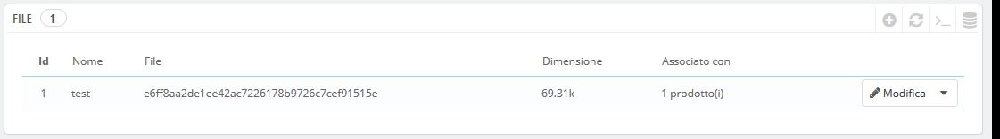
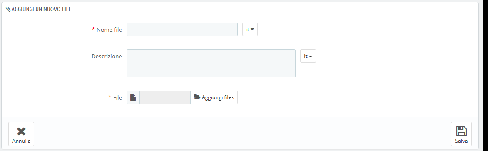

# Gestire i Files

PrestaShop consente mettere a disposizione dei clienti alcuni file prima dell'acquisto.

I file non sono più chiamati "Allegati" in PrestaShop 1.7

Quello che noi chiamiamo "File" in PrestaShop 1.7 è stato nominato "Allegati" nelle versioni precedenti. Il nome è diverso ma funziona tutto allo stesso modo!

Ad esempio, supponiamo che vendi elettronica e desideri che i tuoi clienti leggano un documento su come funziona un prodotto. È possibile caricare un documento a tale scopo.

Potresti anche disporre del manuale PDF del prodotto e far sì che possa essere scaricato direttamente dalla pagina del prodotto.

Ogni prodotto può avere file che possono essere impostati individualmente nella scheda "Opzioni", in "File allegati". Questa pagina consente di accedere a tutti i file allegati del negozio: se è necessario applicare un file associato a molti prodotti, basterà caricarlo una sola volta.

È inoltre possibile caricare gli allegati singolarmente, prima di associarli ai prodotti dalla pagina "File", dal menu "Catalogo".

Il processo per caricare un nuovo allegato nel negozio è lineare:

1. Clicca sul pulsante "Aggiungi un nuovo file" e apparirà il form.
2. **Nome File**. Dai un nome al file in tutte le lingue necessarie. Verrà mostrato ai tuoi clienti.
3. **Descrizione**. Fornisci una breve descrizione, anche qui in tutte le lingue necessarie.
4. Clicca su "Aggiungi file" per selezionale un file da caricare dal tuo computer.
5. Clicca su "Salva".

Si verrà quindi reindirizzati all'elenco dei file in cui apparirà i file appena caricato ora disponibile per tutti i prodotti, tramite l'opzione "File allegati".

Ora la scheda "Allegati" apparirà nel tuo negozio online e i tuoi clienti potranno scaricare il file.                 

