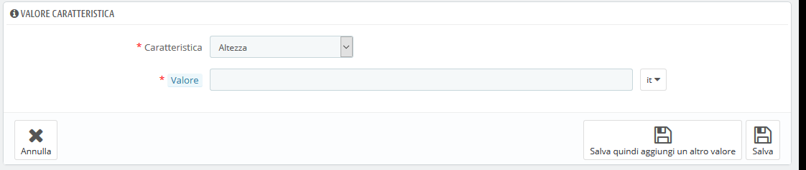

# Gestire le Funzioni Prodotto

Le funzioni sono dettagli intrinsechi di un prodotto: rimangono le stesse per tutte le varianti del prodotto \(o "combinazioni"\).  
Dovresti pensare alle funzioni allo stesso modo in cui pensi agli attributi del prodotto, con la notevole differenza che non è possibile creare varianti di prodotto in base alle funzioni.

La differenza tra un attributo e una funzione dipende dal prodotto stesso. Alcuni prodotti potrebbero condividere la stessa proprietà, una come un attributo creato per modificare le varianti dei prodotti, un'altra semplicemente come caratteristica invariabile.

Ad esempio, un cliente può acquistare una verzione iPad basata sugli attributi \(colore, spazio su disco\), ma non sulle funzioni \(peso, dimensione\).

Allo stesso modo, un altro negozio potrebbe vendere varianti di t-shirt in base agli attributi \(colore, dimensione, sesso\), ma non alle funzioni \(peso\).

Nel tuo negozio, le funzioni vengono visualizzate in una tabella che fornisce ulteriori informazioni sul prodotto; mentre gli attributi consentono di scegliere tra le combinazioni di prodotti.

Le funzionalità sono configurate in base al prodotto, dalla pagina "Prodotto" sotto il menu "Catalogo", ma devono prima essere registrate nel tuo negozio utilizzando lo strumento nella scheda "Funzioni" nella pagina "Attributi & funzionalità" dal menu "Catalogo".

È possibile impostare l'ordine delle funzioni utilizzando le frecce nella colonna "Posizione".

La colonna "Azioni" fornisce la possibilità di modificarle, di eliminarle e di visualizzarle, basta cliccare per visualizzare i valori disponibili di queste funzionalità. È quindi possibile ordinare, modificare ed eliminare i valori se necessario.

## Aggiungere una caratteristica 

Cliccando "Aggiungi nuova caratteristica" apparirà un form molto semplice. Qui puoi nominare le funzioni: per esempio i tipi di cellulari con lettore musicale.  

Nomina questa nuova caratteristica, salva e tornerai all'elenco degli attributi. 

## Aggiungere un valore a una caratteristica 

Clicca su "Aggiungi valore della nuova caratteristica" e apparirà un nuovo form.

Compila il form:

* **Caratteristica**. Dall’elenco a discesa seleziona una delle funzioni disponibili. 
* **Valore**. Dai un valore agli attributi: "5 kg", "27 cm", ecc.

...e salva il tuo futuro valore. Puoi aggiungere più valori per lo stesso tipo di caratteristica salvando le modifiche con il pulsante "Salva e aggiungi un altro valore".

