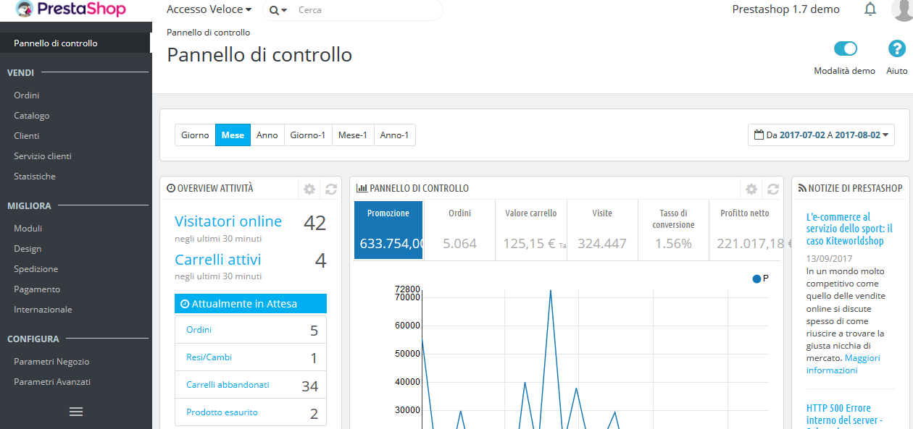

# Gestire il Magazzino

* [ Panoramica Magazzino](panoramica-magazzino.md)
* [ Movimentazioni Magazzino](movimentazioni-magazzino.md)

Puoi gestire il magazzino del tuo negozio utilizzando la pagina "Magazzino", nel menu "Catalogo". Non è richiesta nessuna impostazione per attivare la gestione del magazzino.

La pagina di gestione magazzino è costituita da due schede: "Magazzino" e "Movimentazioni".

Per impostazione predefinita, quando si apre la pagina di gestione magazzino, la scheda "Magazzino" è la quella aperta. All'interno di questa scheda è possibile visualizzare una panoramica delle scorte dei prodotti presenti nel catalogo e gestire le loro quantità. La scheda "Movimentazioni" vi offre una cronologia di tutte le variazioni di quantità.

