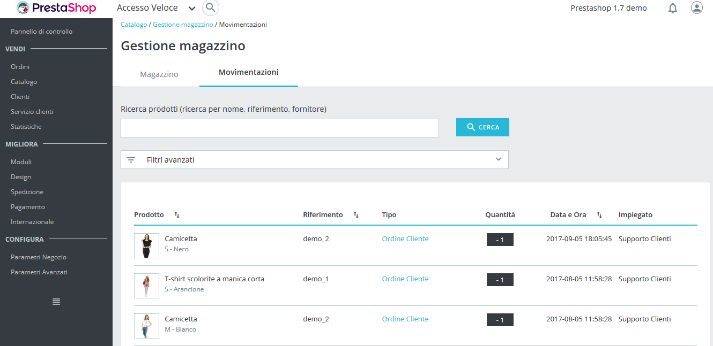
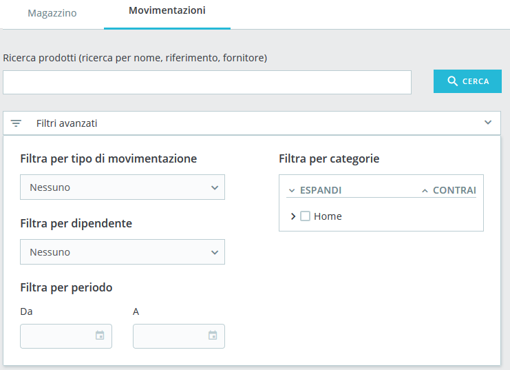

# Movimentazioni Magazzino

La scheda dei movimenti di magazzino fornisce un registro di tutte le modifiche del magazzino. Poiché è una cronologia delle movimentazioni di stock precedenti, questa scheda ha solo un ruolo informativo e pertanto non può essere modificata.

## Panoramica sulle movimentazioni 

### Struttura 

La struttura è simile alla scheda delle scorte, ma qui ogni riga corrisponde a una variazione della quantità fisica di un prodotto o di una combinazione. Contiene le seguenti colonne:

* Miniatura dell'immagine, per facilitare il riconoscimento visivo velocemente.
* Nome del prodotto e quando è una combinazione, i valori dei suoi attributi.
* Riferimento del prodotto. Nel caso in cui una combinazione abbia un proprio riferimento, verrà utilizzato al posto del riferimento principale.
* Tipo di movimento. Rappresenta il motivo per cui la quantità fisica di un prodotto è cambiata.
* Quantità aggiunta o rimossa. Questo delta è formattata con un'etichetta + o - per facilitare il riconoscimento visivo.
* Data e ora, che è l'esatta data del server in cui la modifica è avvenuta.
* Dipendente, che è il nome della persona responsabile della modifica.

Per impostazione predefinita, i movimenti di magazzino sono ordinati in base alla data di scadenza, in modo che quelli più recenti siano in cima.

### Tipi di movimentazioni di magazzino 

A partire dalla versione 1.7.2.0, possono essere creati tre tipi di movimenti quando si verificano i seguenti eventi:

* Edizione manuale da parte di un dipendente, ad esempio se si modifica la quantità di prodotto all'interno della tabella di magazzino.
* Ordine del cliente, quando un ordine passa da uno stato equivalente al 'non spedito' ad un altro stato equivalente allo 'spedito' \(e viceversa\). Ad esempio, quando spedisci un ordine in preparazione, questo creerà un movimento delle scorte, poiché la quantità fisica degli articoli spediti lascia letteralmente il tuo magazzino.
* Prodotti restituiti, quando ricarichi gli stock di un prodotto dopo aver ricevuto e accettato il reso merce.

Negli ultimi due casi, il tipo di movimento nella scheda diventa un collegamento ipertestuale all'ordine cliente corrispondente, pertanto puoi vedere i dettagli di questo tipo di movimento e non devi controllare i timbri temporali tra i movimenti di magazzino e le schede degli ordini.

## Cerca e filtra le opzioni 

### Barra di Ricerca 

Vedi [sopra](http://doc.prestashop.com/display/PS17/Movimentazioni+Magazzino). La ricerca ha esattamente lo stesso comportamento della scheda “Magazzino”.

### Filtri avanzati 

Nella scheda "Movimenti" i filtri avanzati contengono:

* un filtro di tipo di movimentazione, che consente, ad esempio, di cercare i movimenti di magazzino relativi agli ordini dei clienti.
* un filtro per dipendente.

