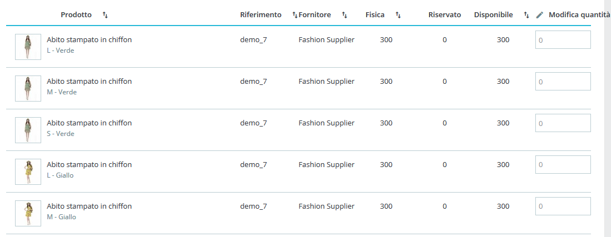
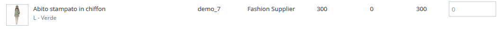
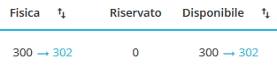
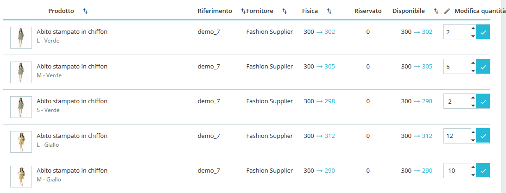
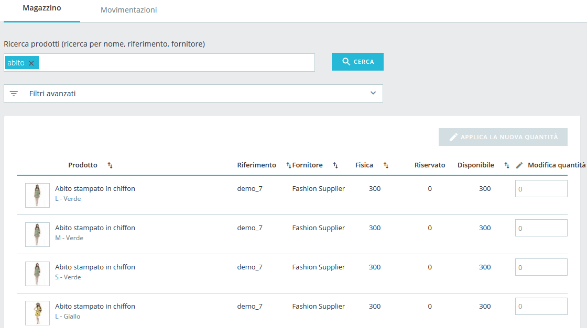
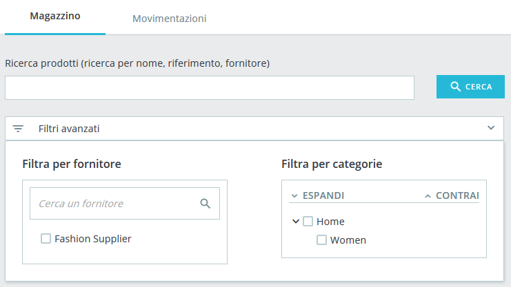
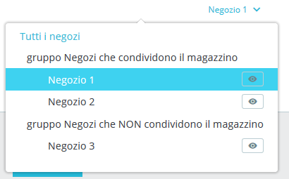

# Panoramica Magazzino

Questa scheda contiene una tabella che presenta le scorte dei prodotti, le opzioni di ricerca e consente di modificare direttamente le quantità dei tuoi prodotti.

Una tabella consente di avere una panoramica del tuo stock di catalogo in un colpo d'occhio.

Ogni riga rappresenta un prodotto \(standard, virtuale, bundle\) o una delle sue combinazioni. L'unica differenza è che gli attributi di combinazione vengono mostrati appena sotto il nome del prodotto.

La tabella contiene le seguenti colonne:

* Miniatura dell'immagine, per facilitare il riconoscimento visivo veloce.
* Nome del prodotto e quando è una combinazione, i valori dei suoi attributi.
* Riferimento del prodotto. Nel caso in cui una combinazione abbia un proprio riferimento, verrà utilizzato al posto del riferimento principale.
* Fornitore. Se vengono assegnati diversi fornitori a un prodotto, qui verrà mostrato solo il fornitore predefinito.
* **Stock fisico**, che rappresenta la quantità effettivamente presente nel tuo negozio.
* **Stock riservato**, che rappresenta la quantità di prodotti di un ordine di un cliente aperto che non è ancora stato spedito.
* **Stock disponibile**, la quantità disponibile per la vendita.
* Modifica quantità. Questo comando consente di modificare manualmente la quantità. Vedi [sotto](panoramica-magazzino.md#PanoramicaMagazzino-qty_edition).

Comprendere le nozioni di stock fisici, riservati e disponibili

A partire dalla versione 1.7.2.0, PrestaShop introduce tre diverse nozioni di stock, differenti da quelle utilizzate in Advanced Stock Management nelle versioni 1.6.

* **Lo Stock fisico** rappresenta la quantità effettivamente presente nel magazzino. È possibile aggiungere o rimuovere fisicamente i prodotti, ad esempio quando ricevi un ordine di vendita o quando effettui una regolazione dell'inventario.
* **Lo Stock riservato** rappresenta la quantità di un prodotto attualmente in un ordine di un cliente aperto che non è ancora stato spedito. In altri termini questi prodotti sono presenti nel tuo magazzino, ma non sono più disponibili per la vendita. Non è possibile modificare direttamente lo stock riservato. Lo stock riservato dipende solo dagli ordini dei clienti.
* **Lo stock disponibile** è la quantità disponibile per la vendita. A differenza di Advanced Stock Management nella versione 1.6, non è possibile modificare direttamente gli stock disponibili a meno che non si modifichi anche lo stock fisico. Si tratta della quantità visualizzata nella pagina ["Prodotti"](http://doc.prestashop.com/display/PS17/Gestire+Prodotti).

Rapporti tra le stock fisici, riservati e disponibili

In qualsiasi momento, questi 3 stock sono collegati dalla seguente equazione:

_Stock fisico – stock riservato = stock disponibile_

La modifica dello stock fisico influenzerà anche lo stock disponibile e viceversa.

Per impostazione predefinita, i prodotti vengono ordinati diminuendo product\_id, il che significa che il prodotto creato di recente sarà in cima. Se ci sono più di 100 prodotti e combinazioni, la tabella viene impaginata.

### Modifica delle quantità 

Le quantità possono essere modificate direttamente nella scheda "Stock", con il campo di immissione situato nella colonna in basso a destra della tabella di riepilogo stock.

#### Simple edition 

Per modificare il titolo di un singolo prodotto inserisci la quantità desiderata nel campo di immissione. In questo input stai digitando un delta di quantità, il che significa che non è il valore di stock finale desiderato, ma la quantità che stai aggiungendo o rimuovendo. Puoi digitare la quantità da aggiungere o rimuovere \(con un segno meno\) oppure utilizzare le frecce su e giù per regolare la quantità.  

Per convalidare il nuovo magazzino, basta cliccare sul pulsante blu "Verifica" all'interno del campo di immissione o utilizzare il pulsante "Applica nuove quantità" nella parte superiore della tabella di riepilogo stock. 

Durante la modifica della quantità, vedrai una panoramica del risultante stock finale:

Questa funzione è qui per aiutarti a vedere contemporaneamente il punto di partenza, il punto finale e la differenza tra essi prima della convalida. Ricorda che, poiché le azioni fisiche e disponibili sono sempre collegate dall'equazione mostrata in precedenza, verranno modificati entrambi contemporaneamente.

#### Modifica Multipla                                  

Se desideri modificare più quantità contemporaneamente, puoi anche modificare le quantità dei diversi prodotti e poi convalidare tutto con il pulsante "Applica nuova quantità".

###  

### Opzioni di ricerca e filtro 

Nella parte superiore della scheda troverai due funzioni per cercare rapidamente qualsiasi prodotto. La barra di ricerca è stata progettata per i casi in cui si conosce il prodotto che si sta cercando, perché si tiene conto del riferimento, del nome o del fornitore. Mentre i filtri avanzati consentono di navigare più opzioni per ottimizzare la ricerca.

#### Barra di Ricerca 

Essa cerca:

* nome del prodotto
* riferimento del prodotto
* fornitore
* valori di attributi _**\[beta come per 1.7.2.0\]**._ Ciò consente di cercare un valore specifico di un attributo come il colore. Quando digiti 'verde', vedrai tutti i prodotti che condividono questo valore di attributo di colore. È ancora in beta e potrebbe non funzionare con valori di attributo troppo brevi come le taglie: 'S', 'M', 'L'.

#### Filtri Avanzati 

Nella scheda "Stock" i filtri avanzati contengono:

* un filtro fornitore che consente di sfogliare rapidamente i fornitori disponibili e scegliere uno o più.
* un filtro di categoria con un albero espandibile.

## Multi-negozio 

Questo nuovo sistema di gestione delle scorte è compatibile con il multinegozio. Per ovvie ragioni, se si dispone di più negozi all'interno di un gruppo in cui gli stock non sono condivisi, non è possibile gestire il proprio magazzino in un contesto " multinegozio" o "gruppo". Se si tenta di farlo, verrà mostrato il seguente messaggio di errore:

Devi invece scegliere un negozio in cui è possibile lavorare per modificare il suo magazzino.

Se stai usando un gruppo di negozi che condividono le stesse quantità, dovrai anche selezionare un contesto di negozio unico al posto di un gruppo, ma ogni modifica che fai in un negozio interesserà anche gli altri negozi.

