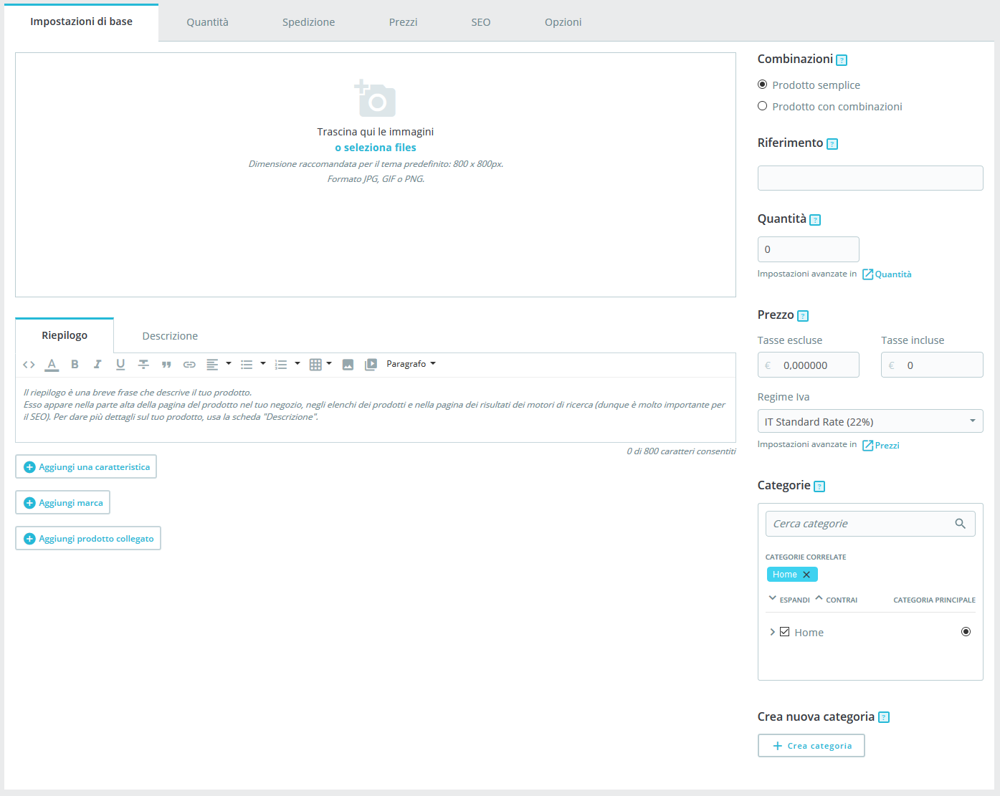
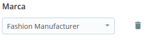

# Gestire Prodotti

Puoi gestire i prodotti del tuo negozio usando la pagina “Prodotti” nel menu “Catalogo”.

Sezioni in questo capitolo:

* [Introduzione alla pagina prodotti](gestire-prodotti.md#GestireProdotti-Introduzioneallapaginaprodotti)
* [Creare un prodotto](gestire-prodotti.md#GestireProdotti-Creareunprodotto)
* [Creare un prodotto con combinazioni ](gestire-prodotti.md#GestireProdotti-Creareunprodottoconcombinazioni)
* [Creare un prodotto virtuale  ](gestire-prodotti.md#GestireProdotti-Creareunprodottovirtuale)
* [Creare un pacco di prodotti](gestire-prodotti.md#GestireProdotti-Creareunpaccodiprodotti)

## Introduzione alla pagina prodotti 

Per creare un nuovo prodotto, dalla pagina “Catalogo” clicca su "Nuovo prodotto" (o clicca su CTRL + P): si aprirà quella che è chiamata pagina prodotto per creare prodotti o modificare quelli esistenti.

### Schede 

In PrestaShop 1.7, la pagina prodotti è organizzata in schede:

* **Impostazioni di base**: contiene tutto ciò che serve per creare un prodotto in modo rapido e semplice. Se però devi aggiungere ulteriori dettagli al tuo prodotto, dai un'occhiata alle altre schede.
* &#x20;**Quantità**, **Combinazioni** o **Prodotti Virtuali**: definisci le quantità di prodotto e le altre opzioni relative alle scorte. Quando il prodotto presenta combinazioni, la scheda verrà rinominata Combinazioni. Qui gestisci tutte le tue combinazioni. Se si dispone di un prodotto virtuale è qui che carichi il file associato, se presente.
* &#x20;**Spedizione**: fornisci dettagli che possono influenzare la consegna del prodotto.
* &#x20;**Prezzi**: perfeziona i prezzi con prezzi specifici o prezzo per unità (tra le altre opzioni di prezzo).
* &#x20;**SEO**: gestisci le descrizione e gli URL dei prodotti accertandoti che siano ottimizzati per i motori di ricerca
* &#x20;**Opzioni**: funzioni addizionali per gestire la visibilità del prodotto, specifiche referenze, file allegati e fornitori. È sempre qui che puoi personalizzare i prodotti.&#x20;

### Nome Prodotto 

Il primo campo da compilare è il nome del prodotto che apparirà nei risultati del motore di ricerca e nell'apposito URL del prodotto. Accanto al campo è disponibile un selettore di lingua che consente di scegliere la lingua in cui si desidera modificare o creare il prodotto.

**Devi** dare al prodotto un nome almeno nella lingua predefinita prima di poterlo salvare. Non potrai salvare fino a quando non gli avrai dato un nome.

Assicurati di tradurre ogni campo in ogni lingua che il tuo negozio supporta. Per fare ciò, clicca sul selettore di lingua accanto al campo del tipo di prodotto e scegli la lingua in cui desideri modificare il prodott

### Tipo di prodotto 

Questa seconda opzione è essenziale: indica se il prodotto è un pacchetto (una combinazione di almeno due prodotti esistenti), un prodotto virtuale (file scaricabile, servizio, ecc.) o semplicemente un prodotto classico inviato via posta. Per ora esploreremo esclusivamente il prodotto standard senza combinazioni e ci occuperemo di prodotti con combinazioni, pacchi e prodotti virtuali nelle apposite sezioni di questo capitolo.

### Language 

### Lingua 

Potresti aver attivato diverse lingue nel tuo negozio per vendere in più Paesi. Se desideri collaborare con i tuoi clienti all'estero, tutti i tuoi contenuti (descrizione prodotti, didascalie, ecc.) devono essere tradotti in queste lingue.

Per tradurre il contenuto del prodotto in un'altra lingua, seleziona la lingua in cui desideri lavorare accanto al selettore prodotti. La pagina del prodotto si aggiornerà con il contenuto disponibile nella lingua selezionata. È possibile passare da una lingua all'altra senza dover salvare il lavoro nel mentre. Accertati di modificare il contenuto nella lingua giusta.

Per impostazione predefinita, la pagina del prodotto mostrerà i contenuti nella lingua predefinita del negozio.

Per aggiungere nuove lingue al tuo negozio, vai alla sezione Internazionale. Puoi aggiungere solo una lingua in "Traduzioni" oppure aggiungere un pacchetto di localizzazione in "Localizzazione". Ulteriori informazioni si trovano nella [sezione internazionale della documentazione](http://doc.prestashop.com/display/PS17/Diventare+Internazionali).

### Pulsanti globali 

*
  *
    *
      *
        *
          * **Vendite**. Ti reindirizza alla pagina "Dettagli del prodotto" del pannello delle statistiche (menu "Statistiche"), che fornisce un grafico sia delle visite della pagina di quel prodotto che delle sue vendite
          * **Elenco prodotti**. _Novità di PrestaShop 1.7_. Mostra l’elenco di tutti i prodotti per consentirti una veloce navigazione da un prodotto a un altro.
          * **Aiuto**. Apre il supporto contestuale in una colonna con la pagina della Guida per l’Utente corrispondente alla pagina prodotto.&#x20;

In fondo alla pagina sono disponibili diverse azioni:

* **Elimina** (icona cestino). Rimuove tutti i dati del prodotto corrente e lo elimina, incluse le immagini, le combinazioni, le funzioni, ecc.
* **Anteprima**. Mostra la pagina del front office del tuo prodotto. È molto utile, perché funziona anche se il prodotto è disattivato.
* **Online / Offline**. È qui che attivi o disattivi il prodotto. Per impostazione predefinita è disabilitato, in modo che i tuoi clienti non posanno vederlo nel tuo negozio.
*   **Duplica**. Salva il prodotto corrente, quindi crea una copia esatta del prodotto e ti porta alla nuova pagina prodotto. È molto utile quando si desidera utilizzare i dati del prodotto corrente come modello per un altro prodotto senza inserire manualmente tutti i dati del nuovo prodotto. Ad esempio, due prodotti potrebbero essere molto diversi, ma potrebbero condividere le stesse associazioni, corrieri o impostazioni fornitore.

    Non sopra duplicare!

    Se è necessario creare diverse versioni dello stesso prodotto, per la varietà di colori, capacità, dimensioni, ecc., occorre creare una combinazione di prodotti piuttosto che duplicarlo X volte. Vedi l'opzione "Combinazioni" nella scheda "Impostazioni di base", spiegata nella sezione "Creazione di un prodotto con combinazioni" di questo capitolo.
* **Vai al catalogo** Consente di salvare tutte le modifiche apportate, qualsiasi dato del prodotto e ti riporta all'elenco dei prodotti.
* **Aggiungi nuovo prodotto**. Salva qualsiasi modifica apportata a qualsiasi dato del prodotto e apre una nuova pagina per creare un nuovo prodotto.
* **Salva**. Consente di salvare tutte le modifiche apportate a uno qualsiasi dei dati del prodotto e conservarli nella relativa scheda. Particolarmente utile quando si desidera cambiare le schede senza perdere le modifiche di quella corrente o accertarsi che le modifiche vengono applicate immediatamente.

Tasti rapidi

Alcuni tasti di scelta rapida sono stati introdotti con PrestaShop 1.7 per aiutarti a risparmiare tempo quando crei diversi prodotti nella stessa riga. Il comportamento è lo stesso descritto sopra e funziona per le seguenti opzioni:

* Vai al catalogo: CTRL+Q
* Salva: CTRL+S
* Aggiungi nuovo prodotto: CTRL+P
* Duplica: CTRL+D

## Creare un prodotto 

La pagina prodotto, che è stata ridisegnata in PrestaShop 1.7, rende più semplice creare un prodotto grazie alle schede avanzate.

### Impostazioni di base 

La scheda "Impostazioni di base" fornisce le opzioni principali necessarie per creare un prodotto di base: in pochi click sarai in grado di creare un nuovo prodotto. Da lì puoi anche consultare le altre schede per aggiungere ulteriori dettagli al tuo prodotto.

#### Immagini 

La sezione immagini si trova nella parte superiore sinistra della scheda "Impostazioni di base". Dovresti caricare tutte le immagini del prodotto, comprese tutte le sue combinazioni (colore, dimensione, forma, ecc.).

**Per aggiungere una o più immagini al prodotto**:

Trascina e rilascia le tue immagini direttamente dalla tua cartella o clicca su "seleziona i file" (o in qualsiasi punto della sezione dell’immagine) per aprire la cartella delle tue immagini. È possibile selezionare le immagini necessarie tenendo premuto il tasto Ctrl durante la selezione dei file oppure è possibile selezionarne una per volta. La dimensione massima predefinita di un file immagine viene impostata da PrestaShop in base alle impostazioni PHP del server. Questa dimensione può essere ridotta nella pagina preferenze “Immagini” nella sezione “Immagini Prodotto”. &#x20;

**Immagine di copertina**

Le immagini caricate vengono visualizzate come anteprime. La prima sarà quella predefinita/copertina del prodotto che apparirà automaticamente anche nella pagina del tuo negozio.

È possibile modificare l'immagine di copertina cliccando sulla miniatura dell'immagine: appariranno le impostazioni per quella immagine. Lì è possibile controllare o deselezionare l'opzione "Copertina" per scegliere se usarla come cover o meno.

**Zoom e Didascalia**

Quando si clicca su "Zoom", l'immagine appare nel suo formato reale, nel caso in cui si desidera esaminarla più da vicino.

Ogni immagine può avere una didascalia: utilizzala per descrivere brevemente l'immagine (e il prodotto). Se usi più lingue, non dimenticare di tradurla!

**Ordinare le Immagini**

Una volta caricate tutte le immagini del prodotto, puoi modificare l'ordine trascinando ogni immagine. Puoi anche aggiungere altre immagini cliccando sull'icona "+".

#### Riepilogo e Descrizione 

Descrivere bene il tuo prodotto è essenziale sia per il cliente (più informazioni ci sono meglio è) sia per i motori di ricerca (aiuterà il tuo negozio a comparire in più risultati di ricerca).

Nella parte inferiore dello schermo, i due campi di descrizione hanno ciascuno scopi diversi:

* Il **campo** **"Riepilogo"** consente di scrivere una breve descrizione che verrà mostrata nei motori di ricerca e nella descrizione del prodotto.\
  &#x20;Questo campo è limitato a 400 caratteri per impostazione predefinita: se superi tale limite, PrestaShop ti avviserà con un messaggio in rosso sotto il campo. Puoi modificare tale limite nella pagina delle preferenze "Prodotti", dove troverai l'opzione "Massima dimensione riepilogo prodotti".
* Il **campo** **"Descrizione”** consente di scrivere una descrizione completa del prodotto che verrà visualizzata direttamente nella pagina del prodotto. L'editor di testo offre una vasta gamma di opzioni per creare descrizioni visivamente attraenti (carattere, dimensione, colore del testo, ecc.). Questo secondo campo non ha limiti, ma meglio non eccedere e fornire le informazioni essenziali in modo convincente.

####  

#### Funzioni 

Sotto le descrizioni dei prodotti, puoi scegliere diverse opzioni. L'opzione "Aggiungi una caratteristica" serve a specificare le caratteristiche dei tuoi prodotti (es. peso, materiale, Paese di origine, ecc.).

Quando crei funzioni e valori (es. maglie in lana e materiali in microfibra), li assegni ai prodotti ove necessario. Non c’è quindi bisogno di compilare i campi delle funzioni per ciascuno dei tuoi prodotti, ma semplicemente compilare i valori necessari e applicarli in un secondo momento.

Tieni presente che **differentemente dalle combinazioni**, **questi valori non cambiano e valgono per il prodotto generico** (vale a dire: tutte le tue combinazioni condivideranno le stesse caratteristiche).

**Aggiungere una funzione**

Prima di aggiungere una funzione a un prodotto devi crearla per un uso generale del tuo negozio. Dovresti andare alla pagina "Attributi & funzioni" nel menu "Catalogo".

Le funzioni e la creazione dei relativi valori sono spiegate nel dettaglio nella pagina [dedicata nella guida utente](http://doc.prestashop.com/display/PS17/Gestire+le+Funzioni+Prodotto).

**Assegnare un valore a una funzione**

Supponiamo che hai già impostato tutte le tue funzioni e i relativi valori.

Quando clicchi su "Aggiungi una funzione", visualizzi un menu a discesa che elenca tutte le funzioni del tuo negozio. Seleziona quella da aggiungere. Successivamente, è possibile assegnare uno dei valori predefiniti (come impostato durante la creazione della funzione) se disponibile o impostare manualmente un valore nel campo "valore personalizzato".

Se non è disponibile alcun valore per una funzione si visualizzrà il messaggio "Nessun risultato trovato".

Se scegli di utilizzare un valore personalizzato, non dimenticare di impostarlo per ogni lingua che il tuo negozio supporta. Utilizza il selettore di codice di lingua nella parte superiore della pagina per modificarla.

Se sono disponibili valori predefiniti, verranno visualizzati in un elenco a discesa. Basta cliccare su di esso e scegliere il valore corretto.

Una volta impostate tutte le funzioni pertinenti, salva per visualizzare immediatamente le modifiche nel front office.

Ricorda: se una funzione non ha alcun valore assegnato, non verrà presa in considerazione per quel prodotto e non sarà visibile sul tuo negozio.

#### Marca 

Nello stesso modo in cui puoi aggiungere una funzione, puoi aggiungere una marca. Clicca su "Aggiungi una marcha" e scegli una marca dal menu a discesa.

Se il marchio desiderato non è disponibile nel menu a discesa, vai alla pagina "Marchi & fornitori" per creare una nuova marca.

Un prodotto può essere associato solo ad una marca.\

#### Prodotto correlato 

Il campo "Aggiungi un prodotto correlato" consente di scegliere i prodotti pertinenti da associare a quel prodotto e li mostra ai clienti quando visitano la pagina del prodotto (se il tema lo supporta). Clicca su "Aggiungi un prodotto collegato", digita le prime lettere del prodotto e selezionalo. Il prodotto viene quindi aggiunto in fondo al campo.

Puoi associare un prodotto a quanti altri prodotti ritieni necessari. Clicca sull'icona del cestino per eliminare l'associazione dei prodotti.

Un'associazione va in una sola direzione: il prodotto associato non presenta un'associazione con il prodotto corrente nella sua pagina impostazioni.

#### Combinazioni 

Spesso venderai lo stesso prodotto in diverse versioni: condividono lo stesso nome, ma potrebbero differire per il colore, per la capacità, per la dimensione dello schermo e per altri attributi. Nella maggior parte dei casi questi attributi si uniscono: si potrebbe avere la versione rossa del prodotto disponibile con capacità di 1 Gb o 2 Gb oppure uno schermo 12 '' o 15 ''. È per questo che PrestaShop chiama queste versioni "combinazioni": il tuo stock di prodotti può essere composto da diverse varianti di un singolo prodotto, che in effetti sono semplicemente i suoi attributi combinati in modi specifici.

Se hai bisogno di combinazioni per il tuo prodotto, seleziona "Prodotto con combinazioni". La scheda "Quantità" della pagina del prodotto verrà rinominata "Combinazioni" e ti permetterà di creare le tue combinazioni.

Non è possibile creare combinazioni se non si dispone già degli attributi di prodotto impostati correttamente in PrestaShop. Inoltre, non dovresti creare una combinazione per funzioni che i tuoi clienti non possono di scegliere.

La creazione di attributi si effettua tramite la pagina "Attributi & Funzioni" dal menu "Catalogo" ed è spiegata in dettaglio [nel relativo capitolo della documentazione](http://doc.prestashop.com/display/PS17/Gestire+gli+Attributi+dei+Prodotti)

Per scoprire di più sulle Combinazioni, leggi la [sezione dedicata alla fine di questo capitolo](gestire-prodotti.md#GestireProdotti-Combinazioni1).

#### Quantità 

Indica quanti prodotti sono disponibili per la vendita.

Questa opzione non verrà visualizzata se si sta creando un prodotto con combinazioni: le quantità per le combinazioni vengono gestite nella scheda "Combinazioni", in quanto ogni combinazione può avere un valore diverso.

Altre opzioni di quantità sono disponibili nella scheda "Quantità".

#### Prezzo 

Definisci a quanto vuoi vendere un prodotto.

* **Prezzo – Tasse escluse**. È qui che devi impostare tuo prezzo, indipendentemente dal calcolo dalle tasse e dagli altri prezzi.
* **Prezzo – Tasse incluse.** Mostra il prezzo del prodotto con le tasse incluse. Puoi modificare il valore e si aggiornerà automaticamente il campo "Tasse escluse" in base alla regola fiscale che hai scelto.
* **Regole fiscali**. La tassa applicabile al prodotto. Scegli tra le diverse imposte che hai registrato. Quando cambia la regola fiscale, il prezzo cambia di conseguenza.

Altre opzioni di prezzo sono disponibili nella scheda "Prezzi". Se si modifica il prezzo nelle "Impostazioni di base" o nella scheda "Prezzi" è uguale, poiché le schede sono sincronizzate.

Le regole fiscali possono essere gestite nel menu "Internazionale", nella pagina "Imposte".

#### Categorie 

La sezione "Categorie" consente di scegliere in quale categoria deve apparire il prodotto. Puoi selezionarne più di una, ma tieni presente che è meglio per il cliente che la categoria contienga solo prodotti equivalenti e comparabili. Pertanto, si dovrebbe evitare di selezionare categorie radice e preferire categorie secondarie.

Ad esempio, la categoria "telefono" può contenere sotto categorie di "marche" (Apple, Samsung, HTC, ecc.) così come "caratteristiche" (dual sim, Android, ecc.). Sta a te indicare la categoria più utile ai tuoi clienti.

**Associare categorie esistenti**

Per associare una categoria al prodotto, puoi utilizzare la barra di ricerca oppure espandere l'elenco delle categorie e selezionare ciò che desideri associare.

**Utilizzando la barra di ricerca**. Digita le prime lettere della categoria e la barra mostrerà tutte le categorie corrispondenti e il percorso per accedervi. Scegli la categoria e clicca su di essa. Sarà mostrata nella sezione "Categorie associate".

**Utilizzando l'elenco delle categorie**. Cliccando su "Espandi", vedrai l'albero di categoria e da lì potrai selezionare le categorie da associare.

Nell'elenco delle categorie associate, passando con il mouse su una categoria specifica, vedrai il percorso che porta alla categoria. Può essere utile se hai più categorie con lo stesso nome (come "Scarpe" che può essere sottocategoria sia di "Bambini" che di donne "Donna")

**Categoria principale**

Il selettore "categoria principale" è utile quando un articolo viene salvato in diverse categorie. Serve principalmente per chiarire quale categoria deve essere utilizzata nel caso in cui il tuo cliente arrivi sul tuo sito da un motore di ricerca, poiché il nome della categoria apparirà nell'URL del prodotto.

**Creare una nuova categoria**

Se ritieni necessario aggiungere una categoria, salva lo stato attuale del prodotto prima di cliccare sul pulsante "Crea nuova categoria".

Cliccando su "Crea una categoria" verranno visualizzate le opzioni di categoria. Compila il nome della categoria e seleziona la categoria genitore. Cliccando su Crea, verrà creata la nuova categoria e verrà associata automaticamente al prodotto.

Non dimenticare di passare alla pagina "Categorie" per completare i dettagli di questa nuova categoria. Per ulteriori informazioni sulle categorie [vai alla relativa sezione della documentazione](http://doc.prestashop.com/display/PS17/Gestire+Categorie).

&#x20;La nuova categoria non apparirà automaticamente nel menu del negozio. Per visualizzarlo, è necessario modificare il menu con il modulo "Menu principale" (se si utilizza il tema predefinito) o qualsiasi modulo personalizzato di gestione menu.

\
A questo punto hai inserito le informazioni essenziali per una pagina base prodotto. Salva. Per renderlo immediatamente disponibile e in vendita, clicca su "Offline": il suo stato cambierà in "Online" e sarà visibile sul tuo negozio.

Tuttavia, dovresti continuare a leggere, poiché ci sono molti altri dettagli che puoi aggiungere al tuo prodotto per renderlo più attraente per i clienti!

### **Quantità** 

Le quantità di prodotto vengono gestite in una singola scheda. PrestaShop le utilizzerà per determinare quando un prodotto è esaurito o non più disponibile.

#### Prodotto Standard 

Per un prodotto standard ci sono solo due campi:

* **Quantità.** Definisce quanti prodotti sono in vendita. È lo stesso valore di quello in "Impostazioni di base".
* **Quantità minima per la vendita**. Potresti preferire che un prodotto venga venduto solo dopo aver raggiunto una quantità minima di ordini. Utilizza questo campo per impostare il numero di articoli minimo per la vendita. Il cliente sarà in grado di acquistare questo prodotto solo quando si raggiunge questa quantità minima.

#### Prodotti con Combinazioni 

Il modo in cui funziona è abbastanza facile: la pagina presenta una tabella con tutte le combinazioni del prodotto (se non esistono combinazioni la tabella ha semplicemente una singola riga). Spetta a te impostare la scorta di tutte le combinazioni.

Per ulteriori informazioni sulle combinazioni di prodotti [leggi la relativa sezione al fondo della pagina.](gestire-prodotti.md#GestireProdotti-Combinazioni1)&#x20;

Pacchi e prodotti virtuali presentano impostazioni differenti, troverai ciò che ti serve al fondo di questo capitolo.&#x20;

#### **Preferenze di disponibilità**  

**Comportamento esaurito**

L'opzione "Comportamento quando esaurito" consente di impostare il comportamento PrestaShop quando il prodotto è esaurito:

* Rifiuta gli ordini (il prodotto non è più disponibile per la vendita).
* Accetta gli ordini (in sostanza, si sta facendo pre-vendita).
* Usa comportamento predefinito (rifiuta gli ordini). Questa terza opzione di default e semplice utilizza l'impostazione predefinita globale (menu "Preferenze", pagina "Prodotti", sezione "Scorte Prodotto", opzione "Consenti ordini di prodotti esauriti").

**Etichette **

* **Etichetta contrassegna quando disponibile**. Consente di mostrare un messaggio ai visitatori quando il prodotto è in magazzino, ad esempio "Articolo disponibile". Li rassicura che il tuo negozio può immediatamente inviare loro il prodotto.
* **Etichetta quando non è disponibile (ed è consentita la prenotazione)**. Consente di mostrare un messaggio ai tuoi visitatori quando il prodotto è esaurito, ma si può ordinare (come impostato con "Quando esaurito"), ad esempio "Prenotalo ora!". Rassicura i clienti che il tuo negozio invierà loro immediatamente i prodotti che sono in magazzino.
* **Data disponibilità**. Indica quando il prodotto sarà nuovamente in magazzino.

Puoi anche configurare le impostazioni generali applicate a tutti i tuoi prodotti: l'opzione predefinita è quella di rifiutare gli ordini, ma può essere modificato nella sezione "Impostazione prodotti" nella sezione "Parametri del negozio" ("Consenti l'ordine di articoli non in magazzino").

### **Spedizione** 

La scheda "Spedizione" ti consente di fornire alcuni dettagli preziosi sull’imballaggio del tuo prodotto. Non è disponibile nel caso di un prodotto virtuale.

* **Dimensioni imballo (larghezza, altezza, profondità, peso).** Dovresti cercare di riempire ogni campo, poiché conoscere la dimensione e il peso esatti di un imballaggio non è solo utile per te, ma PrestaShop può anche dirigere automaticamente determinati formati/pesi a corrieri in base a queste impostazioni. Il prezzo finale dell'ordine apparirà al cliente una volta che PrestaShop (o il cliente) selezionerà un corriere.

I valori utilizzano le unità predefinite di peso, volume, distanza e dimensioni, come specificato nella pagina "Localizzazione" del menu "Localizzazione".

I valori non devono essere interi. Se i tuoi prodotti hanno peso inferiore a 1 kilo, puoi semplicemente utilizzare un punto (.) per indicare le frazioni:

* 123 kg
* 1.23 kg
* 0.23 kg
* ecc.
* **Spese di spedizione** (**Spese di spedizione addizionali**). Può risultare molto utile per prodotti specifici particolarmente difficili da imballare o molto pesanti.
* **Corrieri disponibili**. Puoi scegliere se spedire il prodotto solo con alcuni corrieri selezionati. Se non è selezionato nessun corriere, saranno disponibili tutti i corrieri per gli ordini dei clienti.

### **Prezzi**  

La scheda prezzi consente di perfezionare la tua strategia di prezzi, utilizzando i prezzi alternativi (prezzo per unità) o creando alcune regole di prezzo specifiche per il prodotto.

#### **Prezzo al Dettaglio**  

ll prezzo del tuo prodotto senza tasse.

* **Prezzo – tasse escluse**. È qui che puoi impostare un prezzo arbitrario, indipendente da altri calcoli e dai prezzi regolari. Lascia "0" in questo campo per utilizzare il prezzo predefinito.
* &#x20;**Prezzo - tasse incluse**. Mostra il prezzo del prodotto incluse tasse. Puoi modificare il valore, si aggiornerà automaticamente il campo "Prezzo al dettaglio ante imposte" in base alla regola fiscale che hai scelto.
* &#x20;**Prezzo per unità** (**tasse escl**.). Il prezzo unitario del prodotto al momento della somma per scopi di valutazione.
* &#x20;**Regole fiscali**. La tassa applicabile al prodotto. Scegli tra le diverse imposte che hai registrato. Se desideri apportare modifiche, un collegamento ti reindirizzerà alla pagina delle regole fiscali. [Scopri di più riguardo le regole fiscali in questa sezione](http://doc.prestashop.com/display/PS17/Regole+Fiscali).
* &#x20;**Visualizza la bandiera "In promozione!" sulla pagina del prodotto e nel testo dell'elenco dei prodotti**. Seleziona questa casella per mostrare che il prodotto è in promozione, sia nella pagina del prodotto che nel testo nell'elenco dei prodotti. L'icona "In promozione" apparirà sotto al prodotto. È possibile modificare questo logo tramite il seguente file: `themes/default/img/onsale_en.gif`
* &#x20;**Prezzo finale al dettaglio**. Questo prezzo, compreso lo sconto, verrà aggiornato durante la digitazione.

Puoi compilare il campo "Prezzo tasse escluse" e scegliere la tassa da applicare e il campo calcolerà automaticamente il prezzo al dettaglio con le tasse. È disponibile anche l'operazione opposta.

**Prezzo di costo**&#x20;

Inserisci il prezzo in cui hai pagato il prodotto (quanto ti costa comprare o realizzare quel prodotto), ti permetterà di confrontarlo con il prezzo di vendita per calcolare facilmente il tuo profitto.

Il prezzo di costo dovrebbe essere inferiore al tuo prezzo al dettaglio.

#### Prezzi Specifici: Gestire Sconti 

Puoi cambiare il prezzo totale del prodotto a seconda della quantità di prodotti acquistati dal cliente, del gruppo di utenti, del Paese, ecc. Si fa attraverso la sezione "Prezzi specifici" nella scheda "Prezzi". Clicca sul pulsante "Aggiungi un prezzo specifico" per il form di creazione:

Questo è un modo molto semplice per creare un prezzo scontato per questo prodotto (e tutte le sue combinazioni).

* **Per**. Consente di essere molto specifici sui gruppi a cui si applica questo prezzo, comprese le valute, i Paesi e anche i gruppi di clienti (di cui parleremo nel prossimo capitolo).
* &#x20;**Cliente**. Puoi scegliere di essere ancora più specifico e impostare direttamente a chi si applica lo sconto che stai creando. Inizia a digitare le prime lettere del nome o del cognome del clienti e selezionare quello/i desiderato/i.
* &#x20;**Combinazioni**. Puoi scegliere di applicare un prezzo specifico a tutte le combinazioni del prodotto o solo una. Se si desidera applicare a più di una combinazione ma non a tutte, è necessario creare un prezzo specifico per ciascuna combinazione.
* &#x20;**Disponibile da/a**. Qui è possibile definire una serie di date nelle quali lo sconto è attivo. Cliccando su ciascun selettore verrà aperto un calendario, semplificando il processo.
* &#x20;**A partire da \[] unità**. Contiene il valore da cui deve essere applicato lo sconto. Il valore predefinito è "1", ovvero qualsiasi quantità. Se hai selezionato una combinazione a cui si applica il prezzo specifico e se definisci più di un'unità, il cliente dovrà acquistare una determinata quantità di questa combinazione per beneficiare dello sconto.
* &#x20;**Prezzo del prodotto** (**tasse escl**.). È qui che puoi impostare un prezzo arbitrario, indipendente dai calcoli e dai prezzi regolari che supererà il prezzo al dettaglio. Per abilitare questo campo, devi prima cliccare su "Lascia il prezzo iniziale".
* &#x20;**Lascia il prezzo iniziale**. Seleziona questa casella per ripristinare il campo "Prezzo del prodotto" e impedire le modifiche.
* &#x20;**Applica uno sconto di**. Utilizza il selettore per impostare il tipo di sconto (un importo specifico nella valuta predefinita o una percentuale del prezzo predefinito). Sulla scheda del prodotto, il prezzo iniziale apparirà crocettato vicino al prezzo scontato.\

Una volta che hai scelto i tuoi valori, clicca su "Applica": il riepilogo delle impostazioni di sconto apparirà sotto. Lo sconto sarà immediatamente visibile nel negozio.

Se desideri eliminare un valore, clicca sull'icona del cestino nella tabella.

Se vuoi costruire sconti più complessi, vai a leggere il menu "Sconti" nella pagina [Gestisci sconti nel capitolo di questa guida.](http://doc.prestashop.com/display/PS17/Gestire+gli+Sconti)

#### **Gestione Priorità** 

Un cliente potrebbe avere a disposizione più prezzi e regole di sconto, anche quando hai impostato prezzi dettagliati e quantità di sconti, con gruppi personalizzati e negozi (se in contesto multinegozio). PrestaShop utilizza quindi un insieme di priorità per applicare una singola regola di prezzo a quel cliente. Ad esempio, puoi decidere che il gruppo prevalga sulla valuta.

È possibile modificare le impostazioni predefinite di PrestaShop usando la sezione "Gestione priorità"

L’ordine di priorità di default è:

1. Negozio (in un contesto multinegozio).
2. Valuta.
3. Nazione.
4. Gruppo.

Una casella in basso ti consente di aggiornare le impostazioni di tutti i prodotti. Se la casella non è selezionata, le modifiche apportate si applicano solo al prodotto corrente.

### **SEO** 

Per migliorare l’elenco di prodotti e aumentare la visibilità del tuo negozio, ti consigliamo di compilare con attenzione i diversi campi SEO: meta titoli, descrizioni, parole chiave e friendly URL.

"SEO" sta per "Search Engine Optimization” (ottimizzazione dei motori di ricerca). Scopri di più su Wikipedia: [https://it.wikipedia.org/wiki/Ottimizzazione\_(motori\_di\_ricerca)](https://it.wikipedia.org/wiki/Ottimizzazione\_\(motori\_di\_ricerca\))

Scopri le migliori pratiche SEO per l'e-commerce! Scarica gratuitamente e leggi la “Guida Completa SEO di PrestaShop": [https://www.prestashop.com/it/risorse/guide/guida-pratica-seo-search-engine-optimisation](https://www.prestashop.com/it/risorse/guide/guida-pratica-seo-search-engine-optimisation)

Pe accedere alle informazioni SEO per i prodotti, vai nella scheda "SEO".

#### Search Engine Optimization (Ottimizzazione per i Motori di Ricerca) 

I campi in questa pagina consentono di ottimizzare direttamente la visibilità del tuo catalogo sui motori di ricerca.

* **Meta Titolo**. Questo è il campo più importante, il titolo che apparirà su tutti i motori di ricerca. Sii molto diretto: devi convincere l'utente nel motore di ricerca a cliccare sul tuo link, non su un altro sito. Assicurati che il titolo sia unico per il prodotto all'interno del tuo sito.
  * Esempio da seguire: "Levi's 501® Original Jeans - Tidal Blue - Original Fit".
  * Esempio da non seguire: "Articolo # 02769869B bestseller".
* **Descrizione**. Una presentazione del prodotto in un paio di righe (idealmente meno di 155 caratteri), destinata a catturare l'interesse di un cliente. Verrà visualizzata nei risultati di alcuni motori di ricerca in corrispondenza delle ricerche degli utenti: un motore di ricerca potrebbe scegliere di visualizzare le parole chiave cercate direttamente nel contesto della pagina. Assicurati che la descrizione sia unica per questo prodotto all'interno del tuo sito.
*   **Friendly URL**. Un altro campo estremamente importante. Permette di riscrivere gli indirizzi web dei tuoi prodotti come desideri. Ad esempio, invece di avere un indirizzo come\
    &#x20;[http://www.myprestashop.prestashop.com/index.php?id\_product=8\&controller=product](http://www.myprestashop.prestashop.com/index.php?id\_product=8\&controller=product)\
    &#x20;puoi impostare:\
    &#x20;[http://www.myprestashop.prestashop.com/8-name-of-the-product.html](http://www.myprestashop.prestashop.com/8-name-of-the-product.html).\
    &#x20;Tutto quello che devi fare è indicare nel campo "Friendly URL" le parole che desideri mostrare, anziché il nome predefinito, separate da trattini.

    Il pulsante "**Reset URL**" rende facile creare un Friendly URL appropriato basato sul nome del prodotto. Una volta generato, è possibile modificare l'URL se necessario.

I Friendly URL funzioneranno solo se è stata attivata la riscrittura dell'URL. Puoi farlo nella sezione delle preferenze di "SEO & URL" (nel menu "Traffico") nella sezione "Imposta URL".

Ulteriori informazioni sulla pagina di preferenza "SEO & URLs" nel [capitolo “Traffico” di questa guida](http://doc.prestashop.com/display/PS17/Traffico).

#### &#x20;Pagina di reindirizzamento 

Quando il tuo prodotto è offline, la sua pagina non sarà disponibile sul tuo negozio. Devi decidere cosa vuoi mostrare ai tuoi visitatori:

* **Nessun reindirizzamento (404).** In questo modo verrà visualizzata una pagina "404 errore – Non trovato".
* &#x20;**Reindirizzamento permanente (301).** Reindirizzerà permanentemente il visitatore ad un'altra pagina prodotto. Quell’URL della pagina prodotto non sarà più indicizzato dai motori di ricerca: sarà sostituito dall'URL della pagina del prodotto scelto in sostituzione. Scegli la pagina del prodotto che desideri mostrare. Ricorda che è permanente, quindi assicurati di non aver più bisogno di questo URL prima di attivare il reindirizzamento 301!
* &#x20;**Reindirizzamento temporaneo (302**). Si tratta di un reindirizzamento temporaneo a un'altra pagina del prodotto. Scegli la pagina del prodotto da visualizzare. I motori di ricerca indicheranno ancora l'URL della pagina del prodotto, in modo da poterlo riutilizzare facilmente in un secondo momento, se riattivi il prodotto, per esempio.

### **Opzioni**  

La scheda "Opzioni" fornisce ulteriori impostazioni per gestire i riferimenti di prodotto, i fornitori, la personalizzazione del prodotto, la visibilità e i file.

#### **Visibilità**  

Puoi scegliere di rendere il prodotto disponibile attraverso diversi canali:

* **Ovunque**. I clienti possono accedere al prodotto navigando nel catalogo, cercando il nome del prodotto o direttamente utilizzando il suo URL.
* &#x20;**Solo catalogo**. I clienti possono accedere al prodotto navigando nel catalogo o utilizzando direttamente l'URL.
* &#x20;**Solo ricerca**. I clienti possono arrivare al prodotto cercando il nome o utilizzando direttamente il suo URL.
* &#x20;**Da nessuna parte**. I clienti possono accedere al prodotto utilizzando solo l’URL. Non lo troveranno navigando nel catalogo o cercando il suo nome. Questo serve per la creazione di prodotti privati, a cui solo pochi visitatori attendibili possono accedere, anche temporaneamente (puoi cambiare questa impostazione in qualsiasi momento).

**Opzioni**. Un paio di specifiche opzioni.

* **Disponibile per l'ordine**. Se deselezioni questa casella i clienti non saranno in grado di aggiungere questo prodotto al proprio carrello. Questo lo rende più simile a una modalità Catalogo singolo prodotto (rispetto alla preferenza "modalità Catalogo").
* &#x20;**Mostra il prezzo**. Se l'opzione "disponibile per l'ordine" non è selezionata, puoi scegliere di visualizzare il prezzo del prodotto (anche se i visitatori non saranno in grado di acquistarlo) oppure scegliere di non visualizzarlo.
* &#x20;**Solo web (non venduto nel tuo negozio).** Se la tua attività commerciale dispone di negozi veri e propri in cui i clienti possono acquistare, questa opzione risulterà preziosa quando un prodotto viene venduto solo online e non in negozio, in modo da impedire ai clienti di controllare online il prezzo del prodotto, quindi recarsi presso il tuo negozio per acquistarlo direttamente, evitando i costi di spedizione.

#### Tag 

I tag sono termini e parole chiave che aiutano i tuoi clienti a trovare facilmente ciò che cercano. Quando useranno la barra di ricerca per esplorare il tuo catalogo, digiteranno alcune parole chiave specifiche. Scegli le parole chiave più pertinenti con il tuo prodotto per assicurarti che il prodotto venga mostrato nei risultati quando un visitatore lo cerca.

Per aggiungere più tag è sufficiente separarli da una virgola. Ad esempio: "piatto, stoviglie, tovaglia".

Tutti i tag possono essere visualizzati nella pagina "Ricerca", nel menu "Parametri del negozio". Ulteriori informazioni sulla gestione dei tag possono essere trovate in questo [capitolo dedicato](http://doc.prestashop.com/display/PS17/Tag).

I tag dei prodotti non sono identici alle parole chiave delle pagine: non hanno alcun impatto diretto sul posizionamento sui motori di ricerca.

#### Condizioni & Referenze 

**Condizione**. Non tutti i negozi vendono nuovi prodotti e alcuni mercati richiedono queste informazioni. Questa opzione consente di indicare le condizioni del prodotto:

* **Nuovo**. Il prodotto è nuovo di zecca, venduto nella sua confezione originale.
* **Usato**. Il prodotto è stato venduto almeno già una volta e probabilmente utilizzato da qualcun altro (seconda mano). Dovrebbe essere venduto nella sua confezione originale, che potrebbe essere chiusa con nastro.
* **Rigenerato.** Il prodotto è stato restituito per vari motivi ("graffi o altre forme di danno cosmetico che non influenzano le prestazioni dell'unità"). Scopri di più su Wikipedia: [https://it.wikipedia.org/wiki/Ricondizionamento](https://it.wikipedia.org/wiki/Ricondizionamento)
* **Codice Referenza**. Questo è il tuo riferimento interno. Potrebbe essere un numero o il relativo riferimento della posizione di archivio, del suo fornitore, o qualsiasi altro aspetto che lo rende unico
* **ISBN.** L'ISBN viene utilizzato a livello internazionale per identificare i libri e le loro varie edizioni. Se i tuoi prodotti sono libri o hanno il diritto di avere un numero ISBN, inseriscilo qui.
* **UPC barcode.** Questo standard per i codici a barre è utilizzato principalmente negli Stati Uniti, Canada, Regno Unito, Australia, Nuova Zelanda.
* **EAN-13 o JAN barcode**. Questi sono i numeri del codice a barre del prodotto, utilizzati in tutto il mondo per identificarlo. È possibile utilizzare un numero EAN-13 o un numero JAN.
  * Il codice EAN-13 è il numero internazionale dell’articolo composto da 13 cifre. Scopri di più su Wikipedia: [https://it.wikipedia.org/wiki/European\_Article\_Number](https://it.wikipedia.org/wiki/European\_Article\_Number)
  * Il codice JAN è specifico del Giappone, ma è anche compatibile con l’internazionale EAN. Scopri di più su Wikipedia: [https://en.wikipedia.org/wiki/International\_Article\_Number#Japanese\_Article\_Number](https://en.wikipedia.org/wiki/International\_Article\_Number#Japanese\_Article\_Number)

#### Personalizzazione 

PrestaShop consente ai tuoi clienti di personalizzare il prodotto da acquistare.

Esempio: sei un rivenditore di gioielli e i tuoi clienti hanno la possibilità di incidere i propri gioielli con un testo o un'immagine. I clienti possono inviare il testo e/o l'immagine quando effettuano il loro ordine.

Il vantaggio di questa funzione è che offre ai tuoi clienti un servizio personale, che senza dubbio apprezzeranno!

Vediamo come configurare questa funzione. Clicca su "Aggiungi un campo di personalizzazione" per indicare quale tipo di contesto (file e/o testo) può essere personalizzato. Puoi aggiungere quanti campi ti servono e metterli a disposizione dei tuoi clienti.

Per ogni campo di personalizzazione hai bisogno di specificare due informazioni:&#x20;

* **Etichetta**. Compilalo con l’etichetta pubblica appropriata: sarà un indicatore per il cliente, quindi sii molto specifico.
* **Tipo**. Indica se desideri che il cliente digiti del testo o fornisca un file. \

Esempio 1: il cliente può personalizzare un copertina del libro, fornendo 3 immagini. Puoi fornire 3 campi di personalizzazione:

| Etichetta                                        | Tipo     |
| ------------------------------------------------ | -------- |
| Copertina frontale (20.95 x 27.31 cm, colore)    | Immagine |
| Copertina nera (20.95 x 27.31 cm, bianco e nero) | Immagine |
| Retro (20.95 x 1.716 cm, colore)                 | Immagine |

Esempio 2: se i clienti possono incidere parole su un prodotto, è possibile utilizzare quanto segue:

| Etichetta                         | Tipo  |
| --------------------------------- | ----- |
| Prima riga (24 caratteri)         | Testo |
| Seconda riga (24 caratteri)       | Testo |
| Ultima riga, firma (16 caratteri) | Testo |

\
Una volta che tutti i campi delle etichette sono stati riempiti, non dimenticare di salvare le modifiche.

**Lato cliente**

Una volta che un prodotto dispone di proprietà personalizzabili impostate, la sua pagina di prodotti front end ha un nuovo blocco, sotto la descrizione: "Personalizzazione del prodotto".

Il cliente deve scegliere i file e/o aggiungere un testo quindi salvarli prima di aggiungere il prodotto nel carrello.

Le immagini e i testi personalizzati verranno visualizzati nel carrello finale.

Il resto del processo di acquisto rimane lo stesso.

**Lato commerciante**

Una volta che l'ordine è stato convalidato dal cliente, il commerciante riceve una notifica dell'ordine nel back office.

Può quindi verificare l'ordine che indica l'immagine e il testo nell'elenco prodotti. Il commerciante deve quindi semplicemente scaricare l'immagine (cliccando sull'immagine nell'ordine) o copiare/incollare il testo e utilizzarle/o nel suo strumento di personalizzazione.

Il resto dell'ordine e del processo di consegna rimane lo stesso.

#### **Allegare file**  

PrestaShop ti consente di rendere disponibili alcuni file ai clienti prima dell'acquisto.

Ad esempio, se vendi elettronica puoi fornire un documento da leggere sul funzionamento di un prodotto. È possibile caricare un documento con questa finalità.

Potresti anche disporre del manuale PDF del prodotto e inserirlo per il download direttamente sulla pagina del prodotto. Il cliente può accedervi anche se non ha acquistato il prodotto.

**File allegati**

Se hai già caricato alcuni file da allegare, vedrai qui l'elenco dei file disponibili collegati al prodotto. Basta selezionare il file che si desidera allegare al prodotto.

**Allegare un nuovo file**

Se non hai ancora allegato alcun file, puoi caricare un file direttamente in questa pagina:

1. Clicca su "Allega un file"
2. &#x20;Clicca su "Sfoglia" per selezionare un file sul computer.
3. &#x20;Compila il titolo del tuo allegato (non deve essere lo stesso del nome del file originale).
4. &#x20;Fornisci una descrizione. Ciò ti aiuterà a distinguere i file caricati con chiarezza e darà ulteriori informazioni ai tuoi clienti.
5. &#x20;Clicca su "Aggiungi".
6. &#x20;L'allegato appare nell'elenco "File Allegati ", già selezionato per indicare che è già stato collegato al prodotto.
7. &#x20;Salva il prodotto.

Una nuova scheda apparirà sulla pagina del prodotto, accanto a "Dettagli del prodotto", in cui i tuoi clienti possono scaricare i file appena caricati.

Se occorre rimuovere un allegato da questa pagina prodotto, deselezionalo nella tabella "File Allegati".

#### **Fornitori**  

Indicare il fornitore del prodotto non è molto importante per i clienti (molto meno del marchio in ogni caso), ma può risultare una parte essenziale della tua gestione interna, non meno importante per la gestione del tuo stock: è necessario sapere da chi hai acquistato il prodotto. Il fornitore del prodotto deve essere impostato dalla sezione "Fornitori" della scheda "Opzioni".

Non puoi utilizzare questa funzionalità se non hai almeno già un fornitore registrato nel tuo negozio. I fornitori vengono creati dalla pagina "Marche & fornitori", sotto il menu "Catalogo".

Il processo completo di registrazione dei fornitori è spiegato nel dettaglio [nel capitolo dedicato in questa guida](http://doc.prestashop.com/display/PS17/Gestire+Fornitori).

Associare il prodotto a uno o più fornitori è veramente facile: basta selezionare la casella corrispondente al fornitore e salvare le modifiche.

**Referenze fornitori**

La sezione fornitori è inoltre dotata di una scheda che consente di impostare il riferimento preciso e il prezzo unitario/la valuta per ogni combinazione di prodotti, per fornitore. Se il prodotto ha più di un fornitore, la scheda mostrerà ciascun fornitore uno dopo l'altro.

Ci sono molte altre opzioni correlate al prodotto nella pagina "Impostazioni prodotto" nel menu "Parametri negozio":

* Numero di giorni per i quali il prodotto è considerato "nuovo".
* Ordine prodotto predefinito.
* Abilita la gestione avanzata del magazzino.
* eccetera.

Verifica che queste impostazioni globali siano come desideri.

## Creare un prodotto con combinazioni  

Per abilitare le combinazioni di prodotti, è necessario prima scegliere l'opzione "Prodotto con combinazioni" dalla scheda "Impostazioni di base". Vedrai che la scheda "Quantità" cambia in "Combinazioni" e qui potrai gestire le combinazioni dei tuoi prodotti.

Non è possibile creare combinazioni per pacchetti di prodotti o prodotti virtuali: è disponibile solo per i prodotti standard.

Non è possibile creare combinazioni se non si dispone già degli attributi di prodotto impostati correttamente in PrestaShop.

Inoltre, non dovresti creare una combinazione per le funzionalità che i tuoi clienti non possono scegliere.

Gli attributi si creano nella pagina "Attributi del prodotto" nel menu "Catalogo" e viene spiegata dettagliatamente nel capitolo con lo stesso nome, presente in questa guida.&#x20;

Sta a te come combinare questi attributi di prodotto, PrestaShop ti fornisce due modalità per raggiungere questo obiettivo.

### Aggiungere combinazioni 

#### Metodo Manuale 

Questo metodo consente di creare combinazioni una dopo l'altra. Pertanto, è da riservare a prodotti con poche combinazioni o a prodotti con combinazioni molto specifiche che non possono essere create in modo affidabile utilizzando il metodo automatico (vedere la sezione successiva).

Aggiungere una nuova variante prodotto richiede solo pochi passaggi.

1. Nella barra di combinazioni, immetti la combinazione di attributi che è necessario creare, con i relativi valori.&#x20;

Ad esempio, se è necessario creare una combinazione per una maglietta, taglia M e colore rosso, è necessario inserire "dimensione M colore rosso". Durante la digitazione, vedrai i suggerimenti che appaiono sotto la barra, seleziona semplicemente gli attributi e i valori necessari.\
È possibile aggiungere più coppie di attributo-valore quante necessarie per una combinazione.\
È possibile aggiungere solo una coppia per attributo a una combinazione: è impossibile avere entrambi "Colore: Blu" e "Colore: Rosso" nelle tue coppie; altrimenti è necessario creare nuovi attributi, ad esempio "Colore primario" e "Colore secondario".\
Puoi eliminare una coppia di attributo-valore cliccando sulla croce nella casella grigia.

&#x20;2\. Quando hai tutti gli attributi necessari, clicca su "Genera" a destra.

&#x20;3\. La combinazione apparirà in una tabella sottostante.

#### Metodo Automatico 

Se hai troppe versioni o varietà di prodotti diversi, puoi utilizzare il "Generatore di combinazioni di prodotti". Questo strumento consente di generare automaticamente tutte le combinazioni e le possibilità.

Invece di digitare ogni combinazione desiderata, è possibile utilizzare il selettore sul lato destro della pagina. Elenca tutti gli attributi e i relativi valori.

Ecco cosa occorre fare:

1. Per ogni attributo, seleziona i valori da aggiungere come combinazioni. È possibile selezionare diversi valori per ogni attributo per risparmiare tempo.
2. Verranno aggiunte automaticamente le combinazioni corrispondenti nella barra a sinistra.
3. Se sei soddisfatto della selezione, clicca su "Genera": crea automaticamente la tua combinazione, **con tutte le combinazioni possibili**.

Per una singola combinazione, puoi modificare la sua quantità direttamente nella tabella, modificarla (cliccando sull'icona con la matita) o eliminarla (con l'icona cestino).

### Gestire combinazioni 

#### Combinazioni di Default 

Quando hai diverse combinazioni disponibili, devi scegliere quali combinazioni saranno la combinazione predefinita che i tuoi clienti vedranno arrivando sulla scheda prodotto. Se vogliono acquistare un'altra combinazione, dovranno selezionarla (modificando il colore, la dimensione o qualsiasi attributo che si possa avere).

#### Modificare una combinazione 

Ogni combinazione può essere ulteriormente gestita cliccando sull'icona di modifica. Si aprirà una piccola finestra quando è possibile modificare i dettagli di questa combinazione specifica.

* Dettagli combinazione
  * **Imposta come combinazione di default**. Seleziona questa casella se desideri che la combinazione che stai creando sia effettivamente quella principale per questo prodotto.
  * **Quantità**. Immettere la quantità disponibile per la vendita di questa combinazione
  * **Date disponibile**. Se la combinazione non è disponibile, puoi indicare quando lo sarà nuovamente.
  * **Quantità minima per vendita**. Potresti preferire questa combinazione solo per vendite in quantità minima. Utilizza questo campo per impostare il numero di articoli minimo da vendere. Il cliente sarà in grado di acquistare questo prodotto solo quando si raggiunge la quantità minima per quella combinazione.\
    ****
  * **Referenze e riferimenti specifici (ISBN, EAN-13 e UPC)**. Se necessario, indica i riferimenti della combinazione, i numeri ISBN EAN-13 e/o UPC in ogni campo, come se si sta creando un prodotto completamente nuovo. Questi numeri possono essere utilizzati dal tuo magazzino o dal tuo corriere, quindi assicurati di riempire questi campi spesso essenziali per la tua attività commerciale.
* Prezzo e impatto\

  * **Prezzo di costo**. Questo campo è utile se il prezzo originale del prodotto cambia semplicemente perché questa è una combinazione.
  * **Impatto sul prezzo/prezzo per unità/peso.** Se si suppone che la combinazione abbia un impatto sul prezzo originale/prezzo unitario del prodotto, compila il campo mostrato con il valore di tale impatto (ad esempio "-2" se il prezzo dovrebbe essere diminuito di 2).
* **Immagine.** Le immagini collegate al prodotto originale (così come caricate usando il modulo nella scheda "Immagini" a sinistra) vengono visualizzate. Seleziona la casella per le immagini che meglio rappresentano questa combinazione.

Una volta terminata la modifica di una combinazione, puoi:

* Passare alla combinazione precedente o successiva per modificare anche quella cliccando su "combinazione precedente" o "combinazione successiva"
* Tornare al prodotto cliccando su "torna al prodotto" alla fine della pagina.

#### Azioni in blocco 

È possibile modificare i dettagli per tutte o alcune combinazioni contemporaneamente.

1. Seleziona le combinazioni che si desidera modificare. Clicca a destra sotto "Seleziona" per selezionarle tutte.
2. &#x20;Clicca su "Azioni di massa" sopra l'elenco delle combinazioni.
3. &#x20;Modifica le impostazioni che desideri modificare. Saranno modificate tutte le combinazioni selezionate.
4. &#x20;Cliccare su "Applica" per confermare.

Se vuoi eliminare tutte le combinazioni che hai selezionato, clicca su "Elimina combinazioni".

Dopo aver impostato tutti i dettagli della combinazione, salva le modifiche del prodotto utilizzando il pulsante "Salva e rimani". La tua combinazione apparirà nell'elenco degli attributi in fondo alla schermata.&#x20;

Creare un prodotto virtuale  \
\
 
------------------------------------------------------------------------------------------------------

Il tuo negozio può vendere prodotti virtuali (in parte o esclusivamente), cioè prodotti non spediti, ma piuttosto da scaricare: biglietti di intrattenimento, e-book/file PDF, servizi per la vita reale ...

PrestaShop rende facile creare un prodotto virtuale.

Il processo per farlo è simile a quello per la creazione di un prodotto standard:

* Vai alla pagina "Prodotti", nel menu "Catalogo".
* Clicca sul pulsante "Nuovo prodotto".
* A fianco del nome del prodotto, modifica il tipo di prodotto su "Prodotto virtuale".

L'organizzazione della pagina cambierà:

* La scheda "Quantità" diventa "Prodotto virtuale".
* La scheda "Spedizione" scompare.

La scheda "Prodotto virtuale" richiede solo di specificare un'opzione per il momento: se il prodotto virtuale che stai creando ha un file associato (cioè se il cliente paga per scaricare qualcosa).

* In caso contrario, lascialo in questo modo: stai vendendo un servizio e niente deve essere scaricato.
* Se sì, cliccare sull'opzione "Sì".

Quando si clicca su "Sì", PrestaShop apre una nuova scheda all'interno, da cui è possibile caricare il file che intendi vendere:

*   **File.** Clicca sul pulsante "Sfoglia" per trovare il file sul disco rigido. Non appena hai selezionato un file, inizia il caricamento.

    L'impostazione massima del file di caricamento dipende dalle impostazioni del tuo server e non può essere aumentata da PrestaShop.

    Se si dispone dell'accesso al file php.ini del server, questi sono i valori da modificare:

    * `upload_max_filesize = 20M`
    * `post_max_size = 20M`

    Se non hai accesso al file `php.ini` contatta il tuo hosting a tale scopo.

    * **Nome del file**. Il nome del file. Questo campo viene riempito automaticamente dopo che il file è stato caricato. Non è consigliabile modificarlo con un altro valore.

    È necessario comprimere il file in formato zip, al fine di evitare un errato caricamento del browser in`.exe` o `.jpg`. I browser scaricano automaticamente i file di zip per il cliente, senza prima chiedere conferma.

    Se desideri caricare un'immagine ad alta risoluzione, caricala usando questo modulo, ciò non ti impedirà di caricare la relativa miniatura nella scheda "Immagini" a sinistra.
* **Numero di download permessi**. È possibile impostare il numero di download del file una volta che il cliente lo ha acquistato. Potresti preferire limitare questo valore a 1 o 5. Se vuoi mantenerlo illimitato, impostare il campo di testo su 0
* **Data di scadenza**. I file virtuali possono essere di natura promozionale o perdere il loro valore di vendita dopo una certa data. Se è così, puoi impostare la data di scadenza dopo la quale il prodotto non sarà più disponibile nel tuo negozio. Lasciare vuoto se non esiste una data di scadenza.
* **Numero di giorni**. È possibile impostare il numero di giorni dopo i quali il collegamento di download diventa non funzionante. Se non esiste alcun limite, impostare il campo di testo su 0.

Una volta completata la scheda "Prodotto virtuale", è possibile modificare tutte le altre schede disponibili proprio come per un prodotto normale.

## Creare un pacco di prodotti 

Potresti voler vendere un pacchetto di prodotti composto da diversi articoli. Ad esempio: un pacchetto di inizializzazione del computer composto dal computer stesso, da un monitor e da una stampante. PrestaShop rende facile creare un prodotto "pacchetto" e aggiungere altri prodotti dal tuo catalogo al pacchetto.

I pacchetti consentono di semplificare la preparazione degli ordini. Inoltre consentono ai clienti di approfittare di prezzi e offerte speciali.

Attualmente non è possibile aggiungere a un pacco combinazioni o prodotti virtuali.

Se hai bisogno di pacchetti con combinazioni, dovrai creare singoli prodotti per ogni combinazione. Questa è una limitazione nota che verrà risolta nella prossima versione di PrestaShop.

Attualmente non è possibile aggiungere a un pacco combinazioni o prodotti virtuali.

Il procedimento per creare pacchetti è simile a quello della creazione di regolari prodotti.

1. Vai alla pagina "Prodotti", nel menu "Catalogo".
2. &#x20;Clicca sul pulsante "Nuovo prodotto".
3. &#x20;Procedi con il nome del prodotto in alto, cambia il tipo di prodotto in "Pacco prodotti".

Questo cambierà due cose:

* In "Impostazioni di base" è possibile scegliere quali prodotti fanno parte del pacco
* In "Quantità" è possibile scegliere come gestire le scorte.

### Aggiungi prodotti al pacco 

* Il primo campo viene utilizzato per cercare prodotti già registrati nel tuo negozio.
* Il secondo campo viene utilizzato per indicare che la quantità del prodotto scelto deve essere aggiunta al pacco.
* Il pulsante aggiunge il prodotto al pacco.

Puoi aggiungere il maggior numero di prodotti che desideri.

Puoi rimuovere un prodotto dal pacco semplicemente cliccando sull'icona del cestino quando ti trovi su di esso.

### Gestire quantità del pacco 

Quando si crea un pacco di prodotti, PrestaShop deve sapere come gestire lo stock. Nella scheda "Quantità", in "Quantità confezioni", è necessario scegliere una delle seguenti opzioni:

* **Decremento solo per il pacco** (comportamento predefinito). Quando viene venduto un pacchetto, verrà influenzato lo stock dei pacchi.
* &#x20;**Decremento Prodotti solo per il pacco**. Quando viene venduto un pacchetto, verrà influenzato lo stock di ogni prodotto.
* &#x20;**Decremento in entrambi**. Quando viene venduto un pacchetto, saranno influenzati sia lo stock per il pacco che lo stock per ogni prodotto.
* &#x20;**Comportamento predefinito**. Questo è il comportamento predefinito impostato a livello di negozio nelle impostazioni prodotto. Per impostazione predefinita si avrà " Decremento solo per il pacco " ma cambierà a seconda della tua scelta.

Una volta completata la scheda "Pacco", è possibile modificare il contenuto di tutte le altre schede disponibili come se si fa per un prodotto normale.

12 suggerimenti essenziali per creare una pagina prodotto efficiente

&#x20;Guarda il nostro breve video con 12 suggerimenti su come creare una grandiosa pagina prodotto:

