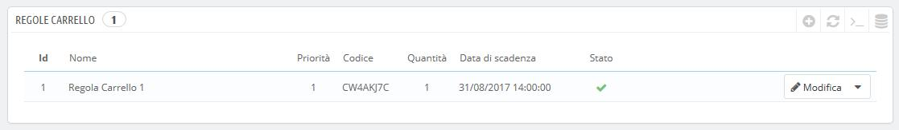
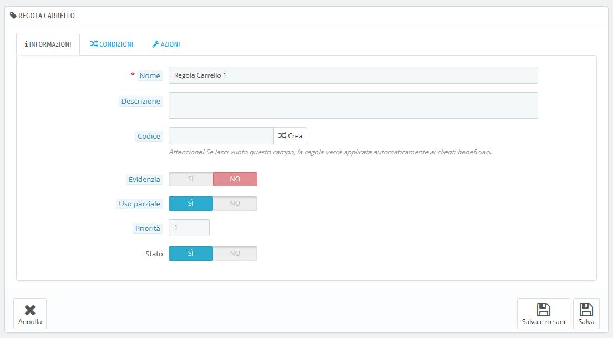
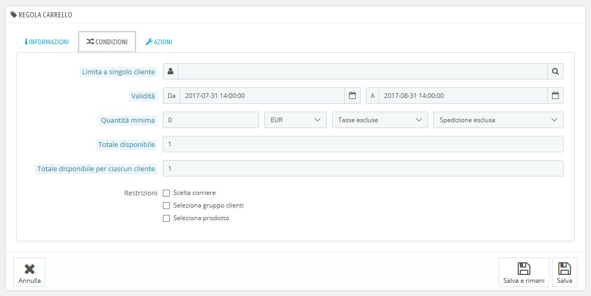
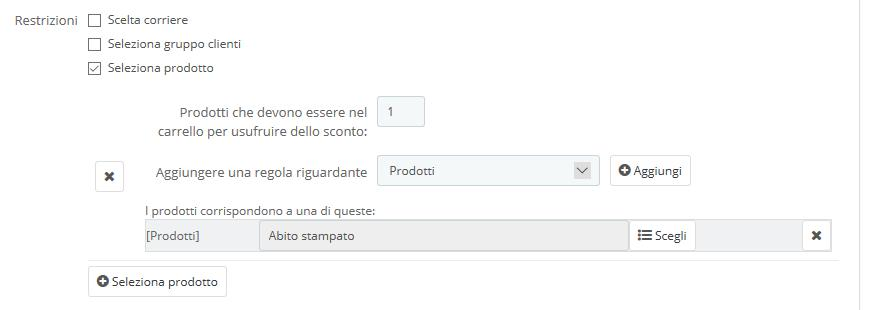
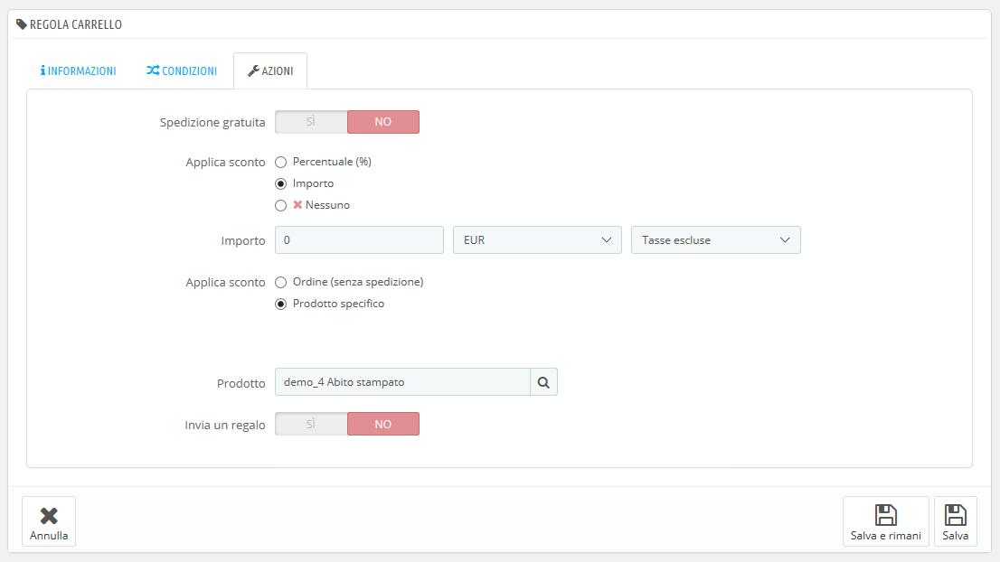
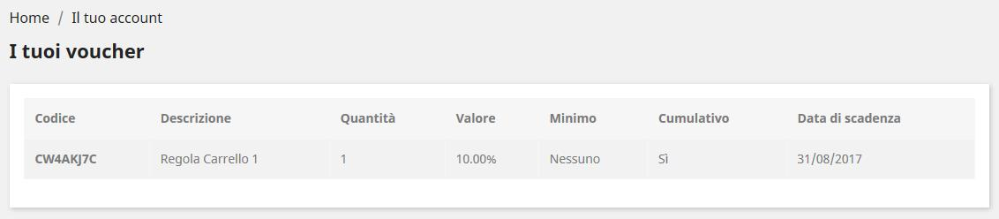
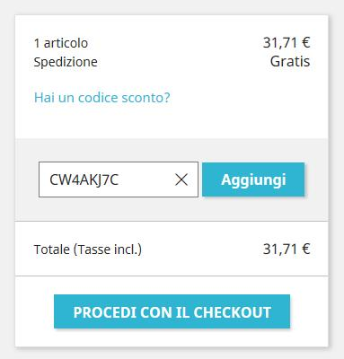

# Regole Carrello

La pagina "Regole carrello" consente di accedere a uno strumento avanzato per creare voucher molto precisi. Quando questa guida menziona i voucher fa riferimento delle regole del carrello – che sono piuttosto diverse dal credito.

Differenze tra credito, voucher e regole del carrello

Un **credito** è principalmente la traccia di un prodotto restituito. Nella maggior parte dei casi l'utente può utilizzarlo come voucher.

Un **voucher** è un codice sconto che non deve essere necessariamente collegato a un prodotto restituito o rimborsato e può assumere più forme rispetto a un semplice credito. Può essere:

* Uno sconto su un ordine (percentuale).
* Uno sconto su un ordine (quantità).
* Spedizione gratuita.

Puoi applicare uno sconto a tutti i clienti, un gruppo di essi, a un singolo cliente; puoi impostare una data di scadenza entro cui può essere utilizzato.

Una **regola del carrello** è fondamentalmente una versione avanzata di un voucher:&#x20;

* Presenta il nome dello sconto
* Consente al cliente di utilizzare solo una parte dello sconto.
* Assegna priorità tra diverse regole del carrello.
* Definisce le compatibilità tra le regole del carrello.
* Consente di applicare sconti solo a determinati carrelli.
* Consente di applicare sconti solo a determinati carrelli e/o categorie di prodotti e/o marche e/o fornitori e/o attributi… o a tutte queste opzioni contemporaneamente se necessario.
* Rende applicabile lo sconto a spedizioni gratuite e/o a uno specifico ordine e/o abbina omaggi a ordini… o a tutte queste opzioni contemporaneamente se necessario!&#x20;

In questa guida per l’utente, "regole carrello" e "voucher" sono sinonimi e intercambiabili.

La pagina "regole carrello" elenca le regole e i voucher del carrello attualmente esistenti che puoi abilitare o disabilitare cliccando sulle icone nella colonna "Stato"&#x20;

## Creare una nuova regola del carrello 

Un voucher può essere creato automaticamente dopo la restituzione di un prodotto, ma è possibile crearne manualmente un nuovo in qualsiasi momento essendo molto specifici sulle sue proprietà. Per questa funzione clicca su "Aggiungi nuova regola carrello".

Il modulo di generazione presenta tre schede che consentono di creare con precisione nuove regole e voucher.

### Tabella Informazioni 

La prima tabella, "Informazioni", contiene le regole che identificano la regola e le impostazioni principali.&#x20;

* **Nome**. Il nome è pubblico, i clienti vedranno come hai nominato la regola.
* **Descrizione**. La descrizione non è pubblica. Aiuta gli addetti al tuo e-commerce a comprendere il motivo per cui è stata creata.&#x20;
* **Codice**. Genera un codice unico per ogni regola. Puoi crearlo manualmente (e quindi usare parole leggibili, come 1VOUCH4GIO), o lasciare che PrestaShop generi una stringa univoca cliccando sul pulsante "Genera". Ovviamente puoi anche usare altri generatori automatici di stringhe (come [http://www.random.org/strings/](http://www.random.org/strings/)).\
  &#x20;Si noti che se non è impostato alcun codice la regola si applica a tutti i clienti:
  * Se è presente un codice il cliente dovrà inserirlo durante il processo dell’ordine.
  * Se non è presente un codice la regola viene applicata automaticamente in cassa e i clienti ne beneficeranno.
* **Evidenzia.** Se abilitato, PrestaShop informerà l'utente che è disponibile un voucher corrispondente agli elementi del suo carrello e potrà aggiungerlo
* **Uso parziale**. Se disattivato, il voucher può essere usato solo una volta, anche qualora non venga utilizzato completamento. Se abilitato viene creato un nuovo voucher qualora quello in uso non venga utilizzato completamente.&#x20;
  * È applicabile solo se il valore del voucher è superiore al totale del carrello. Se abilitato l'uso parziale, verrà creato un nuovo voucher con la differenza
  * Se non si consente l'uso parziale, il valore del voucher verrà ridotto all'ammontare dell'ordine totale.
* **Priorità**. Se un cliente (o un gruppo di clienti) può beneficiare di più di un voucher o se più di un voucher può essere applicato a un ordine, PrestaShop applica il voucher uno a uno nell'ordine alfanumerico. Puoi cambiare l'ordine impostando una priorità inferiore al tuo voucher. Per impostazione predefinita tutti i buoni hanno una priorità di 1. Se si imposta un numero maggiore quel voucher verrà applicato solo dopo quelli con numero inferiore.
* **Stato**. Puoi disabilitare o abilitare una regala ogni qualvolta lo ritieni opportuno.&#x20;

### Tabella delle Condizioni 

La seconda tabella, "Condizioni", contiene un ampio set di possibilità che consente di far beneficiare uno specifico target di determinate regole.&#x20;

* **Limita a singolo cliente**. Qui si indica che il voucher che stai creando è destinato a un solo cliente. Ad esempio, se hai avuto un ritardo nella consegna e desideri fare un gesto di cortesia, puoi creare un voucher esclusivamente per quel cliente. Per trovare rapidamente il cliente digita nel campo di testo le prime lettere del nome, cognome o e-mail.\
  Lasciato vuoto, PrestaShop capirà che qualsiasi cliente può usarlo ... a meno che non abbia aggiunto un gruppo di clienti come ulteriore condizione (vedi la casella "Selezione gruppo di clienti" sotto).
* **Validità**. La validità predefinita è di un mese, ma è possibile limitarla a una settimana o anche a un giorno.&#x20;
* **Quantità minima**. È la quantità minima dell’ordine alla quale si applica il voucher. Il voucher non sarà applicabile se l’ordine non raggiunge la quantità specificata. Puoi scegliere se sono incluse le tasse e/o le spese di spedizione.&#x20;
* **Totale disponibile**. Imposta una quantità disponibile di voucher: o "1" se è destinato a un singolo cliente, o qualsiasi numero se il voucher è destinato a chiunque ne utilizza uno precedentemente.&#x20;
* **Totale disponibile per ciascun cliente**. È possibile impostare il numero di volte in cui un voucher può essere utilizzato per ciascun utente. Quel numero deve essere almeno uguale alla quantità di voucher disponibili sopra (campo "Totale disponibile").
  * Se questo numero è inferiore alla quantità totale dei voucher disponibili, un singolo cliente non sarà in grado di utilizzarli tutti.
  * Impostandolo a "1" assicura che ciascuno dei tuoi clienti possa utilizzare solo il voucher una sola volta. In questo caso, assicurati che il voucher si applichi a un gruppo piuttosto che a un cliente...

Le caselle di controllo in fondo alla sezione sono molto importanti in quanto aiutano a filtrare ulteriormente a cosa o a chi la regola deve essere applicata.

* **Scelta corriere**. È possibile fare in modo che il cliente abbia uno sconto se sceglie un corriere specifico per la consegna del pacco.
* **Seleziona gruppo clienti**. Questo è molto utile. Grazie allo strumento di creazione dei gruppi di PrestaShop è possibile creare sconti che si applicano a una vasta gamma di utenti e creare altre condizioni al di sopra di tale sconto, grazie allo strumento di creazione delle regole del carrello.
* **Compatibilità con altre regole carrello**. Per impostazione predefinita, un ordine può beneficiare di qualsiasi numero di regole del carrello. Con questa opzione puoi dire a PrestaShop che questa regola non può essere combinata con una selezione di altre regole. Questa opzione viene visualizzata solo se si dispone di più regole di carrello.
* **Seleziona prodotto**. Un altro strumento molto utile che consente di creare voucher automatici per carrelli che contengono specifici prodotti. Lo strumento è illustrato nel dettaglio in seguito.
* **Scelta negozio**. Quando la modalità multistore è abilitata, per impostazione predefinita una regola carrello si applica a tutti i tuoi negozi. Con questa opzione è possibile fare in modo che una regola si applichi solo a negozi selezionati.

L'opzione "Seleziona prodotto" porta in un nuovo modulo che consente di creare non solo i voucher per prodotto, ma anche per categorie, per marche, per fornitori e anche per attributi. Puoi combinare tutti questi elementi per selezionare un target di clienti il più possibile specifico.

Ad esempio, puoi creare voucher automatici nel modulo "Compra almeno 3 prodotti Apple, ottieni la spedizione gratuita!"

Si tratta di uno strumento estremamente e la sua configurazione è molto specifica. Puoi aggiungere il maggior numero di sezioni di prodotto necessarie, seguendo questo percorso:

1. Clicca sul link "Seleziona prodotto" per aggiungere una nuova sezione.
2. Indica il numero di prodotti necessari per attivare lo sconto.&#x20;
3. Aggiungi almeno una regola per la tipologia desiderata; prodotti, attributi, categorie, marchi, fornitori. Puoi inoltre aggiungere diverse regole per la selezione del prodotto, anche una per tipologia se occorre.
4. Cliccando sul pulsante "Aggiungi" si crea una nuova riga nella selezione. Per ciascuna tipologia è necessario specificare i dettagli relativi al contenuto a cui si applica la regola. Cliccando sul link "Scegli" si apre una finestra con l’elenco dei contenuti disponibili per tipologia (prodotti, categorie...). Sposta il contenuto dal pannello da sinistra a destra cliccando sul pulsante "Aggiungi" e chiudi la finestra cliccando sulla "X" in alto a destra. Se viene selezionato un solo contenuto il campo viene nominato con il suo nome; altrimenti indicherà il numero del contenuto selezionato.

È possibile aggiungere più righe all'interno di una selezione se necessario. Queste regole sono cumulative: devono essere applicate tutte altrimenti lo sconto non viene concesso.

Le selezioni del prodotto sono indipendenti: è possibile aggiungere più di quanto necessario senza che si influenzino l’una con l’altra. Ciò consente di creare un'ampia gamma di prodotti a cui applicare la regola del carrello.

### Tabella Azioni 

La terza e ultima tabella, "Azioni” è quella in cui si determina in cosa effettivamente consiste lo sconto.

* **Spedizione gratuita**. Riguarda i clienti che possono beneficiare della spedizione gratuita.
* **Applica uno sconto**.&#x20;
  * **Percentuale (%)**. La regola si applica a una percentuale sul totale dell'ordine. Ad esempio, se l'ordine è di € 200 tasse escluse e il valore della regola è del 15%, i clienti che beneficiano di questa regola dovranno pagare solo € 170 (tasse e spese di spedizione escluse).&#x20;
  * **Importo**. La regola applica uno sconto monetario sul totale dell'ordine. Ad esempio, se l'ordine è di € 200 tasse escluse, lo sconto di € 20 sull'acquisto, i clienti che beneficiano di questa regola pagheranno solo € 180 (tasse e spese di spedizione escluse). Puoi scegliere se includere o meno le tasse.
  * **Nessuno**. La regola non offre alcuno sconto sull’ordine. Selezionando questa opzione la successiva sezione "Applica uno sconto a" scompare.
* **Applica uno sconto a**.
  * **Ordine (senza spedizione)**. Lo sconto viene applicato all’intero ordine.
  * **Prodotto specifico**. Puoi scegliere a quale/i prodotto/i lo sconto deve essere applicato: digita le prime lettere del prodotto e selezionalo nella lista dei nomi corrispondenti,&#x20;
  * **Prodotto meno caro.** Disponibile esclusivamente per l’opzione "Percentuale (%)". Lo sconto si applica al prodotto meno caro dell’ordine.&#x20;
  * **Prodotto(i) selezionato(i)**. Disponibile esclusivamente per l’opzione "Percentuale (%)". Lo sconto si applica al prodotto selezionato definito nel passaggio precedente.&#x20;
* **Escludi prodotti scontati**.** **_Novità di PrestaShop 1.7_. Per impostazione predefinita, il voucher si applica a qualsiasi tipo di prodotto già scontato o meno. Attivando questa funzionalità il voucher che state creando non verrà applicato a un prodotto o una combinazione se è già scontato.
* **Invia un omaggio gratuito**. Puoi scegliere di offrire un regalo in presenza di alcune condizioni (e saltare lo sconto complessivo). Appare un campo: digita le prime lettere del prodotto e selezionalo nell'elenco dei nomi corrispondenti.

Una volta che tutto è stato salvato puoi inviare il codice del voucher ai tuoi clienti o lasciare che il sistema gestisca automaticamente le regole del carrello, a seconda delle impostazioni.

Il tuo voucher apparirà nella pagina "Regole carrello", sotto il menu "Regole prezzo". Puoi cancellarlo o modificarlo in qualsiasi momento. Se il voucher è stato impostato su un determinato gruppo o cliente, apparirà nel front office, nella sezione "I tuoi Voucher" del cliente e nel carrello (se scelto), dove sarà possibile  scegliere quale applicare al proprio ordine.

Le regole del carrello impostate per essere destinate a tutti i clienti non appaiono nella pagina "I tuoi Voucher" dei clienti: sta a te informarli occorre quindi metterli al corrente per far sì che li utilizzino.

Per applicare la regola carrello, il cliente deve entrare nel proprio carrello e inserire il voucher ne "Hai un codice promozionale?" e cliccare su "Aggiungi". Il cliente non potrà applicare il voucher se il check-out è già stato convalidato.

Una volta applicato, il riepilogo del carrello mostra l'incidenza del voucher sul totale dell'ordine.
