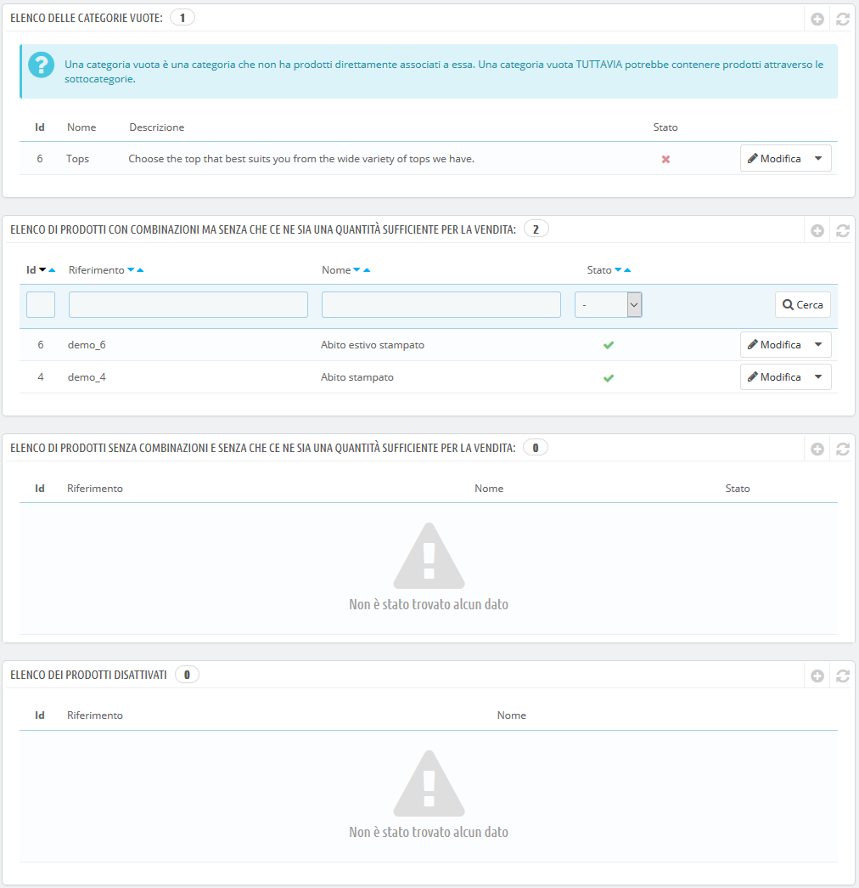

# Monitorare il Catalogo

La pagina "Monitoraggio" elenca le sezioni del tuo negozio alle quali devi prestare massima attenzione al fine di gestire al meglio il tuo catalogo e assicurarti che nulla ti sfugga.

Vengono mostrate sette sezioni:

* **Elenco delle categorie vuote**. Indica le categorie che non dispongono di alcun prodotto. È necessario eliminare queste categorie vuote o riempirle con almeno un prodotto per evitare che i clienti si trovino in una categoria vuota nel tuo negozio.
* **Elenco dei prodotti con combinazioni ma senza che ce ne sia una quantità sufficiente per la vendita.** Indica i prodotti che non sono più in vendita. Se non vi è ragione per cui non siano in vendita, rimettili online.
* **Elenco dei prodotti senza combinazioni ma senza che ce ne sia una quantità sufficiente per la vendita**. Allo stesso modo ti dà i prodotti che non sono più in vendita. Scopri il motivo o rimettili online.
* **Elenco dei prodotti disattivi**. Indica i prodotti che sono stati disabilitati nel negozio e che non sono visibili ai tuoi clienti. Considera se abilitarli \(magari dopo il rifornimento\) o cancellarli dal catalogo.
* **Elenco di prodotti senza immagini**. Indica i prodotti per i quali non sono state ancora caricate immagini. Assicurati di caricare belle immagini per questi prodotti in modo che i clienti avranno un buon modo di capire cosa stanno acquistando!
* **Elenco dei prodotti senza descrizione**. La gente \(e i motori di ricerca\) ama leggere informazioni dettagliate/descrizioni spiritose/grandi storie sui prodotti acquistati. Le descrizioni sono una parte essenziale dei tuoi prodotti, non le trascurare.
* **Elenco dei prodotti senza prezzo**. Ovviamente dovresti prestare attenzione a questa sezione in quanto ti consente di evitare qualche problema se ti rendi conto in tempo che alcuni prodotti senza prezzo possono essere aggiunti ai carrelli dei tuoi clienti. A meno che tu non abbia deliberatamente impostato questi prezzi a 0, dovresti monitorare attentamente i tuoi prezzi.

La pagina "Monitoraggio" dovrebbe essere controllata regolarmente per migliorare la gestione del catalogo.

