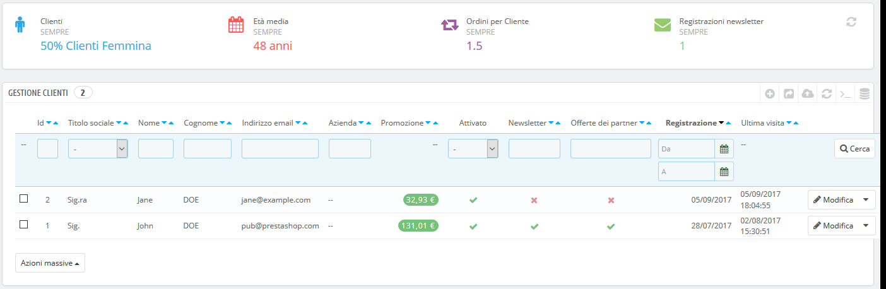
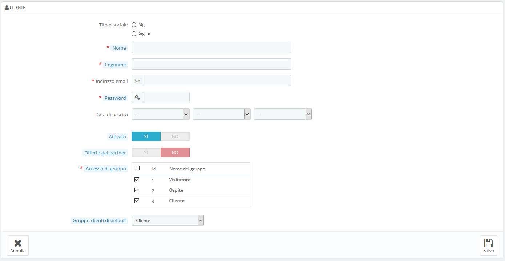
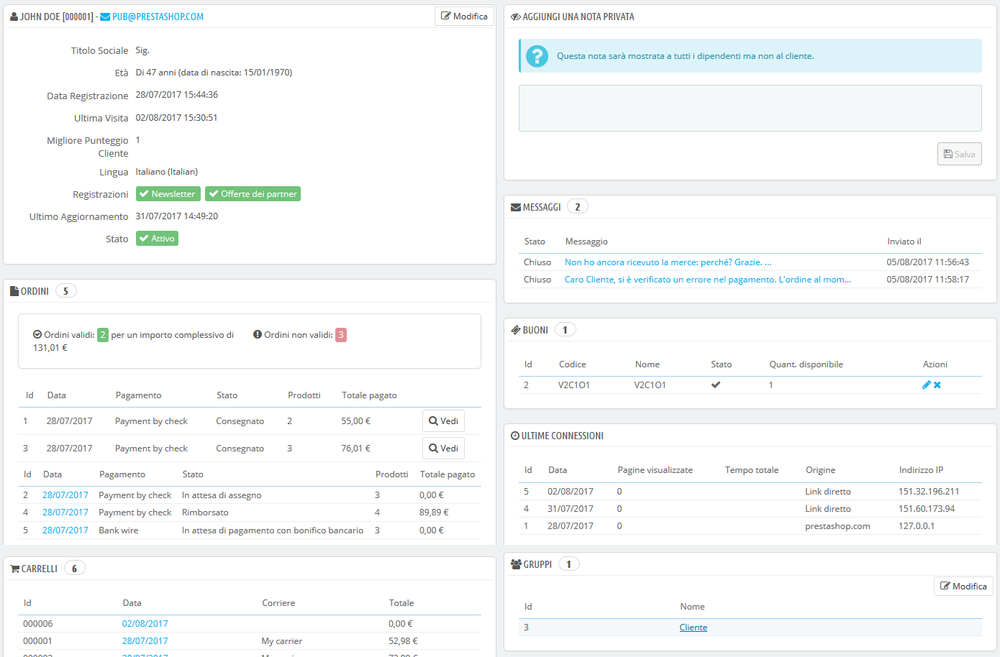
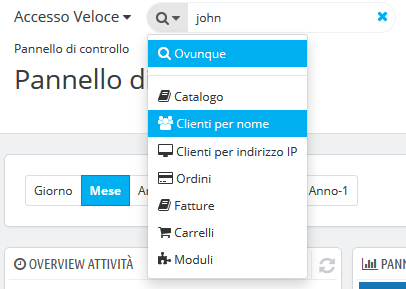
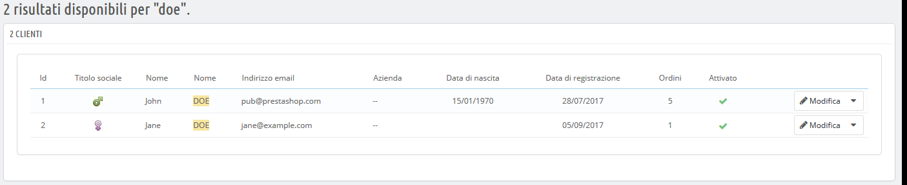
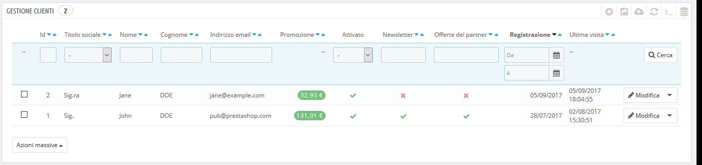

# I Tuoi Clienti

La prima pagina del menu "Clienti" offre un elenco di tutti gli utenti registrati al tuo negozio.



Ciò consente di visualizzare i tuoi clienti nel profondo, con alcuni dettagli che puoi utilizzare per ordinare e cercare i tuoi account:

* **ID**. L'ID univoco collegato al cliente.
* **Titolo sociale**. I clienti possono dichiarare il proprio titolo sociale abbinato a un genere che ti aiuti a personalizzare meglio la loro esperienza con il tuo negozio. Ci sono due titoli sociali predefiniti \(Signora e Signore\), ma puoi crearne altri nella pagina "Titoli" in "Impostazioni clienti" nel menu "Parametri del negozio".
* **Nome e cognome**. Il nome del cliente.
* **Indirizzo email**. L'indirizzo email del cliente utilizzato per registrarsi al tuo negozio.
* **Vendite.** Quanto il cliente ha speso nel tuo negozio.
* **Abilitato**. Indica se il cliente è attivo o meno. Puoi disattivare un account cliccando sulla spunta verde.
* **Newsletter**. Indica se il cliente è iscritto alla newsletter del tuo negozio o meno. È possibile annullare la sottoscrizione cliccando sulla spunta verde.
* **Offerte partner**. Indica se l'account ha accettato di ricevere email dai partner o meno. Puoi cancellarlo cliccando sulla spunta verde**. Non sottoscrivere un utente a queste email senza il suo consenso, in quanto è considerato spam** **ed è illegale**.
* La data di registrazione e l'ultima visita possono essere utili quando si ordinano gli account utente.
* **Azioni**. Puoi modificare l'account dell'utente, semplicemente visualizzarlo a pieno \(con i suoi messaggi, ordini, indirizzi, buoni, ecc.\) o eliminarlo per sempre.

Quando viene installato per la prima volta con i dati di esempio, PrestaShop dispone di un utente predefinito denominato John DOE.

Puoi utilizzare questo utente finto per testare alcune funzioni del tuo negozio, consultare il tuo negozio e vederlo come un utente normale.

Per accedere al tuo negozio utilizzando questo account pubblico, utilizza queste credenziali:

* Indirizzo email: [pub@prestashop.com](mailto:pub@prestashop.com)
* Password: 123456789

**Prima di aprire il tuo negozio al pubblico, assicurati di eliminare questo utente predefinito o almeno modificarne le credenziali**! In caso contrario, visitatori maligni potrebbero utilizzarlo per fare acquisti falsi e altro ancora.

Sotto la tabella dei clienti c’è il pulsante "Imposta i campi obbligatori per questa sezione". Si apre un modulo in cui è possibile indicare se un campo del database è necessario o meno selezionando le relative caselle: in questo modo puoi, ad esempio, inserire il campo "offerte partner" proponendolo ai visitatori che stanno creando un account nel tuo negozio.

Puoi esportare l’elenco dei tuoi clienti cliccando sul pulsante "Esporta" nella parte superiore.

È inoltre possibile importare i clienti utilizzando il pulsante "Importa". Avrai bisogno del tuo file CSV per seguire questo formato:

```text
ID;Title;Last name;First Name;Email address;Age;Enabled;News.;Opt.;Registration;Last visit;
2;1;Gorred;Francis;francis@example.com;-;1;0;0;2013-07-04 15:20:02;2013-07-04 15:18:50;
1;1;DOE;John;pub@prestashop.com;43;1;1;1;2013-07-02 17:36:07;2013-07-03 16:04:15;
```

Altre opzioni di importazione sono disponibili nella pagina "Importazione" del menu "Parametri avanzati".

## Creare un Nuovo Account Cliente <a id="ITuoiClienti-CreareunNuovoAccountCliente"></a>

Per creare manualmente un account cliente, seleziona "Aggiungi nuovo cliente". Viene mostrato un modulo.

Compila le informazioni del cliente:

* Se non desideri chiedere la data di nascita quando il cliente crea un account, puoi disattivare il campo nella pagina "Impostazioni cliente". Basta selezionare "No" nell’opzione "Richiedi data di nascita".
  Se non desideri chiedere la data di nascita quando il cliente crea un account, puoi disattivare il campo nella pagina "Impostazioni cliente". Basta selezionare "No" nell’opzione "Richiedi data di nascita".

  * **Attivato**. Potresti voler creare un account, ma non renderlo subito attivo.
  * **Offerte dei partner**. Può essere utilizzato dai moduli per inviare promozioni di partner a quei clienti che lo hanno richiesto. **Non sottoscrivere un utente a queste email senza il suo consenso, in quanto è considerato spam ed è illegale**.
  * **Accesso di gruppo**. Avere gruppi di clienti consente di creare sconti di gruppo. Molte altre caratteristiche di PrestaShop possono anche essere limitate a gruppi.
  * **Gruppo clienti di default**. Non importa a quanti gruppi il cliente appartienga, deve sempre avere un gruppo principale.

Se i tuoi clienti sono per lo più aziende, devi abilitare la modalità B2B per ottenere opzioni aggiuntive: vai alla pagina "Impostazioni clienti" del menu "Parametri del negozio" e scegli "Sì" per l'opzione "Abilita modalità B2B".


La modalità B2B aggiunge alcuni campi specifici aziendali:

* **Azienda**. Il nome della società.
* **SIRET** . Il suo numero SIRET \(solo in Francia\).
* **APE**. Il suo codice di attività principale \(Activité principale exercée - solo Francia\).
* **Sito web**. Il suo sito web.
* **Quantità massima consentita**. La quantità di denaro in sospeso che l'azienda è autorizzata a gestire.
* **Numero massimo di giorni per effettuare di pagamento**. Il numero di giorni che la società ha a disposizione per pagare.
* **Tasso di rischio**. La tua valutazione di rischi di questa società: bassa, media o alta.

## Vedere le Informazioni dei Clienti <a id="ITuoiClienti-VedereleInformazionideiClienti"></a>

Nel caso in cui desideri avere maggiori informazioni su un determinato cliente, puoi cliccare sul pulsante "vedi", situato alla fine della riga dell'elenco dei clienti. Viene mostrata una nuova pagina.



Le varie sezioni forniscono alcuni dati chiave sull'utente:

* **Informazioni sul cliente**, nome e cognome, indirizzo e-mail, ID, data di iscrizione, data dell'ultima visita, range.
* Informazioni relative all'iscrizione alla newsletter del negozio e alla sottoscrizione di email da parte di società partner, età, data dell'ultimo aggiornamento e se l'account è attivo.
* **Note private** dei dipendenti del negozio \(cioè tue e della tua squadra\).
* **Messaggi** inviati dal cliente al team \(attraverso il servizio clienti\).
* Regole del carrello/**voucher** disponibili.
* **Collegamenti precedenti** nel negozio.
* I **gruppi** a cui appartiene il cliente.
* Sommario degli **ordini** precedenti del cliente. Importo speso, tipo di pagamento, stato dell'ordine. Per ulteriori informazioni su ogni ordine, clicca sulla data dell'ordine.
* I **carrelli** che il cliente ha creato \(non solo quelli convalidati\) dal momento della registrazione. Quando il cliente è nel tuo negozio, puoi vedere cosa aggiunge al carrello in tempo reale.
* Sommario dei prodotti acquistati da un cliente. Tra l'altro, questo ti consente di sapere quando un cliente è molto appassionato di un prodotto e magari creare uno sconto speciale sul 10° acquisto. Cliccando su un prodotto si viene indirizzati all'ordine a cui il prodotto è legato.
* L’elenco dei **prodotti visualizzati** dal cliente. Allo stesso modo, puoi vedere quali pagine di prodotto il cliente visita sul tuo sito web. Se non esegue nessun ordine, nonostante le diverse visite, magari puoi “dare una spinta al cliente” inviandogli uno sconto mirato.
* **Indirizzi** registrati.

## Cercare un Cliente <a id="ITuoiClienti-CercareunCliente"></a>

La ricerca di un cliente sul tuo negozio PrestaShop può essere effettuata in due diversi modi.

**Il primo metodo** consiste nell'inserire le informazioni che hai nella barra di ricerca di PrestaShop, che si trova in alto al centro del back office. Selezionando "ovunque", "per nome" o "per indirizzo IP", è possibile eseguire una ricerca basata su:

* ID. I numeri assegnati al cliente nel database.
* Nome o cognome. Si noti che non è possibile cercare entrambi: scegliere "john" o "doe", poiché "john doe" non funziona.
* Indirizzo email.
* Indirizzo IP. Puoi eseguire la ricerca utilizzando l'IP del collegamento più recente al tuo negozio.



I risultati, se presenti, vengono poi presentati: l'elenco presenta l'ID utente, il titolo sociale, l'email, la data di nascita, la data di registrazione, la quantità di ordini e se è attivo o meno l'account dell'utente. Da lì, puoi visualizzare l'intera pagina dell'utente o modificarne i dettagli.



Il **secondo metodo** consiste nell’andare nella pagina "Clienti", nell’elenco di tutti i tuoi clienti.



In questa pagina è possibile completare i campi nella parte superiore dell'elenco, per filtrarli secondo i seguenti criteri: ID, titolo sociale, cognome, indirizzo email, età, stato dell'account \(attivo o disattivo\), iscrizione alla newsletter, iscrizione agli annunci partner, data di registrazione e ultima data di connessione. Inserisci i tuoi criteri e clicca sul pulsante "Filtra" nell'angolo in alto a destra della tabella. È quindi possibile ordinare l'elenco di alcune delle colonne.

Clicca sul pulsante "Reset" per tornare all'elenco completo.

