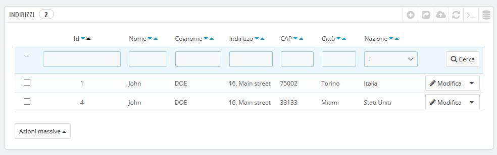
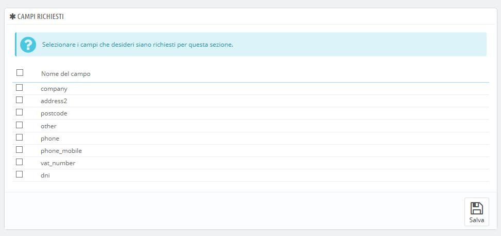
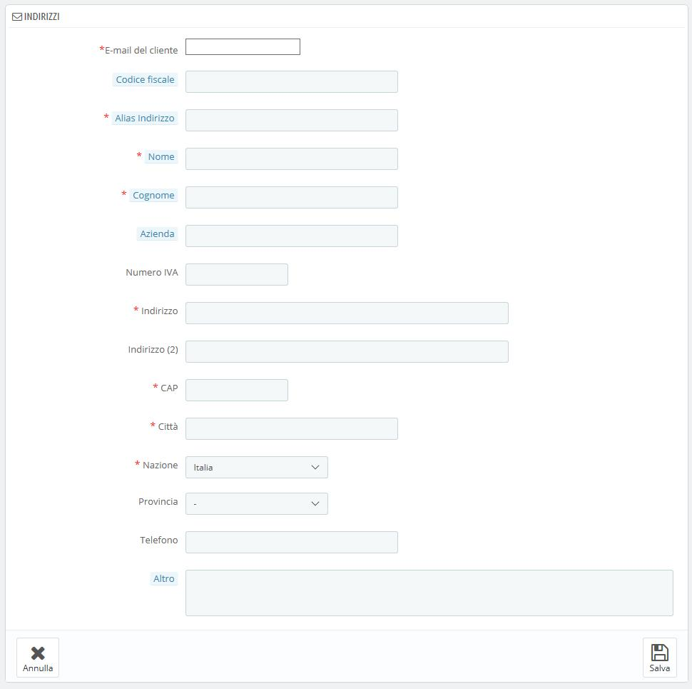

# Indirizzi dei Clienti

Cliccando sulla pagina "Indirizzi" avrai accesso alla lista degli indirizzi dei tuoi clienti (domicilio, ufficio, ecc.) Puoi modificarli attraversi il bottone “Modifica” o cancellarli tutti contemporaneamente.

Sotto la tabella degli indirizzi è presente il pulsante "Imposta i campi obbligatori per questa sezione". Si apre un modulo in cui è possibile indicare se è necessario un campo o meno selezionando le caselle appropriate: in questo modo è possibile rendere campi come "società" o "numero di telefono" obbligatori quando un cliente registra un nuovo indirizzo nel tuo negozio.\

## Aggiungere un nuovo indirizzo 

Hai la possibilità di creare nuovi indirizzi per un cliente attraverso il pulsante "Aggiungi nuovo indirizzo". Si aprirà un modulo con i campi necessari e pertinenti.

Alcuni campi, tuttavia, richiedono particolare attenzione:

* **E-mail del cliente**. Questo campo è essenziale: se stai aggiungendo un indirizzo per un cliente già presente nel database DEVI identificarlo attraverso l’indirizzo email, altrimenti PrestaShop non saprà a chi assegnare questo indirizzo.
* **Codice fiscale**. Il codice fiscale identificativo della persona.
* **Alias indirizzo**. Una breve descrizione, per aiutare i clienti a scegliere il corretto indirizzo: "Domicilio", "Ufficio", "Zio Tom", ecc.
* **Azienda**. Il nome dell’azienda, se il cliente è una persona giuridica.
* **Partita IVA**. La partita IVA del cliente qualora fosse un’azienda.&#x20;
* **Altro**. Addizionali informazioni che potrebbero essere utili alla spedizione.&#x20;
