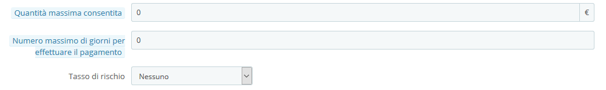
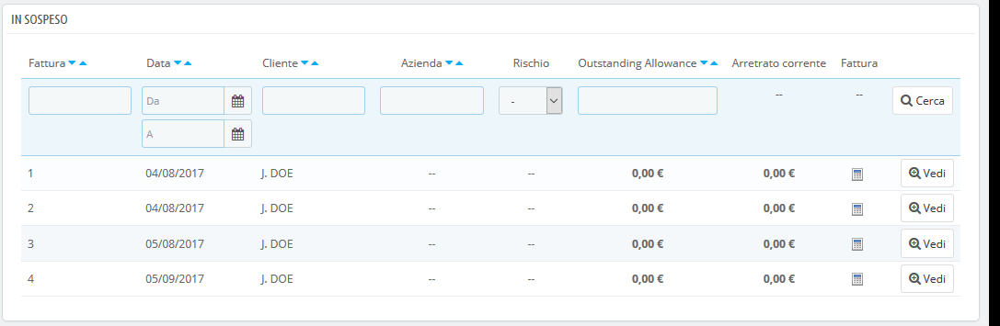

# In Sospeso

Questa pagina è disponibile solo quando si abilitano le funzioni B2B di PrestaShop. A tal fine, vai alla pagina "Impostazioni cliente" e scegli "Sì" per l'opzione "Abilita modalità B2B".

Questa pagina visualizza un rapporto particolare riservato ad alcuni dei tuoi clienti, ovvero mette a disposizione una quantità di denaro che consente loro di acquistare i tuoi prodotti prima che siano effettivamente pagati.

## Abiliatare la funzione in sospeso 

Quando la modalità B2B è attiva \(Parametri del negozio&gt; pagina Impostazioni clienti\), vengono aggiunti al modulo di creazione del cliente tre campi:

* **Quantità massima consentita**. L'importo massimo di denaro che questo cliente può utilizzare per questo tipo di funzione.
* **Numero massimo di giorni per effettuare il pagamento**. Il numero massimo di giorni entro cui il cliente può pagare il suo sospeso.
* **Tasso di rischio**. Il fattore di rischio di questo cliente: Nessuno, basso, medio o alto. Sta a te decidere se un cliente presenta rischi o se pagherà sicuramente in tempo.

È’ necessario riempire questi campi per tutti i clienti professionisti.

## Schermata corrente in sospeso 

Una volta che un cliente con un'indennità in sospeso acquista dal tuo negozio, appare nella pagina Clienti&gt; In sospeso. In questo modo è possibile ottenere una panoramica delle fatture in corso.

