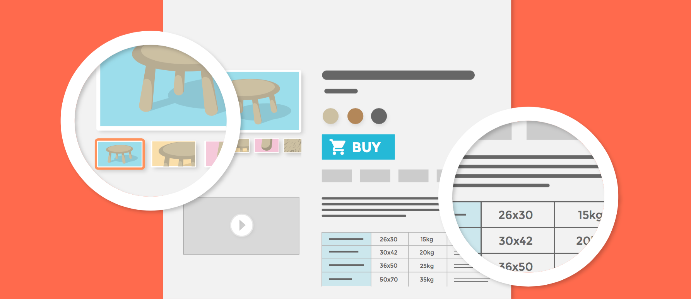

# Gestire il Catalogo Prodotti

## Gestire il Catalogo Prodotti 

La creazione di un sito di PrestaShop è il suo catalogo, che contiene prodotti e categorie di prodotti. Costruire e migliorare il tuo catalogo è fondamentale per rendere il tuo sito web vivo agli occhi dei clienti. Qui il tuo negozio diventa realtà, creando contenuti e dando valore alla tua presenza online.

Essendo il cuore del tuo negozio, il tuo catalogo merita molta attenzione. L'aggiunta di prodotti non significa solo aggiungere un'immagine e un testo e quindi convalidare il contenuto. Significa conoscere bene il tuo prodotto: prezzo, peso, dimensione, caratteristiche, specifiche, dettagli, marca, fornitore e molto altro ancora. Non dovresti iniziare ad aggiungere prodotti al Catalogo senza sapere esattamente quello che vuoi presentare al cliente e quindi avere un piano sui tuoi prodotti e sul modo in cui verranno visualizzati. Ciò significa anche conoscere come le tue tasche il front office del negozio per compilare correttamente i campi richiesti.

È possibile accedere alla sezione "Catalogo" aprendo il menu con lo stesso nome, che elenca tutte le pagine relative al prodotto. Qui gestisci i tuoi prodotti e le loro caratteristiche attraverso il tuo negozio PrestaShop.

Questo capitolo contiene le seguenti sezioni:

* [Gestire Prodotti](gestire-prodotti.md)
* [Gestire Categorie](gestire-categorie.md)
* [Monitorare il Catalogo](monitorare-il-catalogo.md)
* [Gestire gli Attributi dei Prodotti](gestire-attributi-prodotti.md)
* [Gestire le Funzioni Prodotto](gestire-funzioni-prodotto.md)
* [Gestire i Marchi](gestire-marchi.md)
* [Gestire Fornitori](gestire-fornitori.md)
* [Gestire i Files](gestire-files.md)
* [Gestire gli Sconti](gestire-sconti/)
* [Gestire il Magazzino](gestire-il-magazzino/)

