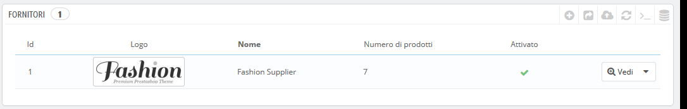
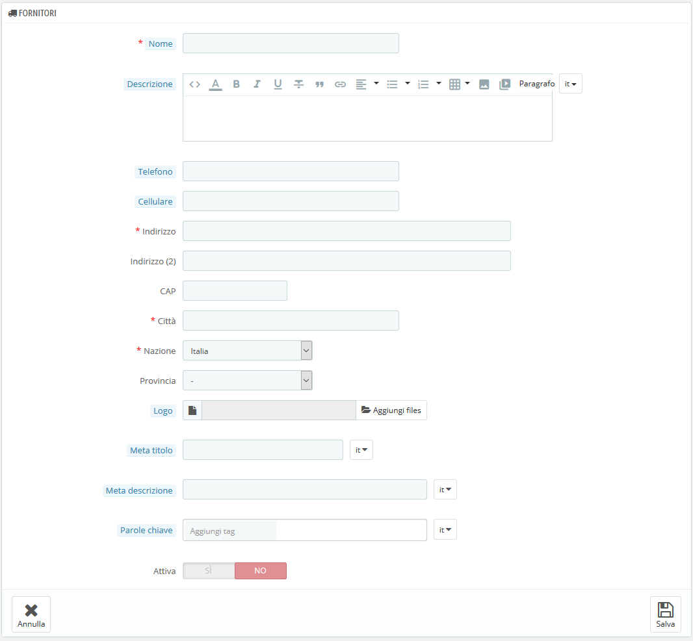

# Gestire Fornitori

La registrazione dei fornitori è facoltativa se si dispone già di marche che forniscono direttamente i propri prodotti. Tutto dipende dalle tue esigenze, ma se il fornitore dei tuoi prodotti non è lo stesso del marchio del prodotto, allora dovresti registrare entrambi nel tuo sistema e associarli a ogni prodotto.

In PrestaShop, un fornitore è l'azienda che ti fornisce un prodotto.

Anche se vendi direttamente tuoi prodotti è necessario creare almeno la tua azienda come fornitore.

Proprio come per i marchi, i visitatori del tuo sito possono avere accesso rapido a tutti i prodotti del fornitore. Questo rende più facile navigare nel tuo sito. In termini di visibilità, riempire questi campi migliorerà la tua posizione nei motori di ricerca.

 Clicca su "Aggiungi nuovo fornitore" e apparirà il form da compilare.

Compila tutti questi campi:

* **Nome**. Indica il nome del fornitore per semplificare le ricerche dei tuoi visitatori.
* **Descrizione**. Aggiunge una descrizione più complessa del tuo fornitore, della sua attività e dei suoi prodotti. È possibile specificare le peculiarità e promuovere la qualità dei prodotti. La descrizione del fornitore verrà mostrata all'interno del tuo negozio.
* Il campo indirizzo \(Telefono, telefono cellulare, indirizzo, codice postale, città, Stato e Paese\). Il campo "Stato" viene visualizzato solo per i Paesi interessati.
* **Logo**. Avere un logo del fornitore è essenziale: porta i clienti a fidarsi del tuo negozio quasi quanto si fidano di quel fornitore/marchio.
* Il campo SEO \(Titolo, Descrizione, Parole Chiave\). Fornisce le stesse funzionalità delle categorie.
  * **Titolo**. Il titolo che apparirà sui motori di ricerca quando viene fatta una ricerca da un cliente.
  * **Descrizione**. Una presentazione del fornitore in poche righe per catturare l'interesse di un cliente, che apparirà nei risultati di ricerca.
  * **Parole chiave**. Parole chiave da scegliere affinché il tuo sito si riferisca ai motori di ricerca. È possibile immetterne diverse, separate da virgole, nonché espressioni e modi di dire, che devono essere inserite tra virgolette.
* **Attiva**. È possibile disattivare un fornitore, anche solo temporaneamente. Verrà rimosso solo dall'elenco dei fornitori sul front-end del tuo negozio.

Salva le modifiche e verrai riportato nell'elenco dei fornitori. Da lì, puoi:

* Cliccare sul nome o sul logo di un fornitore e ottenere tutti i prodotti associati. Se non ci sono, allora dovresti lavorare su ogni prodotto, dalla pagina "Prodotti" nel menu "Catalogo".Lo stesso risultato si ottiene cliccando sull'icona di visualizzazione a destra.
* Disattivare il fornitore cliccando sulla spunta verde. Una volta disabilitato, appare una croce rossa al suo posto: clicca per attivare nuovamente il fornitore.
* Visualizzare/modificare/eliminare il fornitore cliccando sui rispettivi pulsanti a destra della riga.

