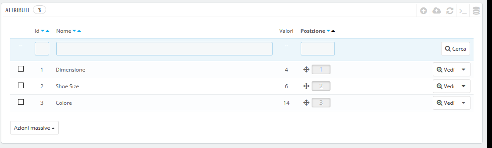
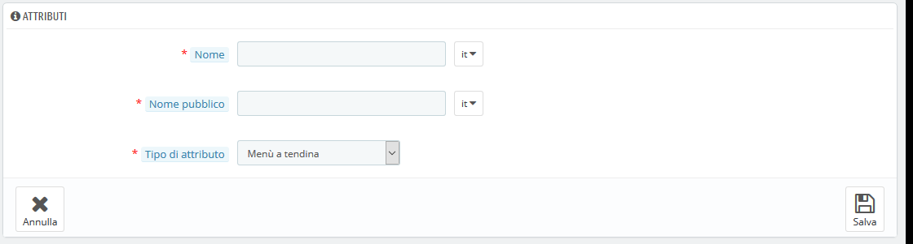
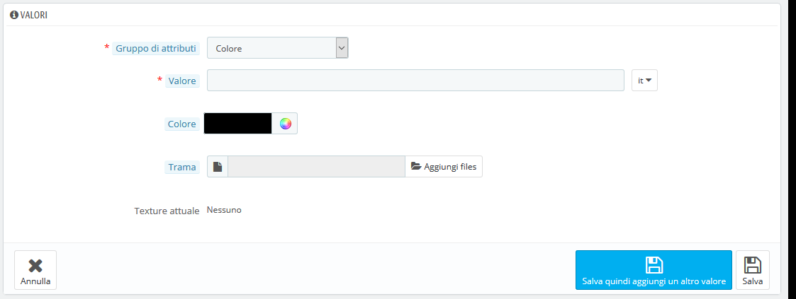

# Gestire gli Attributi dei Prodotti

Gli attributi sono la base delle varianti di prodotto \(o "combinazioni" nell'interfaccia di PrestaShop\): è possibile creare varianti di un prodotto solo se almeno uno dei suoi attributi cambia.  
Dovresti pensare agli attributi come proprietà di un prodotto che può cambiare tra le diverse varianti, mantenendo lo stesso nome del prodotto: colore, capacità, dimensione, peso ecc. È possibile variare qualsiasi cosa nelle versioni dello stesso prodotto, ad eccezione del prezzo.

La differenza tra un attributo e una funzione dipende dal prodotto stesso. Alcuni prodotti potrebbero condividere la stessa proprietà, una come attributo creato per modificare le varianti dei prodotti, un'altra semplicemente come caratteristica invariabile.

Ad esempio, un cliente può acquistare una versione iPad basata sugli attributi \(colore, spazio su disco\), ma non sulle caratteristiche \(peso, dimensione\).

Allo stesso modo, un altro negozio potrebbe vendere versioni di t-shirt in base agli attributi \(colore, dimensione, sesso\), ma non alle caratteristiche \(peso\).

Nel tuo negozio, le caratteristiche vengono visualizzate in una scheda che fornisce ulteriori informazioni sul prodotto; mentre gli attributi consentono di scegliere tra le combinazioni di prodotti.

Gli attributi sono configurati in base al prodotto, dalla pagina "Prodotti" nel menu "Catalogo". Tuttavia, devono prima essere registrati nel tuo negozio utilizzando lo strumento della scheda "Attributi" nella pagina "Attributi & funzioni", nel menu "Catalogo".

Questa pagina presenta un elenco di tutti gli attributi attualmente registrati. Puoi modificare o eliminare ognuno di essi utilizzando le azioni a destra della tabella o vedere i rispettivi valori cliccando su "Mostra" che apre una nuova tabella.

È inoltre possibile impostare l'ordine di presentazione degli attributi nel front office cliccando sulle icone della freccia o trascinando ciascuna riga quando il mouse passa sulla colonna "Posizione".

## Creare nuovi attributi 

Per aggiungere un attributo o, in altre parole, aggiungere un gruppo di possibilità di variabili \(colori, capacità, materiale, ecc.\), clicca su "Aggiungi nuovo attributo". Si visualizzerà una nuova pagina.

Compila il form:

* **Nome**. L’esatta descrizione dell’attributo. Occorre che sia breve ma precisa per evitare che venga confusa con un altro attributo. 
* **Nome Pubblico**. Il nome dell'attributo, come visualizzato dai clienti nella pagina del prodotto. Poiché alcuni attributi possono avere lo stesso nome, questo campo, per variare il relativo contenuto, consente di presentarlo correttamente nel contesto del prodotto, mentre rende possibile riconoscere facilmente un attributo rispetto a un altro con nome simile ma significato diverso.
* **Tipo di attributo**. Consente di scegliere se la pagina del prodotto deve mostrare i valori di questo attributo tramite un elenco a discesa, un elenco di pulsanti di selezione o un selezionatore di colore \(o trama\).

Salva il nuovo attributo per tornare all'elenco degli attributi. Devi ora aggiungere i valori al tuo attributo.

## Creare un nuovo valore 

Clicca su "Aggiungi nuovo valore". Compare una nuova pagina.

Compila il form:

* **Gruppo di attributi**. Dal menu a discesa seleziona uno degli attributi disponibili.  
* **Valore**. Dai un valore all’attributo: "Rosso", "16 Gb", "1.21 gigawatt"...

I seguenti campi vengono mostrati solo se l’attributo è un campo della tipologia colore. 

* **Colore**. Se l’attributo è un colore puoi inserire il suo valore nel codice colore HTML \(ad esempio "\#79ff52" o "azzurro chiaro"\) o usare il selezionatore per ottenere esattamente la giusta tonalità.
* **Trama.** Se il prodotto non utilizza un colore solido ma piuttosto una trama \(come ad esempio maculato\) è possibile caricare un file di piccole dimensioni che verrà visualizzato sulla pagina del prodotto. Si noti che questo sostituirà il colore HTML dal campo sopra riportato. Cliccare sul pulsante "Salva" per avviare il caricamento. È inoltre possibile utilizzare questa opzione per consentire al cliente di scegliere la variabile di colore da un'immagine del tuo prodotto piuttosto che un colore. Il modo in cui viene visualizzato sul front end dipende dal tema che utilizzi…
* **Texture attuale.** Una volta caricato un file di trama viene visualizzato in questa sezione come promemoria.

È possibile aggiungere altri valori allo stesso tipo di attributo salvando le modifiche con il pulsante "Salva quindi aggiungi un altro valore".

Una volta impostati gli attributi e i valori puoi creare variabili di prodotto \(o "combinazioni"\) di ciascun prodotto nella scheda "Combinazioni" dalla pagina "Prodotti" nel menu "Catalogo".

