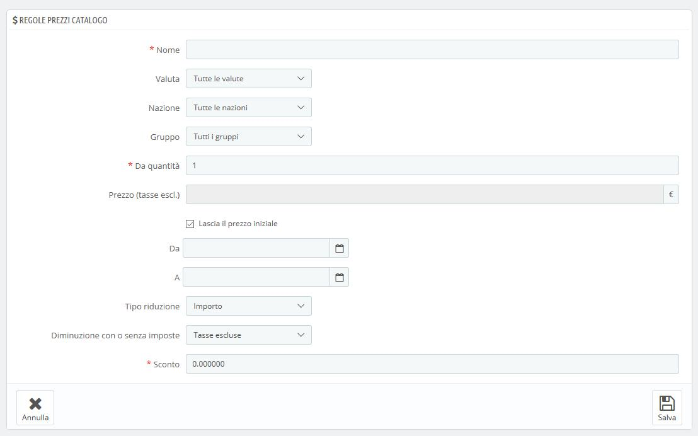
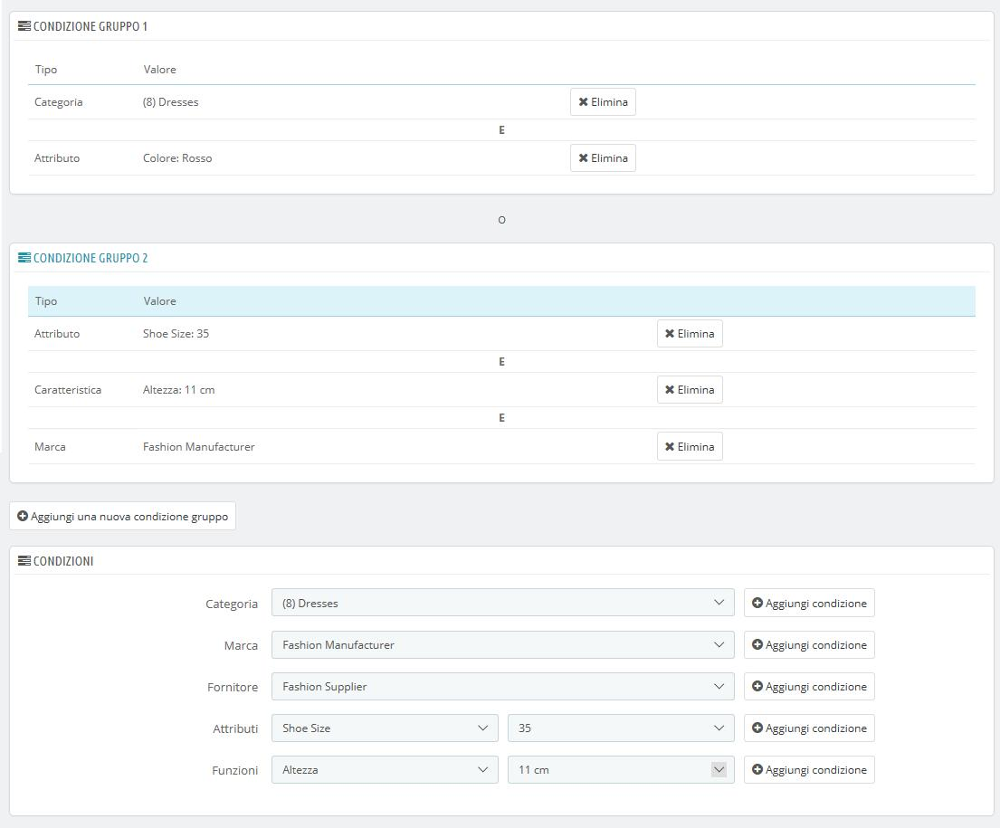

# Regole Prezzi Catalogo

Le regole dei prezzi del catalogo consentono di assegnare sconti per categoria, marca, fornitore, attributo o funzionalità. Come è implicito nel suo nome questo tipo di regola si applica a una gamma di prodotti; non può essere utilizzata per un singolo prodotto. Per applicare uno sconto a un singolo prodotto occorre creare una regola del carrello oppure creare un prezzo specifico \(nella scheda "Prezzi" all’interno della pagina dedicata al prodotto\).

Ad esempio è possibile impostare una regola dedicata ai clienti spagnoli appartenenti al gruppo "Buoni Clienti" impostano il 10% di sconto sugli acquisti della categoria Elettronica e su tutti i prodotti Sony, per la prima settimana di luglio.

La pagina "Regole prezzi catalogo" elenca le regole attualmente esistenti che puoi modificare o eliminare cliccando sui pulsanti di azione. Se devi disattivare una regola, devi semplicemente cambiare la data di fine impostandola al giorno precedente.

## Creare una Nuova Regola Prezzi del Catalogo 

La pagina del modulo di creazione è composta da due sezioni che consentono di creare nuove regole precise. 

### Regole prezzi catalogo 

Il primo modulo è semplice da capire.

È qui che imposti le regole dei vantaggi, degli sconti e altri dettagli. 

* **Nome**. Il nome è pubblico, gli utenti vedranno esattamente il nome che inserisci.
* **Negozio**. _Solo per la modalità multistore._ La regola si applica ai clienti che acquistano attraverso uno specifico negozio. Disponibile esclusivamente se si hanno minimo due negozi. 
* **Valuta**. La regola si applica ai clienti che impostano il pagamento con una specifica valuta. 
* **Nazione**. La regola si applica a clienti di uno specifico Paese. 
* **Gruppo**. La regola si applica a clienti che appartegono a uno specifico gruppo. 
* **Da quale quantità**. La regola si applica se l’ordine presenta almeno un numero specifico di prodotti corrispondenti.
* **Prezzo \(tasse escluse\)**. Il nuovo prezzo per la selezione del prodotto. Qui puoi impostare il prezzo pubblico dei prodotti che corrispondono alle regole che stai stabilendo. Per impostazione predefinita, la regola si applica al prezzo inizialmente impostato.
* **Da** e **A**. La regola si applica nell’intervallo di tempo qui impostato.
* **Tipo di riduzione**. Lo sconto può essere sia una quantità di denaro sia una percentuale sul totale dell’ordine.
* **Riduzione con o senza tasse**. Lo sconto può includere la tassa o lasciarla invariata.
* **Riduzione**. È il valore dello sconto. A seconda del "Tipo di riduzione" impostato, inserendo "10" nel campo, può sia significare "€10 di sconto" \(in base alla valuta predefinita\) sia "10% di sconto".

Naturalmente puoi combinare tutte queste regole.

### Condizioni 

La sezione "Condizioni" consente di impostare i prodotti a cui si applica la regola dei prezzi delle categorie. Si visualizza solo se si clicca sul pulsante "Aggiungi un nuovo gruppo condizione".

Se non si impostano condizioni, la regola del prezzo si applica a TUTTI i prodotti del tuo catalogo. Presta attenzione a non dimenticare le condizioni!

Le condizioni sono costruite attorno ai gruppi condizione, ciò significa che i dati della sezione "Regolamento dei prezzi catalogo" possono essere applicati a molteplici intervalli di prodotti.

Le condizioni sono raggruppate in modo inclusivo: tutte le condizioni del gruppo si applicano ai prezzi del catalogo. Ecco cosa sta a indicare la "E".

Invece le condizioni gruppo sono esclusive: solo a quel gruppo viene applicato il prezzo catalogo. Ecco cosa sta a indicare la "O".

Il gruppo di condizione predefinito è vuoto. È possibile aggiungere condizioni ad esso utilizzando i menu a discesa nella parte inferiore della sezione:

* Scegli una categoria o qualsiasi altro tipo di selezione e quindi clicca sul pulsante "Aggiungi condizione".
* La condizione apparirà nel gruppo condizione. Puoi inserirne molteplici. 
* Una volta completato un gruppo, se desideri crearne uno nuovo, clicca su "Aggiungi nuovo gruppo condizione". Apparirà un nuovo gruppo, che puoi compilare nello stesso modo.

Per impostazione predefinita le nuove condizioni vengono aggiunte al gruppo di condizioni creato per ultimo. Se necessiti di aggiungere condizioni a un gruppo precedente, clicca sul quel gruppo per evidenziarlo e aggiungi le condizioni che occorrono.

Allo stato attuale non è possibile eliminare un gruppo di condizione.

