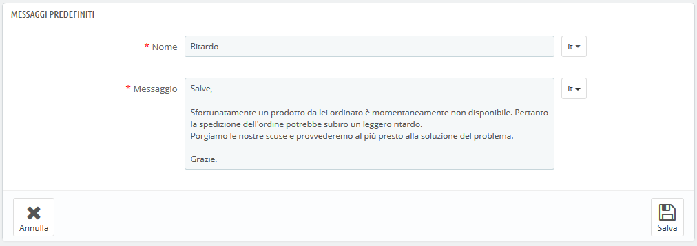
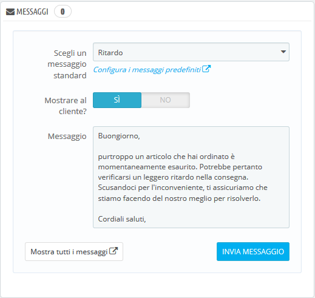

# Messaggi d'Ordine

Quando devi inviare un messaggio a un cliente utilizzando l'interfaccia PrestaShop \(dalla pagina degli ordini\), puoi scegliere di salvare quel messaggio per inviarlo nuovamente ad altri clienti che presenteranno domande o commenti simili.

Per effettuare questa operazione, vai alla pagina "Messaggi d’ordine" nel menu "Servizio clienti". È già stato salvato un messaggio predefinito: "Ritardo".

## Creare un nuovo messaggio 

Per aggiungere un altro messaggio predefinito, clicca sul pulsante "Aggiungi nuovo messaggio d’ordine". È inoltre possibile modificare un messaggio predefinito.

Il form è molto semplice:

* **Nome**. Dai al tuo messaggio un nome descrittivo in modo da poterlo trovare facilmente in seguito.
* **Messaggio**. Scrivi il contenuto che desideri inviare ai tuoi clienti.

Una volta fatto, clicca su "Salva".

È possibile creare quanti più messaggi sono necessari.

## Inviare un messaggio a un cliente 

Una volta che tutti i messaggi predefiniti sono stati impostati, puoi inviarli direttamente al cliente:

1. Seleziona il messaggio predefinito.
2.  Modificalo se necessario per adattarlo all'ordine o al cliente.
3.  Abilita l’opzione "Mostra al cliente?"
4.  Clicca su "Invia messaggio".

Il tuo cliente riceverà il tuo messaggio nell'indirizzo di posta elettronica associato a quell’account. Per seguire la conversione, passa alla pagina "Servizio clienti" nel menu "Clienti".

