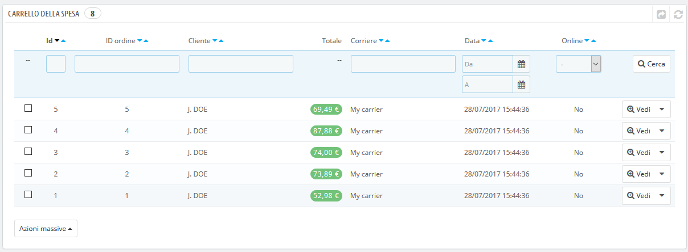
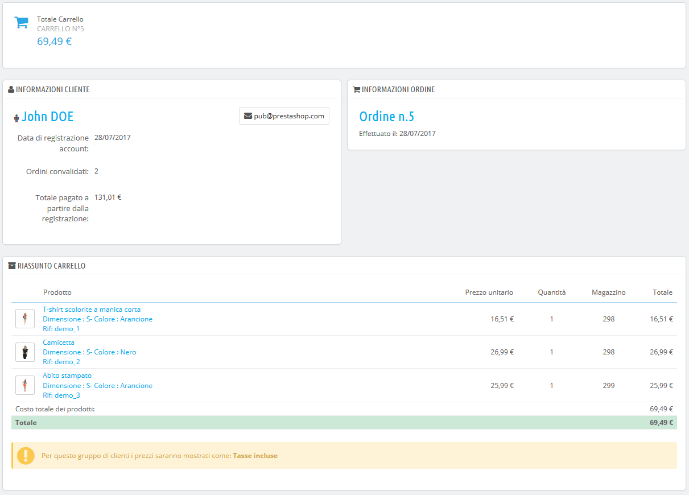

# Carrelli della Spesa

PrestaShop contiene alcune funzioni di marketing molto potenti che consentono di vedere in tempo reale i prodotti che i clienti stanno aggiungendo ai propri carrelli. Ci sono due modi per raggiungere questo obiettivo:

1. Vai alla pagina "Clienti" nel menu "Clienti", individua il cliente che desideri e visualizza il suo profilo. Nel profilo, scorri fino alla sezione "Carrelli", in cui puoi vedere tutti i carrelli creati da lui.
2. Vai alla pagina "Carrello acquisti" nel menu "Ordini". I carrelli sono ordinati per ID. Trova il cliente che stai cercando.

In entrambi i casi è possibile cliccare sull'icona "Vedi" per visualizzare il contenuto del carrello del tuo cliente e utilizzare queste informazioni per migliorare le prestazioni commerciali.

Nella pagina del carrello le informazioni più importanti si trovano nella sezione "Riepilogo del carrello", in cui è possibile visualizzare i prodotti che il cliente ha scelto di acquistare, il prezzo di ciascun elemento, la quantità inserita nel carrello e il valore totale del carrello.

Gestire carrelli abbandonati

L'abbandono del carrello significa spesso che una vendita è stata persa. La pagina "Carrello acquisti" indica i carrelli che non sono stati trasformati in ordini, sta a te ricordare al cliente che può ancora tornare per concludere l'acquisto.

I carrelli abbandonati \(o "carrelli fantasma"\) avranno un link per l’eliminazione alla fine di ogni riga, mentre i carrelli senza link di eliminazione sono carrelli elaborati, cioè l'acquisto è stato confermato e ora devi inviare i prodotti.

Per impostazione predefinita, sta a te contattare il cliente del carrello abbandonato. È possibile installare il modulo Promemoria disponibile nell'installazione predefinita che consente di inviare vouchers a coloro che abbandonano i carrelli pesa o a coloro che si desidera ringraziare per l’ordine oppure ai migliori clienti per ringraziarli per gli acquisti e per la loro fedeltà... Nota che questo può portare a un abuso: alcuni clienti potrebbero abbandonare i carrelli allo scopo di ricevere un voucher...

È inoltre possibile acquistare il modulo Remarketing Carrelli Abbandonati di PrestaShop per uno strumento completo: [https://addons.prestashop.com/it/remarketing-carrelli-abbandonati/16535-sollecito-di-carrelli-abbandonati.html](https://addons.prestashop.com/it/remarketing-carrelli-abbandonati/16535-sollecito-di-carrelli-abbandonati.html)

