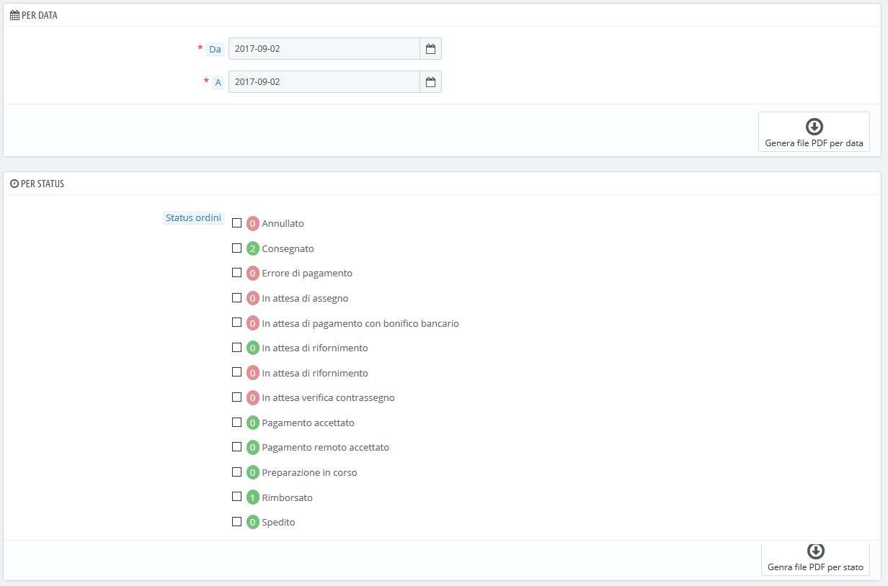
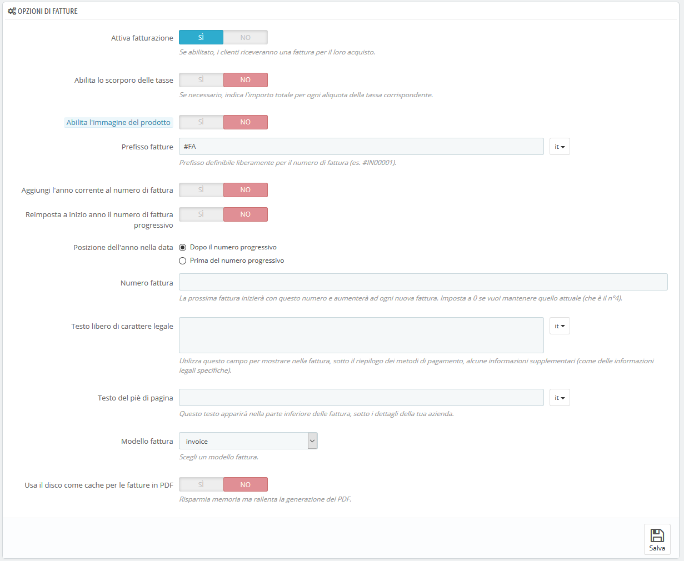

# Fatture

Ogni volta che viene confermato un ordine nel tuo negozio, viene inviata una fattura al cliente. Questa pagina consente di configurare le fatture e di scaricare una selezione di fatture.

## Generare fatture in file PDF 

È possibile scaricare le fatture per un singolo ordine dalla pagina dell'ordine. La pagina "Fatture" consente di scaricare, contemporaneamente, una selezione di fatture dagli ordini passati in formato PDF, (in un unico file PDF).

È possibile ottenere un file PDF contenente più fatture in base a due criteri principali:

* **Per Data**. Molto utile quando è necessario stampare tutte le fatture di un determinato mese o di un trimestre. Seleziona la data di inizio e di fine e clicca sul pulsante "Genera file PDF per data" nella barra superiore.
* **Per Status dell'ordine**. Un must-have quando è necessario stampare con precisione gli ordini cancellati, rimborsati o prenotati. PrestaShop indica in modo utile, tra parentesi, il numero di fatture legate a ogni status.

In entrambi i casi, le fatture vengono generate in un unico file PDF, ciascuna con le proprie pagine. Non è possibile ottenere un singolo file PDF per ogni fattura del periodo o per gli status concessi utilizzando questa pagina.

Se desideri personalizzare l'aspetto delle fatture del tuo negozio, devi modificare il modello del file.

I file del modello PDF si trovano nella cartella `/pdf`. Apri il file `invoice.tpl` e modificalo come desideri: è un file HTML con tag Smarty.

Quando i clienti richiedono le fatture, è possibile reindirizzarli alla sezione "Cronologia ordini" del loro account utente con tutte le fatture disponibili.

## Opzioni Fatture 

Puoi scegliere se le fatture devono essere rese subito disponibili o meno ai tuoi clienti non appena l'ordine viene effettuato, così come impostare il prefisso e il numero di fattura che desideri elencare nella versione stampata della fattura. Questa funzionalità consente di semplificare la gestione del tuo account.

* **Attiva fatturazione.** Se disattivato, il cliente non riceverà una fattura dopo l'acquisto. Sarai responsabile della gestione delle fatture.
* **Abilita la scorporo delle tasse.** _Novità in 1.6_. Quando abilitato, la fattura elenca tutte le diverse imposte applicate all'ordine, invece di una sola percentuale.
* **Abilita l'immagine del prodotto.** _Novità in 1.6.1_. Quando abilitata, aggiungerà l'immagine del prodotto accanto al nome del prodotto nella fattura.
* **Prefisso fatture.** Per impostazione predefinita, PrestaShop dispone di prefissi di fattura adattati alla lingua: "FA" in italiano, "IN" in inglese (per “_invoice_”), "FA" in francese (per "_facture_"), "CU" in spagnolo (per "_cuenta_") ecc. puoi anche scegliere codici di lingua: “IT”, "EN", "FR", "SP", ecc. Ovviamente puoi anche scegliere di avere un solo prefisso per ogni lingua o di non avere un prefisso.\
  PrestaShop genererà quindi il numero di fatture in base alle impostazioni dell'utente: "# IN000001", "# FA000002", ecc.
* **Aggiungi l'anno corrente al numero di fattura.** Oltre al numero di fattura e al prefisso, apparirà anche l'anno nel numero della fattura.
* **Reimposta a inizio anno il numero di fattura progressivo.** All'inizio di un nuovo anno, il numero di fattura viene ripristinato per ricominciare da 0.
* **Posizione dell'anno nella data.** Scegli dove visualizzare l’anno nella data del numero della fattura, prima o dopo il numero progressivo.
* **Numero fattura.** Se la tua azienda ha già ricevuto ordini e fatture prima di iniziare a utilizzare PrestaShop, puoi utilizzare questa opzione per cominciare la numerazione della fattura da un numero maggiore.
* **Testo libero di carattere legale.** _Novità in 1.6.1.0_. Questo campo consente di inserire alcuni contenuti aggiuntivi alla fattura, nel caso in cui la legislazione locale richieda di mostrare ulteriori informazioni. Sulla fattura apparirà sotto al riepilogo dei metodi di pagamento. Naturalmente, puoi utilizzare questo campo libero per mostrare qualsiasi testo ritieni necessario.
* **Testo del piè di pagina.** Puoi utilizzarlo per avere un testo personalizzato in fondo a tutte le fatture. Il testo apparirà sotto il nome del tuo negozio nella fattura.
* **Modello fattura.** A seconda del tuo tema, potrebbe essere possibile utilizzare più di uno stile di fattura. Provali con un falso ordine, al fine di scegliere quello che preferisci. Se sai come codificare in HTML, puoi aggiungere i tuoi modelli di fattura o modificare quelli esistenti: si trovano nella cartella / `pdf/` della tua installazione PrestaShop.
* **Utilizzare il disco come cache per le fatture PDF.** È possibile scegliere di memorizzare le fatture generate sul disco server di PrestaShop piuttosto che nella cache del server. Anche se consente di risparmiare sull'utilizzo della memoria, rallenta la generazione dei PDF, perciò utilizzala in modo consapevole.

Non dimenticate di salvare le modifiche.
