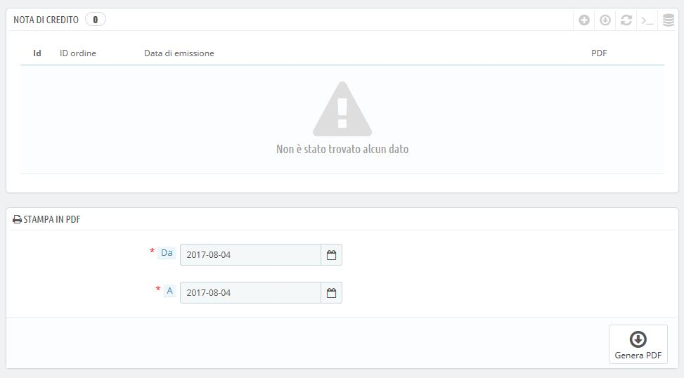
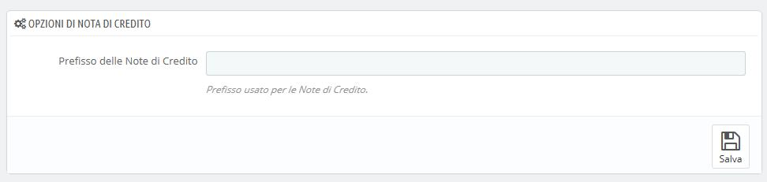
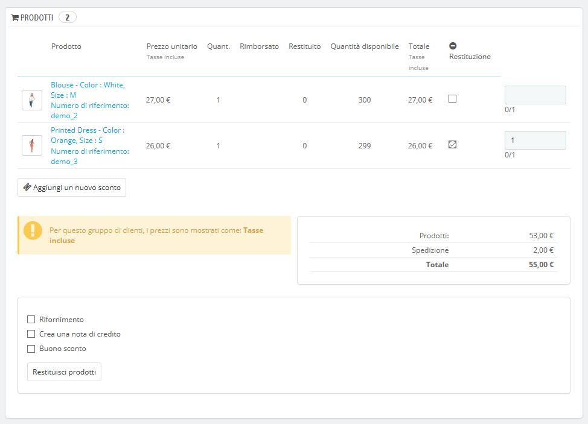
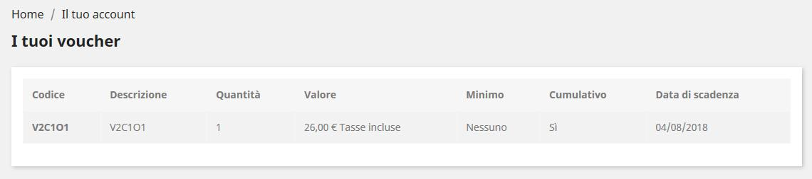

# Note di credito

A seconda dei tuoi accordi sul reso dei prodotti, potresti ricevere della merce indietro. Una volta ricevuta, è **necessario** creare una nota di credito dalla pagina dell'ordine.  
Le note di credito non vengono create nella pagina "Note di credito", ma elencati solo qui. Questa pagina viene utilizzata anche per generare un PDF delle tue note di credito.

## Opzioni di nota di credito 

È presente solo una opzione nella pagina: 

* **Prefisso delle note di credito**. Potrebbe essere cosa gradita taggare a seconda della lingua le tue note di credito. Puoi ovviamente anche scegliere di non inserire alcun prefisso. 

PrestaShop genererà il numero di nota di credito in base alle tue impostazioni.

Non dimenticare di salvare le tue modifiche. 

## Creare una nota di credito 

Nella lista dei tuoi ordini \(pagina "Ordini"\), clicca sull’ordine oggetto del reso in modo che vengano mostrati ulteriori dettagli – ciò accadrà solo se il cliente ha già inviato il reso.

Sotto alla scheda "Prodotti" procedi in questo modo:

1. Seleziona l’articolo\(i\) reso\(i\).
2. Seleziona la casella "Prodotto nuovamente in magazzino" se desideri che il prodotto rientri in magazzino.
3. Seleziona la casella "Genera una nota di credito".
4. Per soddisfare il cliente in seguito all’errore sul suo ordine, è consigliabile generare un voucher selezionando la casella “Buono sconto”.
5. Puoi inoltre rimborsagli i costi di spedizione cliccando a fianco su “Includi spedizione”.

Una volta selezionate tutte le opzioni che desideri conferma cliccando su “Prodotti Resi”.

La nota di credito è ora stata creata e sarà disponibile nei dettagli dell'ordine anche nella pagina "Note di credito". Da lì, è possibile cliccare sul collegamento per scaricare il file PDF. Il cliente vedrà il credito nella sua area personale.

Se hai creato un voucher, il cliente lo vedrà nella sezione "Voucher" del proprio account. Cliccando su di esso, dovrebbe apparire qualcosa di simile:

La quantità di articoli restituiti viene aggiunta al voucher. Il cliente può utilizzare il codice di sconto \(elencato nell'estrema sinistra della colonna\) la volta seguente che mette un ordine.

