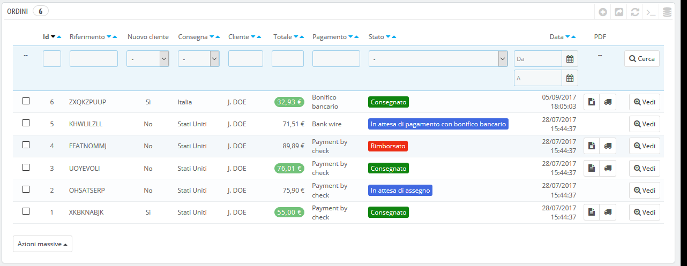

# Ordini

La pagina "Ordini" nel menu "Ordini" consente di visualizzare tutte le informazioni sugli acquisti effettuati sul tuo negozio. Sono disponibili tutte le transazioni del tuo negozio, organizzate per data \(per impostazione predefinita, dalla più recente alla meno recente\).

Puoi filtrare i risultati e trovare facilmente gli ordini che stai cercando utilizzando i campi di cui sopra. Ad esempio, per identificare gli ordini del Sig. Rossi, digitare "Rossi" nel campo "Cliente" e quindi cliccare su "Ricerca".

NON PUOI ANNULLARE UN ORDINE. È illegale rimuovere le informazioni di pagamento, un ordine o fatture di un'azienda europea. Pertanto, l'implementazione del pulsante "Elimina" nel menu ordini renderebbe PrestaShop illegale in Europa.

Puoi esportare l’elenco dei tuoi ordini cliccando sul pulsante "Esporta" nella parte superiore.  
Non è possibile importare ordini.

## Creare un ordine 

Una delle caratteristiche di PrestaShop è la possibilità di creare un ordine direttamente dal back office. Ad esempio, è estremamente utile quando un cliente vuole acquistare un prodotto ma non riesce e devi procedere tu manualmente, inserire un ordine preso telefonicamente o che ti è giunto via email.

Cliccando su "Aggiungi nuovo ordine" si apre una nuova pagina con un solo campo di testo, denominato "Ricerca di un cliente". Quando crei un nuovo ordine tramite il back office, la prima attività è associare tale ordine a un cliente. Digita le prime lettere del nome, cognome o email del cliente e PrestaShop mostrerà gli account corrispondenti.

Se il cliente per cui stai creando quell’ordine non dispone già di un account utente, puoi crearne uno al volo: clicca sul pulsante "Aggiungi nuovo cliente" per aprire una finestra con i dettagli dell'account principali pronti per essere rinseriti. Una volta che l'account viene salvato, diventa l'account selezionato dell'ordine.

Tieni presente che dovrai registrare anche l'indirizzo del cliente - il pulsante "Aggiungi nuovo indirizzo" è disponibile nella parte inferiore della pagina, nella sezione "Indirizzi".

Clicca sul pulsante "Scegli" sul cliente corretto e apparirà l'intero ordine. È nella sua sezione principale, "Carrello" dove si prendono tutte le decisioni necessarie per quell’ordine. Puoi anche scegliere di utilizzare un ordine precedente del cliente o un carrello precedentemente abbandonato.

La pagina consente anche di vedere i carrelli e gli ordini precedenti di quel cliente, se presenti. Se si scopre che si tratta di un carrello che un cliente in qualche modo non può convalidare è comunque possibile utilizzare quel carrello cliccando sul pulsante "Usa".

Il campo "Ricerca di un prodotto" consente di trovare in modo dinamico i prodotti da aggiungere: digita le prime lettere del nome e PrestaShop apre un elenco a discesa con i prodotti corrispondenti. Scegli un prodotto, seleziona una quantità e clicca sul pulsante "Aggiungi al carrello". Naturalmente puoi scegliere tra le numerose combinazioni di prodotti, se presente, nell'elenco a discesa "Combinazioni" che compare in tal caso.

Tieni presente che PrestaShop ti indica lo stock rimanente di un determinato prodotto, e ti consente di informare il cliente, attraverso il modulo d'ordine, se quel prodotto è esaurito.

Se necessario, puoi anche concedere a quell’ordine un voucher o una regola del carrello o crearne uno al volo cliccando sul pulsante "Aggiungi nuovo voucher".

Infine, è necessario specificare a quale indirizzo l'ordine dovrebbe essere consegnato \(ed eventualmente fatturato\). Qui, di nuovo, è possibile creare nuovi indirizzi al volo utilizzando il pulsante "Aggiungi un nuovo indirizzo".

## Vedere i Dettagli dell'Ordine 

Per elaborare gli ordini ricevuti devi visualizzare le informazioni che essi contengono.

Dalla pagina Ordini, clicca sulla riga dell'ordine oppure clicca sul pulsante a destra dell'ordine.

Il foglio di dettaglio dell'ordine è un’intera pagina.

Nella parte superiore della pagina è presente un breve riepilogo dell'ordine: la data in cui è stato convalidato, la somma totale del denaro, il numero di conversazioni del servizio clienti e il numero di prodotti dell'ordine.

Il foglio di dettaglio dell'ordine consente di accedere a:

* Sulla sinistra, informazioni sull'ordine:
  * Lo stato e la sua cronologia dell'ordine.
  * Le informazioni di spedizione: peso totale dell'ordine e corriere scelto dal cliente.
* A destra, informazioni sul cliente:
  * Nome e cronologia dell'acquisto.
  * Nota privata, se presente.
  * Indirizzi di spedizione e fatturazione \(con una mappa di posizione approssimativa di Google Maps\).
* Il metodo di pagamento utilizzato, il costo dei prodotti e i costi di spedizione.
* Diversi dettagli sui prodotti ordinati.

## Cambiare l’ordine 

Gli ordini non sono definitivi. Diversi motivi possono rendere necessario cambiare un ordine prima che i suoi prodotti siano preparati, imballati e inviati al destinatario: es esempio un prodotto può essere esaurito, il cliente potrebbe cambiare idea, ecc.

### Aggiungere un nuovo prodotto 

Nella parte inferiore dell'elenco "Prodotti" è presente il pulsante "Aggiungi un prodotto", che aggiunge un campo all'ordine.

Quando si aggiunge un prodotto, la tabella dei prodotti inserisce una nuova riga con una serie di campi. Il primo campo di testo è in realtà un piccolo motore di ricerca: digita le prime lettere di un prodotto per visualizzare l’elenco di prodotti corrispondenti. Seleziona quello che vuoi aggiungere e il campo grigio della riga diventa disponibile.

Se il prodotto dispone di combinazioni, è possibile selezionarlo in un elenco a discesa che appare sotto al nome: il prezzo dell'unità viene aggiornato di conseguenza.

Imposta la quantità e quindi clicca sul pulsante "Aggiungi": il prodotto viene aggiunto.

Non è possibile aggiungere più quantità di prodotto rispetto a quanto disponibile.

### Rimuovere Prodotti 

Per annullare un prodotto, vai all'elenco dei prodotti e deseleziona il prodotto cliccando sull'azione "Elimina" oppure cliccando sull'azione "Modifica" nel caso in cui ciò che serve è rimuovere una certa quantità di prodotto.

È possibile modificare la quantità di diversi prodotti contemporaneamente.

Se la quantità di un prodotto raggiunge 0, viene rimossa del tutto dall'ordine.

Non è possibile rimuovere più della quantità del prodotto.

Clicca sul pulsante "Annulla" per annullare la modifica.

## Modificare i Dettagli d’Ordine 

Molte sezioni del foglio ordini possono essere modificate, consentendo di aggiornare o correggere alcuni dati forniti dai clienti.

### Stato ordine 

Il primo elenco a discesa nella pagina ordini consente di modificare lo stato. È una parte molto importante dell'intero processo di monitoraggio degli ordini, per ogni cambiamento di stato, saranno disponibili nuove funzionalità e documentazioni per l'ordine.

* È possibile scegliere tra i seguenti stati:
*  In attesa di pagamento tramite bonifico bancario.
*  In attesa di denaro e della convalida della consegna.
*  In attesa del pagamento via assegno.
*  In attesa del pagamento PayPal.
*  Annullato.
*  Consegnato.
*  Odine inevaso \(non pagato\).
*  Odine inevaso \(pagato\).
*  Pagamento accettato.
*  Errore di pagamento.
*  Elaborazione in corso.
*  Rimborsato.
*  Il pagamento remoto è stato accettato.
*  Spedito.

Per una visione globale dell'attività dell'ordine, ogni cambiamento di stato viene registrato; il registro appare appena sopra l'elenco a discesa del modifica stato. Si dovrebbe modificare uno stato solo se è stato chiaramente confermato: non contrassegnare un ordine come "Consegnato" al momento dell'invio della spedizione, utilizza "Spedito"; non utilizzare "Lavorazione in corso" quando in realtà si è dato solo un rapido sguardo all'ordine, ecc.

Dalla versione 1.6.1.0, è possibile inviare nuovamente l’email per comunicare le stato dell’ordine al cliente. Per inviarla clicca su "Invia nuova posta" accanto allo stato dell'ordine. Se hai modificato l'ordine ad un certo punto, verrà inviata un'email aggiornata.

### Pulsanti d’Azione 

I pulsanti di azione cambiano a seconda dello stato dell'ordine. Ad esempio, una volta che l'ordine è nello stato "Consegnato", il pulsante "Annulla" viene sostituito da due nuovi pulsanti: "Prodotti resi" e "Rimborso parziale".

I resi dei prodotti non vengono attivati per impostazione predefinita. Per attivarlo, vai alla pagina "Restituzione Merce" sotto il menu "Servizio clienti" e attiva l'opzione nella parte inferiore della pagina. Ciò vale per tutti i prodotti e per tutti gli ordini.

* **Rimborso standard.** Disponibile una volta che l'ordine raggiunge lo stato "Pagamento accettato". Non disponibile una volta che i prodotti sono stati inviati. Da utilizzare quando è necessario rimborsare l'ordine totale e può essere fatto finché i prodotti sono ancora in magazzino. Clicca sul pulsante "Rimborso standard" e apparirà una nuova colonna nell'elenco dei prodotti, intitolato "Rimborso". Imposta l'importo e la quantità per ciascuno dei prodotti interessati, scegli una delle opzioni in fondo all'elenco \(vedi sotto\) e clicca sul pulsante "Rimborso" nella parte inferiore della tabella.
* **Rimborso parziale.** Disponibile una volta che l'ordine raggiunge lo stato "Pagamento accettato". Da utilizzare quando è necessario rimborsare solo una parte dell'ordine e non l'intero ordine, perché il cliente ha restituito il prodotto ordinato o semplicemente come segno di riconoscenza per un prodotto danneggiato che il cliente ha scelto di tenere comunque. Clicca sul pulsante "Rimborso parziale" e una nuova colonna, intitolata "Rimborso parziale", apparirà nell'elenco dei prodotti. Imposta l'importo e la quantità per ciascuno dei prodotti interessati, scegli una delle opzioni in fondo all'elenco \(vedi sotto\) e clicca sul pulsante "Rimborso parziale" nella parte inferiore della tabella.
* **Restituzione prodotti.** Disponibile una volta che l'ordine raggiunge lo stato "Spedito". Per accettare restituzioni di merce PrestaShop deve essere impostato tramite la pagina Servizio Clienti&gt; Resi Merce, con l'opzione "Abilita restituzione". Da utilizzare solo quando il cliente ha effettivamente restituito i prodotti: una volta ricevuto il prodotto restituito è possibile contrassegnarlo come restituito direttamente nel modulo di ordinazione. Clicca sul pulsante "Reso prodotti" e apparirà una nuova colonna nell'elenco dei prodotti, intitolata "Reso". Seleziona la casella dei prodotti interessati, indica la quantità di articoli restituiti e clicca sul pulsante "Prodotti resi" nella parte inferiore della tabella.

Quando si imposta un prodotto restituito o da restituire, sono disponibili quattro opzioni nell'elenco dei prodotti:

* **Prodotto re-stock**. Se selezionato, PrestaShop considererà che il prodotto restituito è nuovamente disponibile per la vendita e quindi aumenterà la scorta di questo prodotto. Non usare questa opzione se un prodotto viene restituito a causa della sua rottura...
* **Genera una nota di credito**. Verrà creata una nota di credito per gli elementi selezionati. Una nota di credito attesta che la merce è stata restituita al tuo negozio e che un rimborso è stato rilasciato. Il cliente può poi utilizzarlo come scontrino di credito per il suo acquisto successivo.
* **Genera un voucher**. Verrà creato un voucher per la quantità degli elementi selezionati. Il buono prende forma in un codice sconto che il cliente può inserire durante il processo di checkout \(pagamento\). Puoi modificare i buoni esistenti del cliente nella pagina del cliente: dalla pagina dell'ordine corrente, clicca sul nome del cliente nella sezione "cliente"; una volta nella pagina, vai alla sezione "Voucher". Puoi modificare ogni voucher cliccando sull'icona "Modifica".

  In PrestaShop, i buoni sono parte di una speciale funzione di sconto: "regole del carrello". Possono essere creati e modificati dalla pagina "Regole del carrello", sotto il menu "Sconti".

* **Rimborsa il costo di spedizione**. Puoi anche scegliere di rimborsare il costo di spedizione del prodotto restituito, gesto sempre apprezzato.

Se il cliente ha pagato l'ordine utilizzando una carta di credito, il sistema di pagamento dovrebbe rimborsarlo automaticamente. Se l'ordine è stato pagato utilizzando un assegno o un bonifico bancario, è necessario effettuare il rimborso, quindi contrassegna l'ordine come rimborsato manualmente nel back office \(nella pagina dell'ordine\).

Differenza tra una nota di credito, un voucher e una regola del carrello.

Una nota di credito è innanzitutto una prova scritta che un prodotto è stato restituito. Nella maggior parte dei casi, il cliente può utilizzarla come un voucher.

Un voucher è un codice di sconto non legato a un rimborso o un reso e che può assumere più forme rispetto a una semplice nota di credito:

* Sconto su un ordine \(percentuale\).
* Sconto su un ordine \(importo\).
* Spedizione gratuita.

È possibile applicare un voucher a tutti i clienti, un gruppo di clienti o un singolo cliente; è possibile impostare la data di scadenza.

Una regola del carrello è fondamentalmente una versione avanzata di un voucher:

* Nomina lo sconto.
*  Consenti al cliente di utilizzare solo una parte dello sconto.
*  Assegna priorità tra le regole del carrello.
*  Imposta la compatibilità tra le regole del carrello.
*  Lo sconto funziona solo con alcuni corrieri.
*  Lo sconto funziona solo con una selezione di prodotti e/o categorie e/o marche e/o fornitori e/o attributi... o tutti questi contemporaneamente se necessario!
*  Rendi lo sconto applicabile per il trasporto gratuito e/o su un ordine e/o come regalo... o tutti questi contemporaneamente se necessario!

### Documenti 

Puoi ottenere molti documenti in PDF della pagina degli ordini. Se disponibili, sono elencati nella sezione "Documenti" della pagina.

Per impostazione predefinita, è possibile scaricare l'ordine in formato PDF, cliccando sul pulsante a sinistra "Stampa Ordine".

Puoi ottenere una fattura dell'ordine cliccando su "Generazione fattura" dalla sezione "Documenti". La fattura viene generata anche dopo aver inserito l'ordine nello stato "Pagamento accettato".

Una volta generato, il pulsante "Visualizza fattura" viene attivato nella barra superiore.

È possibile personalizzare il layout della fattura: i file del modello PDF si trovano nel `/pdf` folder. Questi file`.tpl` sono in realtà file HTML con tag Smarty per dati dinamici. Puoi modificare il layout della fattura modificando il file denominato `invoice.tpl`.

È possibile aggiungere una nota alla fattura. Nella sezione "Documenti", clicca su "Aggiungi nota": verrà aggiunto un messaggio mostrato sulla fattura, sotto la tabella fiscale.

  
Quando si inserisce l'ordine nello stato "elaborazione in corso", viene generato un PDF per la consegna, che è possibile scaricare dalla sezione "Documenti".

### Spedizione 

I dettagli di spedizione dell'ordine possono essere modificati in parte. Più specificamente, è possibile modificare il numero di tracciamento e il corriere. Nella sezione "Trasporto", clicca sull'icona "Modifica": potrai cambiare i dettagli di spedizione secondo le tue esigenze. Il corriere può essere cambiato finché l'ordine non è ancora stato spedito.

### Indirizzo Spedizione 

La sezione "Indirizzo di spedizione" consente di modificare l'indirizzo di destinazione del pacchetto che il tuo team sta per inviare. Puoi utilizzare l'elenco a discesa per scegliere un altro indirizzo che il cliente lo ha già registrato nel tuo negozio, oppure puoi usare l'icona "Modifica" per modificare l'indirizzo correntemente selezionato.

Se devi inviare il pacchetto a un indirizzo non ancora registrato in PrestaShop è necessario innanzitutto crearlo. Per farlo vai nel menu "Clienti", apri la pagina "Indirizzi" e clicca sul pulsante "Aggiungi nuovo indirizzo". Non dimenticare di inserire l'email corretto del cliente, in quanto questo è il modo in cui PrestaShop associa il nuovo indirizzo al cliente esistente! Una volta completato, torna alla pagina dell'ordine e modifica l'indirizzo utilizzando l'elenco a discesa.

Tieni presente che una piccola mappa consente di visualizzare la destinazione del pacchetto su Google Maps.

### Indirizzo Fattura 

La sezione "Indirizzo fattura" consente di modificare l'indirizzo di pagamento dell'ordine. Come per l'indirizzo di spedizione, dal menu a discesa puoi scegliere un altro indirizzo che il cliente ha già registrato nel tuo negozio, oppure puoi utilizzare l'icona "Modifica" per modificare l'indirizzo correntemente selezionato.

Se è necessario che il pagamento sia legato a un indirizzo non ancora registrato in PrestaShop, è necessario innanzitutto crearlo. A tale scopo, vai nel menu "Clienti", apri la pagina "Indirizzi" e clicca sul pulsante "Aggiungi nuovo". Non dimenticare di inserire l'email corretta del cliente, in quanto questo è il modo in cui PrestaShop associa il nuovo indirizzo al cliente esistente! Una volta completato, torna alla pagina dell'ordine e modifica l'indirizzo utilizzando il menu a discesa.

### Sconto 

Nella sezione "Prodotti", nella parte inferiore dell'elenco dei prodotti, è presente il pulsante "Aggiungi un nuovo sconto". Crea uno sconto semplice, non avanzato come nel sistema di regole del carrello/voucher ma decisamente utile.

Cliccando su di esso si aprirà un nuovo modulo, con i seguenti elementi:

* **Nome**. Dai allo sconto un nome breve. Sarà pubblico al cliente.
*  **Tipo**. Scegli il tipo di sconto: "percentuale", "quantità" o "spedizione gratuita".
*  **Valore**. Per i tipi "percentuale" o "quantità", imposta il valore dello sconto.
*  **Fattura**. Seleziona a quale fattura lo sconto dovrebbe essere applicato. Se esiste più di una fattura, puoi selezionare la casella per applicare lo sconto a tutte le fatture.

Lo sconto sarà applicato al totale prima dei costi di spedizione.

## Allegare un messaggio all’ordine 

Nella sezione "Nuovo messaggio", a destra della pagina, puoi allegare un commento sull'ordine per il tuo team.

Puoi anche inviare il commento al cliente, per dargli informazioni riguardo all'ordine, un ritardo, una sorpresa o mantenerlo informato su offerte e offerte speciali. Questo è un punto chiave della relazione con il cliente.

**Scegliere un messaggio standard**. Nel caso in cui invii un messaggio al cliente, puoi selezionare un messaggio predefinito. I messaggi predefiniti possono essere salvati e utilizzati più volte, evitando di scriverli nuovamente. Se desideri inviare uno di questi messaggi, selezionalo dall'elenco a discesa. È possibile aggiungere ulteriori dettagli al messaggio preimpostato, se necessario.

È possibile creare più messaggi preimpostati utilizzando lo strumento nella pagina "Messaggi dell’Ordine", sotto il menu "Servizio clienti".

**Visualizza al cliente**? Ciò determina se il messaggio è visibile solo al tuo team o lo vuoi inviare al cliente.

**Messaggio**. Nel caso in cui utilizzi un messaggio preimpostato, verrà visualizzato nella casella. Altrimenti, puoi semplicemente scrivere il tuo messaggio.

Il messaggio verrà memorizzato nel profilo del cliente nel database del servizio clienti, accessibile dalla pagina del cliente o dalla pagina Servizio clienti. Il messaggio verrà inviato anche all’email del cliente se lo si desidera.

**Invia messaggio**. Clicca su questo pulsante per inviare il messaggio al cliente o salvarlo per il tuo team.

**Mostra tutti i messaggi**. Questo collegamento ti porterà alla pagina "Servizio clienti". Questa parte è completamente spiegata nel capitolo "Gestione del servizio clienti" di questa guida.

