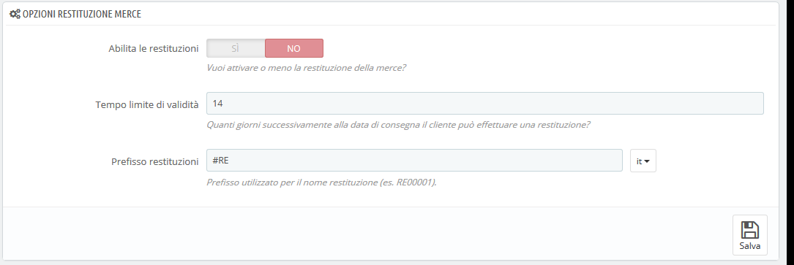
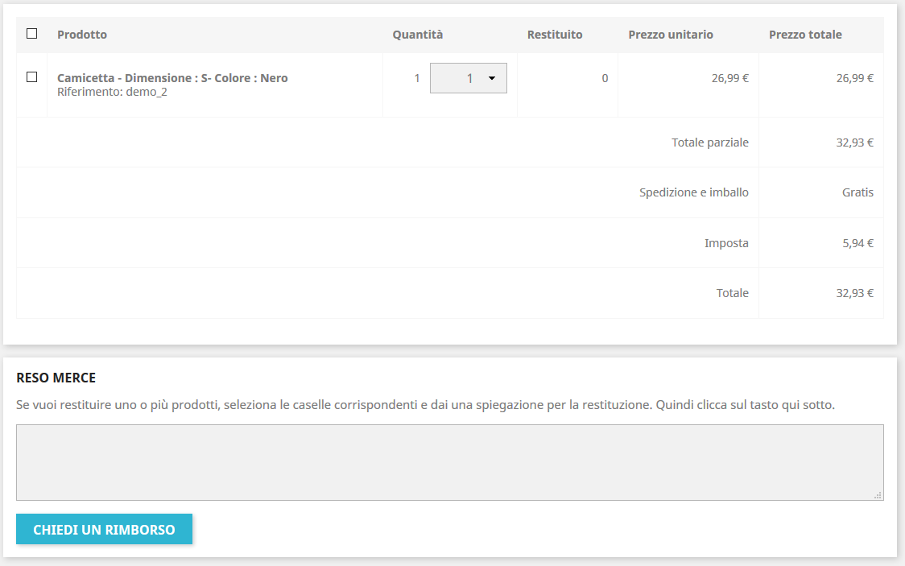
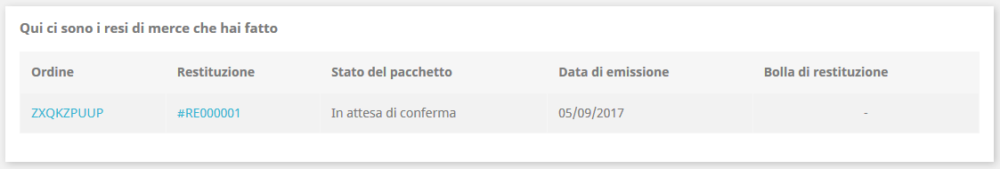
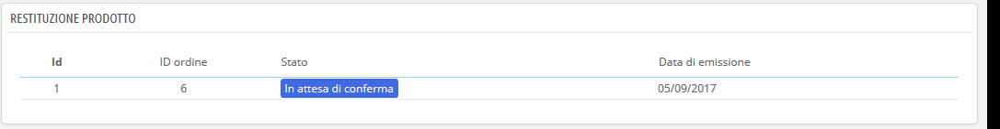
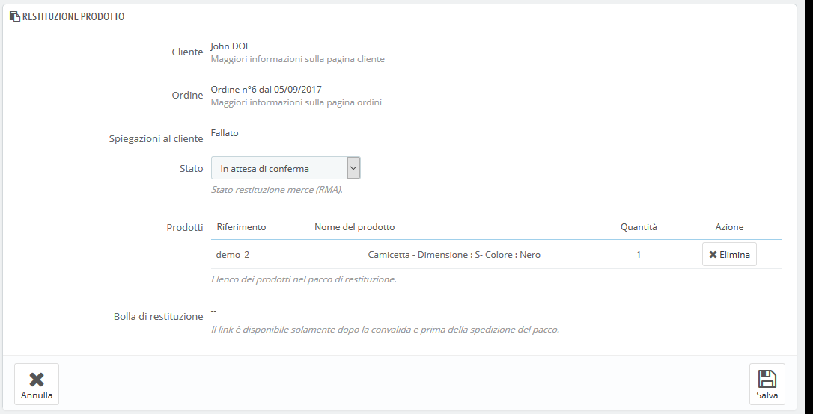
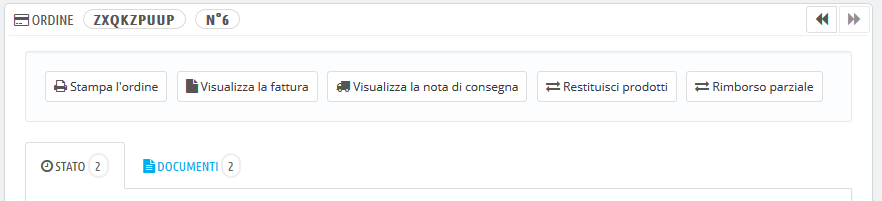

# Resi Merce

La pagina "Restituzione Merce" fornisce un elenco di tutti i processi RMA \(Return merchandise authorization ossia autorizzazione di restituzione merce\).

Nella parte inferiore della pagina hai la possibilità di consentire ai clienti di rinviarti i prodotti \(opzione "Abilita le restituzioni"\). Basta indicare il numero di giorni durante i quali è possibile effettuare una richiesta di restituzione e salvare le impostazioni: così i clienti hanno la possibilità di richiedere l’autorizzazione del reso. Puoi anche modificare il prefisso per il reso o scegliere di non offrirlo.

## Processo di restituzione: come lo vede il cliente 

 Una volta attivata l'opzione di restituzione nel tuo back office, il cliente può scegliere di restituire un elemento \(a condizione che non sia stato superato il limite di validità\). Deve fare quanto segue:

1.  Accedere alla sezione "Cronologia ordini" del suo account.
2.  Selezionare l'ordine da cui desidera restituire un elemento cliccando su "Dettagli".
3.  Selezionare i prodotti che desidera restituire attraverso la casella accanto ai nomi.
4.  Aggiungere la quantità che deve essere restituita \(nel caso in cui sia necessario restituire più di un prodotto\).
5.  \(facoltativo\) Nella sezione "Restituzione Merce", aggiungere una spiegazione, affinché il team capisca meglio perché il cliente desidera restituire quel prodotto.
6.  Cliccare su "Richiedi un rimborso".

Quando è possibile restituire un ordine?

1. I resi devono essere abilitati \(opzione "Attiva ritorni"\).
2. L'ordine deve essere nel termine di validità \(= si è ancora tempo per restituire un prodotto\).
3. Gli ordini devono avere almeno i seguenti stati:

* * Almeno due stati: la condizione "Imposta l'ordine come pagato" abilitata e l'opzione "Imposta l'ordine come spedito" abilitata.O
  * Uno stato che ha entrambe le condizioni \("Imposta l'ordine come pagato" e "Imposta l'ordine come spedito"\) abilitate.

Gli stati possono essere modificati nella scheda "Statistiche" nella pagina "Impostazione ordini" del menu "Parametri del negozio".

Una volta che il modulo è completo, il cliente clicca su "Richiedi un reso" e la richiesta viene inviata al gestore del negozio \(te\) e viene visualizzata come "In attesa di conferma" nella pagina "Resi Merce" del cliente, accessibile dalla pagina dell’account.

## Processo di reso: come lo vedi tu 

La richiesta di reso viene visualizzata nel tuo back office nella pagina "Restituzione Prodotto”. All’inizio la richiesta di reso è nello stato "in attesa di conferma".

Il processo di rimborso può richiedere diversi passaggi, indicati nello stato. Lo stato può essere:

* In attesa di conferma.
*  In attesa del pacchetto.
*  Pacchetto ricevuto.
*  Reso negato.
*  Il reso è stato completato.

Ora sta a te accettarlo o negarlo:

1. Clicca sull'ID della richiesta di reso per ulteriori dettagli.
2. Modifica lo stato per continuare con il processo di reso o arrestarlo.
   * Se si desidera interrompere il processo di restituzione \(e negare il rimborso al cliente\), è sufficiente selezionare lo stato "Reso negato ".
   * Se consenti la restituzione e il cliente viene rimborsato, segui con precisione ogni passo:
     1. Seleziona lo stato: "In attesa del pacchetto". In questo modo verrà inviata un'email al cliente che indica che il prodotto può essere inviato.
     2. Una volta ricevuto il pacchetto, modifica lo stato della richiesta in "Pacchetto ricevuto".
     3. Infine, una volta che l'intero processo è terminato \(il cliente è stato rimborsato o hai rilasciato una nota di credito\), cambia lo stato in "Il reso è stato completato ".
3. Salva.

## Rimborsare un cliente 

Un ordine può essere rimborsato, parzialmente o totalmente. Ciò viene fatto utilizzando due pulsanti di azione situati nella barra superiore della pagina dell'ordine invece che nella pagina di reso.

I pulsanti di azione cambiano a seconda dello stato dell'ordine. Ad esempio, una volta che l'ordine è in stato "Consegnato", "Aggiungi un prodotto" e "Rimuovi prodotto" si trasformano in due nuovi pulsanti: "Prodotti resi" e "Rimborso parziale".

I resi dei prodotti non vengono attivati per impostazione predefinita. Per attivarli, vai alla pagina "Restituzione Merce" sotto il menu "Servizio clienti" e attiva l'opzione nella sezione opzioni nella parte inferiore della pagina. Ciò vale per tutti i prodotti e per tutti gli ordini.

* **Prodotti Resi**. Da utilizzare solo quando il cliente ha effettivamente restituito i prodotti: una volta ricevuto il prodotto restituito, è possibile contrassegnarlo come restituito direttamente nel modulo di ordinazione. Clicca sul pulsante "Restituisci prodotti" e una nuova colonna apparirà nell'elenco dei prodotti, intitolata "Resi". Seleziona la casella dei prodotti interessati, indica la quantità di articoli restituiti e clicca sul pulsante "Prodotti resi" nella parte inferiore della tabella.
* **Rimborso parziale**. Da utilizzare quando è necessario rimborsare solo una parte dell'ordine e non l'intero ordine, perché il cliente ha restituito il prodotto ordinato, o semplicemente come segno di riconoscenza per un prodotto danneggiato che il cliente ha scelto di tenere comunque. Clicca sul pulsante "Rimborso parziale" e apparirà una nuova colonna nell'elenco dei prodotti, intitolata "Rimborso parziale". Imposta l'importo e la quantità per ciascuno dei prodotti interessati, scegli una delle opzioni in fondo all'elenco \(vedi sotto\) e clicca sul pulsante "Rimborso parziale" nella parte inferiore della tabella.

Quando si imposta un prodotto restituito o da restituire, sono disponibili quattro opzioni nell'elenco dei prodotti:

* **Prodotti re-stock**. Se selezionato, PrestaShop renderà il prodotto restituito di nuovo disponibile per la vendita e quindi la scorta di questo prodotto aumenterà. Non dovresti cliccare su questo se un prodotto viene restituito a causa della sua rottura...
*  **Generare una nota di credito**. Quando selezionato, verrà creata una nota di credito per gli elementi selezionati. Una nota di credito attesta che la merce è stata restituita e che il rimborso è stato rilasciato. Il cliente può quindi utilizzare il credito per il suo prossimo acquisto.
*  **Generare un voucher**. Verrà creato un voucher per la quantità degli elementi selezionati. Il buono assume la forma di un codice sconto che il cliente può inserire durante il processo di checkout \(pagamento\). Puoi modificare i buoni esistenti nella pagina del cliente: nella pagina dell'ordine, clicca sul nome del cliente nella sezione "cliente"; una volta nella pagina del cliente, raggiungi la sezione "Voucher". Puoi modificare ogni voucher cliccando sull'icona "Modifica".
* **Restituire il costo di spedizione**. Puoi anche scegliere di rimborsare il costo di spedizione del prodotto restituito, un gesto sempre apprezzato.

Se il cliente ha pagato l'ordine con una carta di credito, il sistema di pagamento può rimborsare il carrello automaticamente o attraverso una tua operazione. Se l'ordine è stato pagato utilizzando un assegno o un bonifico bancario, è necessario effettuare il rimborso, quindi contrassegnare l'ordine come rimborsato manualmente nel back office \(nella pagina dell'ordine\).

